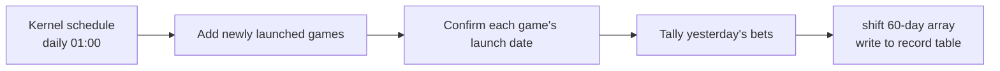

## Background

> [!IMPORTANT]
> **Core pain point: 20 minutes a day filling in Excel — and no way to know whether the entries were even correct.**

The report touched three tiers of users:

- **Risk-control (execution layer)**: each dawn had to manually query the prior day's per-game bet amounts, fill Excel, and convert game by game — 20 minutes of repetitive labor. After automation they moved from "data mover" back to their actual job of analysis and reporting.
- **Head of operations (strategy layer)**: relied on risk-control's Excel to set strategy, but the fixed Excel columns meant games could not be compared or reordered, and the numbers could not be verified. After the rework they can read line charts directly for cross-game trend comparison, with export order aligned to launch date.
- **Chief executive (review layer)**: periodically reviews the report and previously had to accept numbers that "might or might not be right." Once the data came straight from a system tally against the DB, mis-entry was eliminated at the source and the reviewed numbers are trustworthy.

Original pain points:

- **Daily repetitive labor**: each dawn, manually query the prior day's per-game bet amounts and enter them into Excel, converting one game at a time — 20 minutes a day.
- **No verification**: numbers were filled in by "days-since-launch" by hand, so mis-entries and omissions went undetected and confidence was low.
- **Hard to query and compare**: fixed Excel columns meant games could not be reordered, making game-anchored cross-comparison a chore.

New pain points surfaced after launch:

- **Re-run need**: a game was re-launched and management wanted the count restarted from that day, but the report still queried from the old launch date and couldn't be corrected.
- **No memory of query combinations**: every time the page opened, games had to be re-selected from scratch; common combinations couldn't be saved.
- **Export ordering**: exported columns weren't intuitively ordered — the oldest game should be on the left, the newest on the right.

## Goals

- Replace manual entry with a Kernel scheduled job, solving the daily labor and the lack of verification.
- Use v-charts line charts + a vuedraggable draggable table, solving the query/compare difficulty and export ordering.
- Add a re-run feature (UI + CLI) for recomputation after a re-launch.
- Add template management to remember query combinations.

## Key Highlights

1. **Daily manual work zeroed out**: a Kernel job runs the statistics pipeline automatically at 01:00, accumulating 60 days of bet amounts from launch date with no human involvement.
2. **Verifiable numbers**: data comes straight from the game detail database — a DB tally replaces manual Excel entry, eliminating mis-entry at the source.
3. **Multi-game visual analysis**: v-charts line charts show each game's 60-day trend, and vuedraggable lets table columns be dragged and reordered at will, supporting cross-game comparison decisions.
4. **Re-run recovery for any game**: selecting a game + launch date in the UI triggers a re-run; the operation is written to the back-office operation log so history is auditable.
5. **Template-remembered query combinations**: users can create game templates (a template name + a game list) and apply one from the main page via el-select with a single click, with no re-selecting.

## Solution & Architecture

### Back-end pipeline (Kernel, daily at 01:00)



| Step | Description |
|------|-------------|
| 1 Add new games | Add games not yet recorded from the master game list into the launch-date marker table |
| 2 Confirm launch date | Query the game database (open=1) + each game's first created-time to confirm the launch date |
| 3 Tally bets | For games in `finished` state, tally yesterday's bets and shift them into the 60-day array |
| 4 Chain | Chain 1 → 2 → 3 into a single pipeline |

> [!NOTE]
> Currently covers 40 games; a single pipeline run takes ~10 s. A Slack alert fires on Kernel failure; if data looks off, a one-click UI re-run recomputes it.

### Data tables

| Table | Purpose |
|-------|---------|
| Bet-record table | One row per game, storing a 60-day array of bet-amount floats as JSON (unit: 100M, floored to 1 decimal) |
| Launch-date marker table | Records each game's launch date and tally state (notYet / finished) |
| Template-settings table | Template name + a comma-separated list of game ids |

### Front-end components & visualization

- **Main page**: game selector + template el-select + line chart (v-charts) + draggable table (vuedraggable) + el-table + export. The line chart auto-renders 60-day trends, and when comparing a few games the tooltip shows each game's bet amount for a given day precisely; in the table the day column is pinned on the left while game columns drag freely, with a chip row showing the current column order.
- **Re-run**: game el-select + launch-date el-date-picker + a confirmation dialog + an operation-log table.
- **Templates**: a template-list management dialog + an add/edit template dialog (filtering out discontinued and non-listed games).

Multi-version log compatibility: the re-run operation log spanned a column change, so the read side displays with a fallback like `gameName ?? gameId` to keep old records from showing blanks.

## Worst Pitfalls

### Pitfall 1: `update()` returning 0 rows misread as "record not found"

When editing a template, if the user submitted content identical to the existing data, the API returned a failure — leaving users confused: "I didn't change anything, why can't I save?" The root cause was that the original code treated `update()`'s affected rows = 0 as "record not found" and reported failure. But Laravel's `update()` returns 0 affected rows whenever the data is unchanged — that means "nothing changed," not "not found." The fix drops that check entirely: if `update()` doesn't throw, it succeeded. And precisely because affected rows = 0 means nothing changed rather than not found, any settings-style edit that allows resubmitting the same value must never gauge success by affected rows.

```php
// Wrong: a settings page that allows submitting the same value
// must NOT judge success by affected rows
$affected = DB::table('bet_report_template')
    ->where('id', $id)
    ->update($data);
if ($affected === 0) {
    return $this->fail('NO_RESULTS'); // false failure on identical submit!
}

// Right: no exception from update() means success;
// affected=0 only means nothing changed
DB::table('bet_report_template')->where('id', $id)->update($data);
return $this->success();
```

### Pitfall 2: el-select clear event wiping all selected games

The template el-select on the main page had `clearable`; after the user clicked the clear (×) icon, the entire set of manually selected games vanished. The root cause: `@change` also fires on clear, passing a value of `null`; downstream code used it to `find()` the template, got `undefined`, then parsed that into an empty array — overwriting the existing selection. The fix is to early-return on `null` at the top of the handler — with a `clearable` + `@change` component, clearing fires the same event with `null`, so the handler must handle `null` up front, or the downstream find/parse turns around and wipes the user's existing data.

```js
function onTemplateChange (id) {
  if (id == null) return          // clear event → leave existing selection alone
  const tpl = templateOptions.find(t => t.id === id)
  games = parseSelectGameList(tpl.selectGameList)
}
```

## Key Trade-offs

1. **Inject legacy games from the front-end rather than change the DB schema**: a few early-launched games fell outside the standard game-list logic. Rather than alter the table structure or pollute the statistics pipeline for those few, they were defined as a front-end constant and injected via the game selector's parameter. The cost is that these ids are hard-coded in the front-end and adding more would require a code change — but there's no plan to add to this legacy batch, so this trades minimal intrusion for a clean pipeline.
2. **Keep the scheduled-job class names, only reorganize controller namespaces**: as the feature grew, the controller originally named after "60-day bet amounts" had taken on template and re-run responsibilities, so it was folded into a unified namespace and subfolder. But the scheduled job's class names were left untouched — class names don't affect routing or users, and renaming them would only risk disrupting the existing daily schedule, which isn't worth it.

## Quantified Results

| Item | Before | After |
|------|--------|-------|
| Daily manual work time | ~20 hours accumulated over a game's 60-day cycle | 0 hours (fully automated via Kernel) |
| Verifiability | Manual entry; mis-entry undetectable | Tallied straight from DB detail; auditable |
| Reorderable games | Fixed Excel columns | Freely draggable via vuedraggable |
| Re-run / launch-date fix | Not possible | One-click UI re-run + back-office operation log audit |
| Remembered query combinations | Re-selected every time | Applied from a template in one click |
| Export ordering | No rule | Ordered by launch time (oldest on the left) |
| Game coverage | — | 40 games, ~10 s per pipeline run |
| Pain points solved | 0/6 | 6/6 |

## Future Plans

- **Games beyond 60 days**: the bet-record table is a fixed 60-day array and keeps shifting off the earliest day past 60 days; if a "query all history" need arises, it would move to a partitioned table or a separate history table.
- **Paginated re-run operation log**: each dialog open currently loads the first page; if re-runs become frequent the history could grow long, so a date filter can be added later.

## Code Structure Reorganization

Illustrated by one reorganization done as the feature grew: what began as a single controller + a flat page was folded into a module namespace with subfolders.

**Before (flat)**

```
app/Http/Controllers/
  ReportController.php        # named after "60-day bet amounts", single responsibility

src/page/report/
  MainReport.vue              # flat page, no sub-component separation
```

**After (module namespace + subfolders)**

```
app/Http/Controllers/betDaily/
  ReportController.php         # all original methods + re-run / back-office log read
  TemplateSettingsController.php  # template CRUD

src/page/report/betDaily/
  MainReport.vue               # main page (split toolbar, template selection)
  rerun/
    RerunPanel.vue             # re-run dialog + confirmation
    OperationLogTable.vue      # paginated back-office operation log table
  template/
    TemplateManager.vue        # template list management
    TemplateEditor.vue         # add / edit template
    templateApi.js             # template API + parsing
```

> [!NOTE]
> Any module spanning more than one Vue/JS file is wrapped in its own subfolder (rerun/ has 2, template/ has 3), so the page directory doesn't flatten into something hard to maintain.
