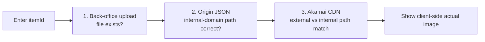

## Background

> [!IMPORTANT]
> **Core pain point: when an item image "wouldn't show," troubleshooting took over 1 hour and was pure stage-by-stage guesswork.**

- **No tooling for the three-stage investigation**: whenever an image broke, someone had to manually:
  - Check the back office to confirm the image had been uploaded
  - Confirm the origin CDN JSON file had been updated
  - Confirm the client side (external network) was showing the correct image
  - Decide whether an Akamai purge cache needed to be pushed
- **Hard to keep the CDN edge in sync with the origin**: Akamai has a cache layer, so after the origin updates an edge node does not necessarily take effect immediately — historically this meant manual waiting or a manual purge.
- **The symptom can't tell the three failures apart**: "the image doesn't show" could be a failed upload, a stale JSON, or an unpurged cache — the same symptom, but three completely different fixes.
- **Only production-like and production have the CDN architecture**: the local dev environment can't reproduce the problem, so it can only be investigated in specific environments.

**Stakeholders**:

- **Customer service / operations**: when a player reports a broken image, they now enter an itemId in the back office directly instead of pulling in the back end.
- **Back-end engineers**: freed from the repetitive step of connecting to the origin by hand to confirm the JSON.

## Objective

Add a verification feature to the item-settings back office so a user can enter an itemId and query the current CDN image status, pinpointing which stage failed (upload / JSON / Akamai cache). It is positioned as a diagnostic tool with no automatic repair — automatic purge is left to a later Akamai API integration.

## Highlights

- **Instant location on entering an itemId**: the new back-office feature takes an itemId → the system checks the three stages in order, replacing what used to be over an hour of manual stage-by-stage investigation.
- **Three-stage diagnosis with an obvious failure point**: (1) whether the back-office image uploaded successfully, (2) whether the origin JSON maps to the correct path, (3) whether the Akamai CDN edge already reflects the latest image — reported separately, so the root cause is clear.
- **External-domain vs internal-domain path comparison**: verification decides whether the CDN is in sync with the origin by comparing the external-domain path (what the client sees) against the internal-domain path (the origin), rather than by HTTP status alone.
- **Client-side image shown directly**: the result renders the image the client actually sees, confirming the end result the player gets rather than an inference from some intermediate stage.
- **Fast location, avoiding pointless purges**: the old instinct was to push a purge, but a purge is useless when the JSON isn't updated; now the JSON is verified first, then the decision is made, avoiding pointless operations.

## Impact

| Metric | Before | After |
|--------|--------|-------|
| Troubleshooting time | 1+ hour (manual stage-by-stage) | Instant lookup on entering an itemId |
| Who has to step in | Back-end engineer (had to connect to origin) | Customer service / operations self-serve |
| Root-cause location | Guesswork and experience | Three stages reported separately, failure point shown directly |
| Pointless purges | Common (push on a cache hunch) | Verify JSON first, act only once the root cause is clear |

## Solution & Architecture

The verification feature is split into three independently reported layers; after entering an itemId it walks through them in order, and a failure at any stage points straight to the root cause:

| Layer | Target | How it's verified | Representative failure |
|-------|--------|-------------------|------------------------|
| Back-office upload | Back-office storage path | Confirm the file exists | Image never uploaded successfully |
| Origin JSON | Origin JSON config file | Read the JSON, confirm itemId → image path maps correctly | JSON not synced/updated |
| Akamai CDN | Edge node (external domain) vs origin (internal domain) | Path comparison — do the external- and internal-domain image paths match | Cache not yet purged, edge still serving the old image |

The **core logic** lives in the item-settings back-office verification feature: it compares the external-domain path against the internal-domain path rather than relying on HTTP status to judge correctness.

> [!NOTE]
> This feature is enabled only on **production-like and production** environments (the local environment has no CDN architecture, so verification is meaningless); the Vue side gates its visibility by environment.

## Challenges

- **Akamai edge response lag**: after a purge, an edge node's update time is not fixed, so the verification copy has to hint "if you just purged, wait a few minutes and re-verify," preventing users from misreading "not yet propagated" as "the fix failed."
- **Independent yet dependent stages**: when the JSON isn't updated, the CDN path is itself wrong, and a CDN 200 is easily misread as fine; the design deliberately shows JSON before CDN, so the display order itself teaches the dependency — only once the JSON is correct does it even make sense to ask whether the CDN reflects the latest image.

## Future Plans

- **Akamai Fast Purge API integration**: connect the Akamai API so the back office can trigger a purge directly on the page once the origin JSON is confirmed correct, without logging into the Akamai console separately.
- **Purge status tracking**: poll purge status after calling purge, and once the edge refreshes, auto-re-verify the CDN layer, giving operations a complete "fix loop."

## Appendix

> [!TIP]
> **Reusable**: the external-domain vs internal-domain path-comparison verification pattern can be applied to other settings pages that manage CDN assets (event banners, game icons, etc.).

Further reading: Akamai [Fast Purge API](https://techdocs.akamai.com/purge-cache/reference/api).
