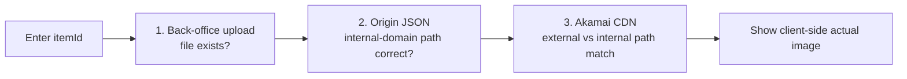

## Background

When an item image "wouldn't show," troubleshooting used to be a manual stage-by-stage process: check the back office to confirm the image was uploaded, connect to the origin to confirm the CDN JSON was updated, verify the image the client actually sees on the external network, and decide whether an Akamai purge cache needed to be pushed — the symptom was always "the image doesn't show," but the root cause could be one of three completely different failures: a failed upload, a stale JSON, or an unpurged cache. A single investigation often took over 1 hour and required pulling in a back-end engineer.

The core of the problem: for one image to render correctly, it must clear three environments that are independent yet sequentially dependent, and a failure in any one of them presents the exact same symptom. Without tooling, whoever was investigating could only guess which stage had broken and then confirm each stage by hand.

## Scope

Added a verification feature to the item-settings back office: entering an itemId reports the three stages in order and directly shows the image the client actually sees:

1. **Back-office upload** — whether the image was actually uploaded to the back-office storage path.
2. **Origin JSON** — whether the origin (internal-domain) JSON config maps that itemId to the correct image path.
3. **Akamai CDN** — whether the image path returned by the external-domain edge node matches the origin (internal domain).

Finally it renders the image the client actually sees, confirming the end result the player gets rather than an inference from some intermediate stage.

## Challenges

The most critical design trade-off was **replacing HTTP-status judgment with path comparison**. A 200 from the CDN for a given path only means "some image is reachable at this path" — not "this image is correct." When a stale JSON still points to a wrong path, the CDN happily returns 200 and is easily misread as fine. So the third stage ignores status codes and instead compares the external-domain path (what the client sees) against the internal-domain path (the origin); only when they match is the CDN considered in sync.

The "independent yet dependent" nature of the three stages also drove the display order. If the JSON isn't updated, the CDN path is itself wrong, so checking the CDN first is meaningless. The JSON stage is deliberately shown before the CDN stage — the display order itself teaches the reader the dependency chain: only once the JSON is correct does it even make sense to ask whether the CDN reflects the latest image.

On top of that, Akamai edge nodes have no fixed purge propagation time, so the result has to hint "if you just purged, wait a few minutes and re-verify," preventing users from misreading "not yet propagated" as "the fix failed."

## Contributions

Implemented the back-office three-stage diagnosis: comparing external-domain paths against internal-domain paths to judge whether the CDN reflects the latest image, rather than relying on HTTP status; reporting the three stages separately so the failure point is obvious; and rendering the client-side actual image at the end. The feature is gated by environment to production-like and production only (the local environment has no CDN architecture, making verification meaningless).

## Impact

| Metric | Before | After |
|--------|--------|-------|
| Troubleshooting time | 1+ hour (manual stage-by-stage) | Instant lookup on entering an itemId |
| Who has to step in | Back-end engineer (had to connect to origin) | Customer service / operations self-serve |
| Root-cause location | Guesswork and experience | Three stages reported separately, failure point shown directly |
| Pointless purges | Common (push on a cache hunch) | Verify JSON first, act only once the root cause is clear |

Troubleshooting dropped from 1+ hour to instant lookup on entering an itemId, with the three failure points reported separately. Customer service and operations can now self-serve without pulling in an engineer, and pointless operations — like pushing a purge on a hunch that "it's probably a cache issue" when the JSON was never updated in the first place — are avoided.

## Key Technical Decisions & Pitfalls

- **Why not trust HTTP status**: a status code only proves "something is reachable at the path," not "the path is correct." A stale JSON pointing to a wrong path still returns 200 — the easiest pitfall to fall into, and the reason the whole verification logic switched to "external-domain vs internal-domain path comparison."
- **Display order as knowledge transfer**: putting JSON before CDN is not just process ordering — it lets non-engineering customer service / operations see that "before the JSON is right, pushing a purge is wasted effort."
- **Verify JSON first, then decide — avoiding pointless purges**: the old instinct was to push a cache purge the moment an image looked broken, but a purge does nothing when the JSON isn't updated. Confirming the JSON first, then deciding whether to purge, cut out a large volume of pointless operations.
- **Environment gating**: the local environment has no CDN architecture, so the feature is enabled only on production-like and production environments, preventing accidental use where it means nothing.
- **Reusable**: the external-domain vs internal-domain path-comparison verification pattern can be applied to other settings pages that manage CDN assets (event banners, game icons, etc.).
- **Future work**: integrate the Akamai Fast Purge API so the back office can trigger a purge directly once the origin JSON is confirmed correct, without logging into the Akamai console separately; then poll purge status after purging and auto-re-verify the CDN stage once the edge refreshes, forming a complete "fix loop."
