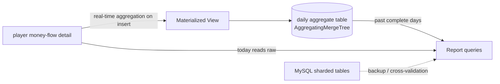

## Background

The existing win-score report was built on a sharded MySQL architecture; as data grew, query performance dropped sharply, with full-month player aggregations routinely taking ~104 seconds. Worse, the old figures came from pre-computed statistics tables that dropped log entries and needed manual reruns, so multiple teams repeatedly questioned whether the numbers were even correct. Slow *and* untrustworthy — both were real pain points.

## Scope

Led the database migration to ClickHouse, redesigning the report computation with a Materialized View + AggregatingMergeTree architecture so figures come directly from real-time aggregation over source detail data (retiring the whole set of "write-the-stats" scheduled jobs and their patch-up logic), while keeping the MySQL sharded tables as a backup and cross-validation source.



## Challenges

The migration had to guarantee full data consistency between old and new systems and a zero-downtime cutover. Along the way, production hit a baffling "report intermittently all-zero / missing games" bug — yet local and test environments hitting the same ClickHouse were fine. It was eventually traced to one production machine running an older libcurl that was incompatible with the `curl_multi` concurrent-query driver loop.

## Contributions

- Took a full day of real data and compared old vs. new values game-by-game and metric-by-metric (bet amount, win/loss, jackpot, rounds, players), cutting over only after confirming an exact match.
- Designed a dual-track parallel run — MySQL stayed live and both systems served data during cutover, switching the report source only once verified, achieving zero downtime with instant rollback (revert at the code layer).
- Located and fixed the intermittent empty responses caused by `curl_multi` exiting its loop early on the older libcurl.

## Key Technical Decisions & Pitfalls

**The worst pitfall: `curl_multi` exiting early on older libcurl**

On older libcurl, when work can proceed immediately without waiting on I/O, `curl_multi_exec` returns `CURLM_CALL_MULTI_PERFORM` (value -1), signalling "call me again right away"; newer libcurl only ever returns `CURLM_OK`. The original driver loop was `while ($running && $status === CURLM_OK)`, so on older libcurl it evaluated false on the very first pass and never entered — the transfer hadn't finished, producing empty responses and intermittently missing report data. The fix drains `CURLM_CALL_MULTI_PERFORM` first:

```php
do {
    $status = curl_multi_exec($mh, $running);
} while ($status === CURLM_CALL_MULTI_PERFORM);
// only then wait on I/O with curl_multi_select and read real results via curl_multi_info_read
```

> Lesson: when environments differ only in a system-library version, make the code robust to the older one — don't mutate the system library on a live machine (the blast radius is too large).

**Key trade-off: approximate distinct-count over exact**

Exact distinct counts (`uniqExact`) require a full hash set — heavy memory, huge state, and no cross-day/cross-source merging. Switching to an HLL approximation (`uniqCombined64`) carries ~0.1% error, which operations statistics tolerate, in exchange for small, mergeable aggregate state and a large speed-up. In practice the player-count segment dropped from ~24s of full scanning to ~0.1s once merged from daily-table state.

## Impact

Full-month player query time dropped from ~104 seconds to ~5 seconds (~21×) with zero reporting-number discrepancy; cross-team "the numbers are wrong" reports disappeared at the source, and the cost of maintaining a whole set of "write-the-stats" jobs went away — greatly improving verification efficiency and system stability for customer service and operations.
