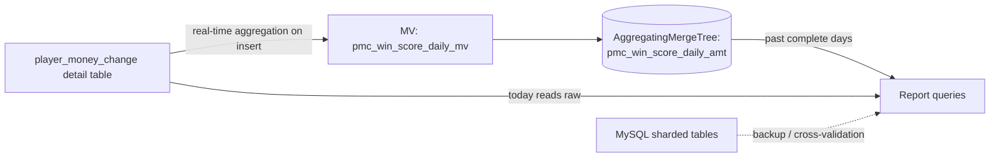

## Background

The company's existing win-score report was built on a sharded MySQL architecture; as data grew, query performance dropped noticeably, with full-month player aggregations routinely taking ~104 seconds and hurting verification efficiency for customer service and operations.

## Scope

Led the database migration to ClickHouse, redesigning the report computation logic with a Materialized View + AggregatingMergeTree architecture while keeping the MySQL sharded tables as a backup and cross-validation source.

## Challenges

The migration required full data consistency between old and new systems and a zero-downtime cutover; during troubleshooting, a libcurl version mismatch was found to cause intermittent bulk-query errors, which had to be located and fixed one by one.

## Contributions

- Took a full day of real data and compared old vs. new system values game-by-game and metric-by-metric (bet amount, win/loss, jackpot, rounds, players), cutting over only after confirming an exact match.
- Designed a dual-track (old + new) parallel-run mechanism, achieving zero-downtime rollout with fast rollback.
- Located and fixed the intermittent bulk-query errors caused by the libcurl version mismatch.

## Impact

Full-month player query time dropped from ~104 seconds to ~5 seconds (~21×) with zero reporting-number discrepancy, greatly improving verification efficiency and system stability for customer service and operations.
