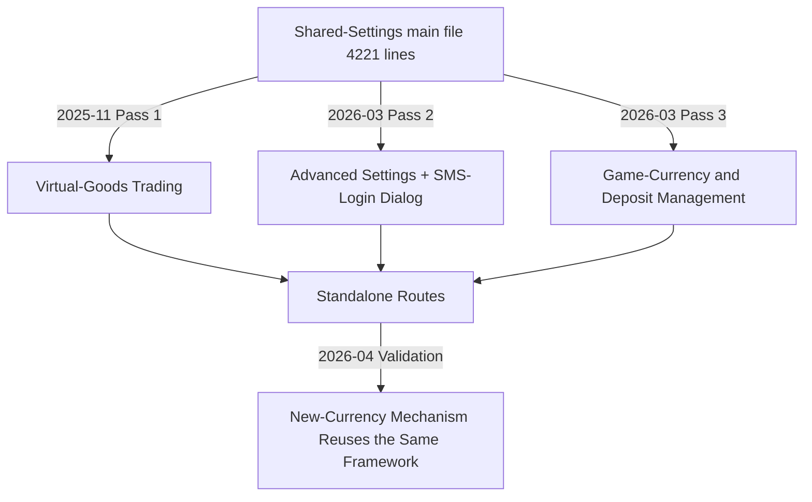

## Background

- The shared-settings main file had long been the "junk drawer" for site-wide shared settings — any cross-game setting got stuffed into it, until it ballooned to **4,221 lines**.
- Advanced settings, game-currency and deposit management, and every dialog were all mixed into the same file, so changing any feature meant hunting through 4,000+ lines.
- The high coupling caused frequent merge conflicts: multiple people editing the same file produced messy conflicts.
- Dialog logic embedded in the main file could not be tested or reused independently, and every extension made it harder to read.
- The maintenance cost for a newcomer (or one's future self) was extremely high — like reading a long document with no table of contents.

## Goal

Split the shared-settings main file by functional responsibility into standalone modules, reducing single-file line count and coupling; this is a **staged milestone**, with the same framework continuing to drive further work.

## Highlights

- **Main file reduced by 54%**: the main file was compressed from 4,221 to 1,963 lines, sharply cutting reading and search cost.
- **Extracted standalone-route modules**: virtual-goods trading, advanced settings, and game-currency & deposit management each got their own route, with clear functional boundaries that can later be granted different permissions.
- **Modularization was not improvised**: virtual-goods trading was extracted first as a trial (Pass 1) as early as 2025-11-06; only after it proved viable did the large-scale split of advanced settings and deposit management follow in 2026-03 — a planned, progressive refactor.
- **Dialog componentization**: 5 dialogs each became standalone components, no longer buried deep in the main file, and can be opened, searched and modified independently.
- **Lower merge-conflict risk**: with features spread across multiple files, the conflict surface shrank for parallel development.
- **A reusable split framework**: the directory structure for modules and dialogs is established, so new settings only need to slot into place.
- **The framework was immediately validated**: in 2026-04 the new-currency mechanism (Q-Coin) feature directly reused the new framework, adding a standalone dialog without changing the main file's structure — proving the split strategy correct.

## Quantitative Results

| Metric | Before | After (staged) |
|------|----------|-------------------|
| Main-file lines | 4,221 | 1,963 (**-54%**) |
| File count | 1 | 10 (4 main modules + 5 dialogs + 1 logic js) |
| Standalone routes | 1 | 4 |
| Dialog components | 0 (all inlined in main file) | 5 standalone components |
| Largest single file | 4,221 | 1,963 |

> [!NOTE]
> **1,963 lines is a 2026-04 snapshot, not the finish line.** The main file kept gaining new features after modularization — for example, the same-period new-currency (Q-Coin) newcomer mechanism added roughly +105 lines back into it. In other words, without this split the main file would already far exceed 4,221 lines; the 54% reduction was achieved while the business kept expanding, so the bloat actually avoided is even larger.

## Solution & Architecture

**Split strategy**: cut by "functional responsibility" rather than "code structure", keeping every module boundary clear.



| Module | Lines | Notes |
|------|------|------|
| Shared-settings main file | 1,963 | core functionality retained |
| Virtual-goods trading | 704 (+ 234 logic js) | extracted in Pass 1 (2025-11), standalone route |
| Advanced settings | 1,260 | extracted 2026-03, standalone route |
| Game-currency & deposit management | 1,326 | extracted 2026-03, standalone route |
| Dialog components | 5 total | belonging to advanced settings and deposit management, each a standalone component |

**Split order** (three progressive passes):

1. **Pass 1 (2025-11), trial**: extracted "virtual-goods trading" from the main file into a standalone module (plus one logic js), slightly shrinking the main file and adding a standalone route, to first validate that the split pattern works.
2. **Pass 2 (2026-03)**: split "advanced settings" into a standalone module and extracted the first dialog (SMS-login settings), establishing the advanced-settings dialog directory.
3. **Pass 3 (2026-03)**: split "game-currency and deposit management" into a standalone module and established its dialog directory.

## Challenges

- The original 4,221 lines were highly coupled: functions, data and computed properties cross-referenced one another, so straight cut-and-paste easily broke things.
- The dialogs' data flow (props / emit) had to be redesigned so a dialog could be decoupled from the main file without depending on parent data.
- New routes had to be added while keeping existing URLs intact (updating the route config in step).

## The Most Painful Pitfall

The most time-consuming step of the split was extracting the dialogs into standalone components. These dialogs were never real Vue components — they lived inline inside the main file's template, so the `this.xxx` they read was actually **the parent component's data**.

The first guess was wrong: it seemed enough to move the template into a standalone component and `import` it back in — but data passing failed completely and the dialog opened blank. The real root cause: once a block becomes its own component, `this` points at the component itself and can no longer reach the parent's data.

The fix was to convert, one by one, every piece of data each dialog depended on into **props in**, and every write-back to the parent into an **emit out**:

```js
// Before: dialog inlined in the parent template, reading parent data directly
// (the component itself owns none of these fields; it relies on this -> parent)
this.settingData.amount = 100
this.saveSetting()

// After: once extracted into a standalone component, the data flow is explicit
props: { settingData: { type: Object, required: true } }
// emit the change back to the parent instead of mutating the prop
this.$emit('update', { ...this.settingData, amount: 100 })
```

So before extracting any dialog from the monolith, the practice is to first list every `this.xxx` it depends on and turn each into a prop — this up-front inventory is what makes the extraction succeed in one pass, instead of discovering the broken data flow only after the cut.

## Key Trade-offs

- **Choice: three progressive passes, not a one-shot big-bang rewrite**
  - Rejected option: split every feature out at once.
  - Why rejected: with 4,221 highly coupled lines whose functions, data and computed properties cross-reference one another, moving it all in one go was extremely risky and hard to verify. Instead the work followed "prove the pattern on one module → ship and validate → split the next batch", spreading risk across time and matching the "staged milestone" framing.
- **Choice: split by functional boundary, not by code structure**
  - Why: functional boundaries map to real business needs and permissions can later be granted per feature; a structural split (grouping methods/computed together) has only engineering meaning, is invisible to the business, and cannot be mapped to "which team owns which block." This decision let the later new-currency mechanism slot straight in, adding settings without ever reaching back to alter the main file's structure.

## Roadmap

- The current framework (directory structure and dialog-componentization convention) is established, so the remaining functional blocks in the main file can keep being extracted.
- The 1,963-line main file still has room to shrink and can be cut again by "settings category".
- Consider fully componentizing the advanced-settings dialogs too, aligning with the already-componentized approach.
- Long-term goal: keep every module under 800 lines so anyone taking over can locate a problem within 10 minutes.

## Appendix

**Reusable method**: the order for splitting a large Vue file — confirm functional boundaries → extract dialog components (handle the broken-`this` problem first) → add routes → delete the corresponding block from the main file.

## File-Structure Overview

**Before (pre-2025-11)**:

```
shared-settings/
└── shared-settings-main.vue      # monolithic file (4,221 lines after virtual-goods was extracted; larger before)
```

**After (staged, 2026-04)**:

```
shared-settings/
├── virtual-goods-trading.vue     # 704 lines (Pass 1, extracted 2025-11, standalone route)
├── virtual-goods-trading.js      # 234 lines (trading logic)
├── shared-settings-main.vue      # 1,963 lines (-54%)
├── advanced-settings.vue         # 1,260 lines (advanced settings, standalone route)
├── advanced-settings dialogs/
│   └── <various>.vue             # e.g. SMS-login settings, special-mode settings
└── game-currency-and-deposit/
    ├── game-currency-and-deposit.vue   # 1,326 lines (standalone route)
    └── dialogs/
        └── <various>.vue         # e.g. deposit bonus, daily bonus
```
