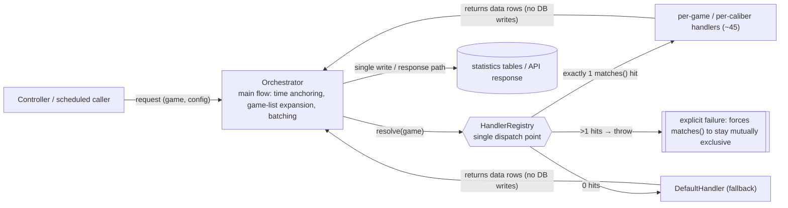
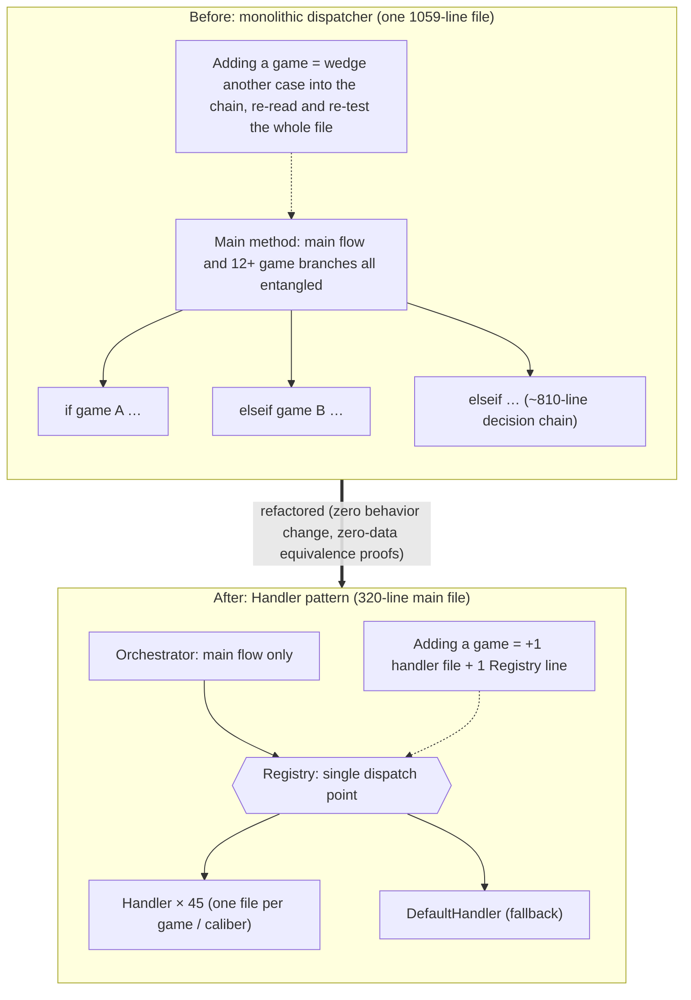

## Background

> [!IMPORTANT]
> The real pain this project solved was not "adding one more game." It was that **these statistics routines had rotted to the point where "everyone knew they were bad, but no one dared touch them," and the machine-information logic was so tangled that "opening the file told you nothing about what it computed."** The refactoring turned them from "don't touch" into "safe to maintain, readable at a glance."

- **Statistics logic too fragile to touch**: the back-end cores of the win-score / per-role win-loss / machine-activity reports were each a monolithic `if/elseif` — often over a thousand lines with a dozen-plus game branches crammed together (the win-score statistics module's main file was **1,059 lines**, with an if/elseif chain of roughly **810 lines**). These are the **write and read paths of financial/operations statistics** — a wrong edit corrupts report numbers. Yet every game shared the same method, so editing game A's branch could break game B, and there was no safe way to verify — the classic "everyone knows it's bad, no one dares touch it."
- **Machine information unreadable**: one main method of the machine-information module contained **three independent `switch` statements**; a single game's logic was scattered across all three. Readers couldn't reconstruct "how is this game actually computed," and changing one game meant synchronized edits in three places — miss one and it's wrong.
- **Every new game made it worse**: this kind of switch "never stops growing" — each new game wedges another case into the middle, and the longer it gets the less anyone dares touch it. A vicious cycle.
- **Trigger**: onboarding a new mahjong-style game required touching all 7 of these monolithic dispatchers. Rather than wedging in 7 more cases and feeding the cycle, the integration became the occasion to refactor them all at once.

## Goal

- Refactor the 7 monolithic dispatchers touched by the new-game integration into the Handler pattern (Contract + a Registry as the single dispatch point + one handler per game or per data caliber), so that "adding a game" no longer touches the main flow; **the refactoring itself must not change the behavior of any existing game**; the new game's logic joins as its own independent handler.

## Highlights

1. **Cost of adding a game dropped from "edit the main method" to "add one file"**: adding a game with special rules = one new handler class + one line in the Registry, with zero changes to the orchestrator. The new mahjong-style game that triggered this refactoring was integrated into all 7 modules exactly this way.
2. **God classes slimmed down substantially**: the win-score statistics main file went from **1,059 → 320 lines** (the orchestrator keeps only the main flow, batching intervals, DB writes, and shared helpers); the giant shared model file shed a cumulative **1,550+ lines** of query logic as game-record queries (list and detail), machine lists, per-role win-loss, and seat-occupancy statistics moved out one by one.
3. **Each game's logic consolidated**: logic previously scattered across multiple switches converged into a single handler class per game — "how this game differs from the others" is visible at a glance.
4. **Zero behavior change — and provably so**: the project distilled a validation methodology that works **without any real DB data** — dispatch equivalence + verbatim body containment + read-only smoke tests; read-only queries additionally get a "run old and new side by side, deep-compare outputs" behavioral proof, and live-data queries get "SQL byte-equivalence via `DB::listen`" — see [Validation Methodology](#validation-methodology).
5. **The methodology is reusable**: the lessons from 7 consecutive refactorings were distilled into a reusable refactoring SOP and regression-QC checklist (per-game vs. per-category criteria, when Default-as-base applies, handling order-sensitive dispatch, validating handlers that execute queries) — the next monolith follows the playbook directly.

## Quantified Impact

| Module (original monolith) | Split | Key numbers |
|---|---|---|
| Game-record query (list) | per-category (3 categories + Base) | ~623 lines moved out of the giant shared model file; new module 811 lines |
| Machine information | per-game (extends an existing Registry) | +468 lines; new mahjong-style game handler 170 lines |
| Per-role win-loss (incl. detail merge) | per-game (4 games + Default) | ~230 lines moved out of the giant shared model file |
| Machine activity | per-game (2 games + Default) + a 237-line querier | 184 lines moved out of the giant shared model file |
| Win-score statistics | per-caliber (12 handlers) | Main file 1,059 → 320 lines (23 files, +1841/−1063) |
| Game-record query (single-record detail / board replay) | per-category (4 categories + Default fallback) | Another ~314 lines moved out; full migration, original method deleted with no delegation shell left (21 files, +854/−296) |
| Seat-occupancy statistics | per-game (7 games + Default, order-sensitive Registry) | 254 lines reduced to a 6-line delegation shell; new module 13 files, 695 lines |

- **Total**: **7** monolithic dispatchers → 7 handler modules, roughly **45** handler classes; the giant shared model file shed a cumulative **1,550+ lines**.
- **Validation coverage (headline numbers)**: win-score statistics — dispatch equivalence across **237 cases with 0 divergence**, verbatim body containment **12/12**; game-record detail — **old-vs-new parallel run 9/9 identical** (down to byte-identical exception messages), dispatch equivalence across 199 cases; seat-occupancy statistics — **SQL byte-equivalence 492/492**, dispatch equivalence 206/206 (198 real games + 8 synthetic order-sensitivity edge cases).
- **Symmetric module layout**: the game-record query module was split into two symmetric submodules — "list" and "detail" — so primary data and detail data are unmistakable; the two READMEs cross-reference each other.

## Solution & Architecture

The three-piece skeleton (every module follows it):

| Role | Description |
|---|---|
| **Contract** | Extracts "what each switch case does" into interface methods (one method per concern, not one giant method) |
| **Registry** | **The single dispatch point**: `resolve($game)` → the matching handler; the main flow knows nothing about any specific game |
| **Handler** (one per game / caliber) | Overrides only what differs from the default; unlisted games fall through to `DefaultHandler` |

Dispatch data flow (identical shape in every module):



- **per-game vs. per-category**: when the axis of repetition is "each game has different rules," split per-game (machine information, per-role win-loss, machine activity, win-score statistics, seat-occupancy statistics); when it is "each data shape/source differs," split per-category (game-record list: 3 categories; game-record detail: 4 categories + fallback).
- **The orchestrator keeps the main flow**: time anchoring, connection checks, game-list expansion, batching intervals, DB writes, and shared helpers stay in the original class; handlers only return data rows and **never write to the DB**.
- **Two Registry variants, chosen by the original code's behavior**:
  - Default is **order-independent**: `resolve()` asks every handler; exactly 1 match → use it, 0 → Default, **more than 1 → throw**. Each handler's correctness depends only on its own `matches()`, never on its position in the list.
  - But when **the original evaluation order itself is behavior** (flag conditions overlapping with literal game names, precedence decided by "first written wins"), the Registry must switch to an **ordered list with first-`matches()`-wins** — it must **not** degrade into a `gameName => class` hashmap, which would lose the flag branches and the precedence.
- The automated write paths already had a scheduler-based re-run safety net; the refactoring leaves that protection untouched.

Structural before/after:



## Validation Methodology

> [!IMPORTANT]
> **This is the project's most reusable asset: how to prove that refactoring a financial statistics routine broke no numbers — with not a single row of real data.**
> The win-score statistics module is the **write path of financial statistics** — it computes each game's total bets / total wins / round counts and writes them into daily report tables. The nightmare scenario when refactoring it is "the SQL silently changed, the report numbers have been wrong ever since, and nobody noticed." The bind: **you can't just "run it and see"** (one run writes to the DB and corrupts the statistics tables), and the QA environment often **has no data at all** for a given game to compare values against.

**The key reframing: don't verify "are the values right" — verify "is it bit-level equivalent to the trusted original."**
"Correct values" require real data plus known-correct answers to reconcile against. But refactoring correctness is a different proposition: **does the new code produce exactly the same behavior as the old code?** The old version had run correctly in production for years; prove the new version byte-for-byte equivalent to it, and correctness is inherited — with **zero real data** throughout. This turns "reconciliation that needs data" into "an equivalence proof that needs none."

Three layers (all required, each catches a different failure class, all zero-real-data):

| Layer | What it catches | How |
|---|---|---|
| **① Dispatch equivalence** | Picking the wrong handler (the biggest risk in an order-sensitive refactoring) | Transcribe the original if/elseif evaluation order **verbatim** into a reference function; exhaustively enumerate every (game, config) via "real game list × currency × synthetic variants," and assert the reference function and `Registry::resolve()` pick exactly the same class (win-score statistics: **237 cases, 0 divergence**; seat-occupancy statistics: **206/206**) |
| **② Verbatim body containment** | Transcription errors in SQL / row-assembly logic | Check out the pre-refactor branch body from version control → normalize (strip comments + apply the known variable renames + strip all whitespace) → assert it is a **substring** of the corresponding handler method's normalized body. **Stricter than a `toSql()` diff**: even where-chains and array keys are compared verbatim (**12/12 PASS**) |
| **③ Read-only smoke** | Wrong column picked but nothing errored / does the syntax even run | Handlers contain only SELECTs (writes stay in the orchestrator), so they can run against real tables with zero side effects — confirming they execute and return the right column counts (19/22 columns for the two output calibers) |

- **Why the standard `toSql()` diff doesn't work here**: each win-score branch executes its query and assembles rows **in place** — there is no intermediate query builder to compare, and dry-run modes blow up on empty results when the code then indexes into them. Hence layer ② compares the source text directly, sidestepping the "no SQL until you execute" dead end.
- **Never run a DB-writing orchestrator end-to-end for testing**: to exercise the main flow's scaffolding, feed it a game filter that matches nothing — the full flow runs with zero writes.

**Upgrade 1 (read-only queries only): run old and new side by side, deep-compare outputs (golden-master).**
When the refactored routine is a **read-only query** (no DB writes), one stronger layer becomes possible before deleting the old method — a **behavioral** proof: call the old monolith and the new module with the same inputs, JSON-normalize both outputs, and **deep-compare for full equality** — including the **exception paths**: even the exception class and message thrown on a no-result lookup must match byte for byte. The game-record query module (single-record detail / board replay) passed **all 9 cases** (6 real record IDs spanning 4 data categories + 3 deliberately non-existent fake IDs), and in one fake-ID case even the database exception's message string was byte-identical. This proves "behavior is completely unchanged" — not merely structural equivalence. The write path (win-score statistics) can't use this (a parallel run would double-write and corrupt the statistics tables), which is why it falls back to the structural three layers above.

**Upgrade 2 (live data only): time-independent "SQL byte-equivalence."**
Seat-occupancy statistics return the **live number of seated players** — running old and new side by side can never produce matching results because the data drifts every second, so "value comparison" is inherently impossible here. The fix is to change what gets compared: not the query's *results*, but the query *itself*. Within a single script, call the old and new implementations back to back, capture the **actual SQL and bindings sent to the database** via Laravel's `DB::listen`, and compare the two byte for byte (**492/492 identical**). Since it compares SQL text rather than results, it is **completely immune to live-data drift**; the branch that goes through an external HTTP interface (and issues no SQL) is covered by verbatim body containment instead.

The whole pipeline (lint → autoload → Registry ordering → dispatch equivalence → SQL byte-equivalence → verbatim body containment → read-only endpoint smoke) has been distilled into a reusable regression-QC checklist, so every future refactoring of this shape runs straight down the list.

## Challenges

- **Overlapping, order-sensitive dispatch conditions**: one slot-game family has three synthetic row types — base, extra-bet, and a special bonus row — with flag conditions (has-battle, has-extra-bet) interleaved with literal game names. The original if/elseif decided precedence implicitly by "first written wins"; the Handler version had to make that implicit order explicit without changing behavior. Another case: one game simultaneously satisfied a machine-type flag *and* another branch's literal game name, and the original code hit the flag branch first — exactly why the seat-occupancy Registry had to use an "ordered list, first match wins" rather than a hashmap.
- **Handlers that "execute queries" rather than "return builders"**: each win-score branch executes and assembles rows in place, with no comparable query builder mid-flight — ruling out the standard `toSql()` diff (see the alternative in Validation Methodology).
- **Structural heterogeneity across branches**: inconsistent table-naming conventions (different infixes/prefixes, one game even missing an underscore), differing column sets, entirely different SQL — and the insert path relied on "each branch supplies a different column set + DB defaults fill the gaps," so no unified row normalizer was possible.

## The Worst Pitfall

- **`git pull` right after a rebase → the branch sprouts duplicate commits plus a merge node**
  - **Symptom**: after rebasing onto the integration branch, the feature branch grew a "merge myself into myself" merge commit, and the same batch of 5 commits doubled into 10 — old and new copies of each.
  - **Root cause**: the rebase rewrote the commit hashes, so local and remote (still on the old hashes) diverged; `git pull` couldn't fast-forward and defaulted to an **automatic merge**, stitching the old and new lines together.
  - **Fix**: `git reset --hard` back to the clean post-rebase line, then `git push --force-with-lease` to overwrite the remote.
  - **Reusable rule**: after any history-rewriting rebase, always realign the remote with `push --force-with-lease` and **never `git pull`** (pull is only for "purely behind, no rewritten history").

## Key Trade-offs

- **The textbook "Default as the shared base, everyone extends it" ❌ (for win-score statistics) → thin abstract + verbatim transcription ✅**
  - Win-score branches are heterogeneous in table names, column sets, and SQL, and the insert path depends on "different column sets + DB defaults filling gaps." Forcing everything to extend Default would mean overriding most of it — and any shared abstraction could silently alter the column set sent to the insert → a behavior change.
  - Instead: a thin abstract base (only a `matches()` default + constants) + each handler **transcribing its own branch verbatim**, with the Default handler serving purely as a fallback (not an inheritance base). A little DRY is sacrificed for "each handler = a 1:1 faithful move of the original branch" — minimal refactoring risk, and verbatim verification stays easy.
  - Counter-example for contrast: the machine-information, game-record, per-role win-loss, and machine-activity branches are more homogeneous, so the textbook Default-as-base form fits them fine.

## Future Plans

- Two early modules still sit in an older directory layer (historical baggage); newer modules live in the domain layer, and a standalone follow-up can migrate the namespaces to match.
- For the win-score read path to serve the new game from the daily aggregate cache table, ClickHouse needs a matching Materialized View and schema (deliberately out of scope this time; listed as a follow-up optimization).
- The remaining monolithic switches not yet handler-ized can be processed one by one with the same SOP.

## Caveats

- **The order-independent Registry's precondition** is that `matches()` conditions are mutually exclusive — if a new handler's condition overlaps an existing one, `resolve()` throws the moment that game appears (by design, forcing the conditions back to exclusivity) instead of silently picking wrong.
- **Synthetic game-row flags are enforced by the orchestrator**: the special bonus row's bonus flags are actively switched off by the orchestrator (matching the original code) — the key precondition keeping the two bonus types mutually exclusive; if that ever changes, the system throws a reminder rather than writing wrong numbers.
- **What the validation proves is "structural equivalence plus behavioral equivalence on read-only paths"** (verbatim-identical SQL / dispatch / row shapes; deep-equal read-only outputs), not a value-by-value comparison against production data (real writes are deliberately never run, to avoid corrupting the statistics tables); value correctness rests on the SQL being byte-identical.

## Appendix

**Reusable lessons**:

- Before splitting a monolithic `switch($game)` / `if-elseif`, identify the axis of repetition: different rules per game → per-game; different data shapes → per-category.
- Choose the validation by handler type: returns a builder → `toSql()` diff; executes queries and assembles rows in place → verbatim body containment; read-only query → old-vs-new parallel run with deep-equal outputs; live data → capture SQL via `DB::listen` and compare byte for byte.
- The full lessons from these 7 refactorings (including when Default-as-base applies, order-sensitive dispatch, and a mandatory-README convention) are distilled into a reusable refactoring SOP and regression-QC checklist; every new module ships with a README mapping the architecture and branch correspondences, so whoever inherits it can jump straight in.

## File Structure

Representative example — the win-score statistics module, before → after:

```
Before:
win-score-domain/
└── win-score-statistics-main-file.php   ← 1,059 lines; a 12-branch if/elseif chain of ~810 lines inside the main method

After:
win-score-domain/
├── report read path (untouched)
└── win-score statistics module/         ← module folder (isolated from the read path)
    ├── orchestrator                     (1,059→320 lines; main flow / batching intervals / writes / shared helpers)
    ├── HandlerContract                  (matches() + collect())
    ├── Context                          (shared per-iteration context)
    ├── HandlerRegistry                  (single dispatch; order-independent, exactly-one-match, >1 throws)
    └── Handlers/
        ├── README.md
        ├── AbstractHandler              (thin base: only a matches() default + constants)
        ├── 12 per-caliber handlers      (card-table, hundred-player, scratch, lotto,
        │   battle bonus, extra bet, the new mahjong-style game, …)
        └── DefaultSlotHandler           (fallback)
```

Another example — the game-record query module's "single-record detail" split plus module reorganization, before → after:

```
Before:
giant-shared-model-file.php              ← single-record detail method: 305 lines, 5-branch if/elseif
game-record-query-module/                ← the "list" side: 7 files + README flat in the root

After:
giant-shared-model-file.php              ← single-record detail method deleted outright (−314 lines, full migration, no delegation shell)
game-record-query-module/
├── list/                                ← record "list" (original files moved in, namespace aligned)
└── detail/                              ← single-record "detail / board replay"
    ├── README.md
    ├── Querier                          orchestrator (shared preamble + dispatch)
    ├── HandlerContract                  (matches() + query())
    ├── HandlerRegistry                  (order-independent: exactly 1 → use, 0 → Default, >1 → throw)
    └── Handlers/
        ├── card-table handler           (9 card-table games, two-table join)
        ├── fishing handler              (bullet scan + cross-table continuation)
        ├── special-fishing handler      (order-ID anchoring, multi-day sharded tables)
        ├── mahjong-style-game handler   (board replay: round-ID table mapping + data enrichment)
        └── DefaultSlotHandler           (fallback: generic slot + special-case post-processing)
```

The old pain of "can't tell primary data (list) from detail" was solved in the same pass: the "list" and "detail" submodules are symmetric and their READMEs point to each other — no more guessing where a file lives.
