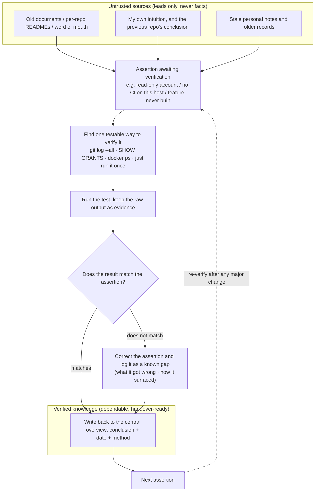

## Background

> [!IMPORTANT]
> **The core pain: taking over another product line's back-office system — six repos (back-end API, admin front-end, a Node WebSocket service, an Electron customer-service desktop app, deployment configuration, and a standalone account platform) spread across two hosts, with the original developer no longer on the team. Older documents and per-repo READMEs existed, but many statements no longer matched reality — and there was no way to know *in advance* which sentences were right and which were wrong.**

- **Zero baseline trust**: the host topology, keys, and database connection details recorded in the old documents turned out, once tested, to be **largely inverted or already invalid**. The problem was not "the docs contain errors" — that is normal. The problem was that **correct and incorrect statements were mixed together and looked exactly alike**, so the trustworthiness of the whole document had to be reset to zero and rebuilt.
- **Each repo followed different rules**: all six repos looked structurally similar on the surface (Git + GitLab CI), but branch merge direction, CI trigger rules, and deployment mechanisms were **different in every one of them**. Applying one set of assumptions across all of them does not merely produce a wrong guess — it produces a wrong action, such as installing a guard rail on the wrong branch.
- **Nobody to ask on demand**: the original developer was no longer on the team. The only cross-check available was a colleague still familiar with the surrounding system (who did not necessarily know every detail either), so most questions had to be answered by testing them myself.

What this page records is not "I wrote a document." It is **the process used, with no trustworthy baseline, to convert guesses one at a time into facts that can be relied on**. The methodology is the real output of this project; the document is only its carrier.

## Core Methodology

> [!NOTE]
> These seven rules are not abstract best practices. They were distilled **after at least 10 occasions on which a document or an intuition was refuted by an actual test**.
> Every rule maps to a real mistake in the [pitfalls table](#pitfalls-in-practice) below — which is exactly why the methodology is portable and checkable:
> a reader can trace "which rule caught which mistake" instead of having to take my word for it.

1. **Treat documents as leads, never as facts (evidence-based exploration)** — any assertion found in a document ("this is a read-only account," "this machine has no CI," "this hook points in direction X") must be verified by hand *before* any decision depends on it: `SHOW GRANTS`, `git log --all`, SSH in and run `docker ps`. "Before" is the operative word — discovering an assertion was false afterwards means the cost has already been paid. (Maps to pitfalls #1, #2, #4)
2. **Never conflate "I could not find it" with "it does not exist"** — when evidence for something cannot be found, the default assumption should be "my search method is wrong," not "this feature was never built." This happened twice: once a control feature appeared to be unimplemented when in fact a connection setting simply pointed at the wrong name for the server-side location; once an entry point was assumed to live in the admin back-office when it actually lived in a separate service's own interface. (Maps to pitfalls #6, #9)
3. **Verify every repo on its own; never copy the previous repo's conclusion** — among four repos that looked structurally identical, one had a **completely inverted** branch merge direction. This is the most dangerous class of error, because verifying the first three correctly creates the illusion that the rule is now understood. Without checking each one, a guard rail ends up installed on the wrong branch — and installing it raises no error at the time.
4. **Use timestamps for forensics, not just commit messages** — the precise timestamps from `git log --format="%ad"` distinguish "these tags were fired off in a burst while debugging CI" from "this really is a steady release cadence." Commit messages alone cannot tell those apart, and the distinction directly determines how a repo's release rhythm should be described to whoever comes next. (Maps to pitfall #3)
5. **Names and directories get changed by people; re-list the current state before acting** — one location was renamed twice within a short period, and the error message gave no hint that "this is the old name" — it only said "path not found." **The failure message itself carries no diagnostic value**, so the only defence is re-listing the directory before operating, rather than relying on memory.
6. **When you catch your own judgement being wrong, correct it outright** — over this process I reached a wrong conclusion at least **3** times (whether a registry location needed a documentation fix, the severity rating of one risk, and the access-scope assumption behind a threat model). Each time the correction came from re-checking the evidence and **proactively revising**, rather than defending the original call. The reason this belongs in the methodology instead of being hidden: in exploration with no trustworthy baseline, reaching wrong conclusions first is close to inevitable, and what actually determines the document's final trustworthiness is **how fast the error is corrected and whether "what it was wrong about" is recorded alongside it**. A document containing only the correct conclusions leaves the next reader unable to tell which conclusions were ever verified.
7. **Write findings back into one central document as you go — not into the chat or your head** — every fact discovered and every decision made goes straight back into the same overview, annotated with the **verification date and the method used**. That has three effects: the same thing never has to be looked up twice; whoever takes over sees the reasoning rather than only the conclusion; and on a later review it is immediately visible which conclusions have aged enough to need re-verification.

## The Assertion-Verification Loop

In practice those seven rules are one loop. Every fact that makes it into the overview document has to travel the full circle from the untrusted sources on the left before it may enter the verified knowledge on the right:

- **What the boundary is for**: nothing inside the left-hand box may be used for a decision — including a conclusion I verified myself in the previous repo minutes earlier. Everything in the right-hand box carries "when and by what method it was verified." That boundary is the only substantive output of the whole method — **a document's value is not how much it says, but whether the reader can tell which sentences were verified**.
- **"Does not match" means recording the gap, not silently rewriting**: the corrected conclusion is written back together with "what it was originally believed to be, and how the mismatch surfaced." A wrong assumption is itself useful information — it marks a spot where intuition misfires, so the next person arrives at the same pit with a warning already in front of them.
- **The loop has a return edge**: verified knowledge also expires. The dashed edge is drawn deliberately — after any major change the facts have to be re-verified, or this overview becomes the next "untrustworthy old document" itself.

## Highlights

- **A 1,700+ line, continuously maintained architecture overview**: covering each of the six repos' roles, a database map, host and network topology, a known-risk list, and deployment procedures. The line count is not the point — the point is that **every entry is annotated with the date and method by which it was verified**, rather than written from impression. That is also what makes the document itself auditable.
- **10+ doc-vs-reality assertions found and corrected** (see the pitfalls below). Each one was capable of causing a misjudgement or a wrong operation at the moment it mattered — and before being tested, each looked exactly like a correct statement.
- **A branch-and-deployment rule document for all six repos**, explicitly flagging **which repo runs in the opposite direction**, so the next person (including future me) does not inherit the wrong assumption.
- **Repetitive operational work distilled into a reusable tool**: the procedure for a reconciliation maintenance tool was written up as a repeatable playbook, so the same situation no longer requires re-reading the source to decide what to do.
- **A broken CI type-check fixed along the way**: it moved from "pending decision" in the old documents to "root cause identified, risk and effort assessed, fixed." Small in itself, but it demonstrates a by-product of exploration — **once the current state is actually established, things that looked like technical debt frequently turn out to be things nobody had looked at**.

## Pitfalls in Practice

In the table below, the point of each row is **the error class in the second column**, not what any single row happened to find. The specific facts are valid only inside this system; the error classes transfer directly to the next unfamiliar system as a checklist.

| # | Error class | Initial assertion | What testing showed | Verification method |
|---|---|---|---|---|
| 1 | Topology taken on faith | The two environments are network-isolated from each other | The documented reachability between the two environments did not match the test | Simply attempted the connection |
| 2 | Credential assumption unverified | A personal key on hand would work | The key was not registered in the target host's `authorized_keys`, so it could not connect | Direct SSH test + inspecting `authorized_keys` |
| 3 | A stale comment read as current state | One repo's image-registry location was recorded wrongly and the doc needed fixing | The current state was in fact correct; that line was a stale comment nobody had removed | Cross-checked with a colleague familiar with the system + compared commit timestamps |
| 4 | Privilege scope never actually queried | The game database used a read-only account (as documented) | Once tested, the privilege scope did not match what the documentation stated | `SHOW GRANTS FOR CURRENT_USER()` |
| 5 | Threat model misapplied | The host is shared with other projects, so unrelated people can reach my things | The actual access scope was far narrower than assumed; the threat model call was wrong | Cross-checked with a colleague familiar with the system |
| 6 | Looked in the wrong place, concluded "never built" | The manual trigger for a reconciliation maintenance tool lives in the admin back-office | Not in the back-office — it lives in the Node WebSocket service's own internal-only interface | Grepped the source of both front-end repos separately |
| 7 | Branch relationship taken on faith | The back-end API's and admin front-end's `qa` branches only track `main` passively | Each `qa` branch held 2 independent commits that had never reached `main` — they had genuinely diverged | `git log origin/main..origin/qa` |
| 8 | Conclusion copied across repos | The standalone account platform, like the other three repos, treats `main` as its trunk | **Exactly the opposite** — `qa` is the trunk, and the `origin/HEAD` default branch points at `qa` too | Checked each branch graph individually + cross-checked with a colleague |
| 9 | "Can't find it" read as "hidden somewhere" | The official site's architecture document must be hidden somewhere | Nobody had ever written one; the root README covered only the API, and the site's code was added later with no doc written after the fact | Read the full README + directory structure directly |
| 10 | A small problem imagined as large debt | The broken CI type-check is complex compatibility debt | Just a version upgrade plus one wrong configuration value; the errors it surfaced were only **5** unused variables | Ran `npx vue-tsc --noEmit` directly for the real error output |

A few rows deserve to be called out:

- **#8 is the most dangerous row.** Verifying the branch direction correctly in the first three repos creates the illusion that the rule is understood; the fourth is the exact inverse. Carrying the earlier conclusion forward would install the `pre-commit` hook on the wrong branch — and **installing it would raise no error at the time**. The failure only surfaces once someone actually commits to the wrong branch and finds the guard was never active. This row is what rule 3 rests on.
- **#6 and #9 are the same error facing two directions.** #6 is "couldn't find it, so it was never built" (it lived in another service); #9 is "couldn't find it, so it must be hidden elsewhere" (nobody had ever written it). Both come from **treating "my search returned nothing" as a conclusion about the system rather than a conclusion about the search**.
- **#4 leaves behind a method, not an answer.** The reusable part of that row is "**always ask `SHOW GRANTS` directly for anything privilege-related instead of trusting the description**" — a document saying read-only does not make it read-only, and the verification costs one command, far less than the cost of the misjudgement.
- **#10 points the other way**, which is worth keeping alongside the rest: exploration does not only underestimate problems, it also overestimates them. An item filed as "complex compatibility debt, pending decision" turned out to be a version bump plus one setting — the real cost was **that nobody had run the one command**.

## Reusable Deliverables

What remained after leaving this system was a set of deliverables with clear roles, rather than conclusions scattered through a conversation:

- **An architecture and operations overview**: the six repos' roles, a database map, host and network topology, a known-risk list, and deployment procedures — every entry annotated with its verification date and method.
- **A cross-repo branch and release-rule document**: each repo's trunk branch, merge direction, CI trigger conditions, and deployment mechanism, with the inverted one flagged.
- **An architecture write-up for the official site**: previously nonexistent, now written into that repo so the next person does not have to reverse-engineer it.
- **A build-and-release guide for the customer-service desktop app**: the packaging and release flow for the Electron app, which had previously existed only as the original developer's habits.
- **A reusable playbook for a reconciliation maintenance tool**: recurring operational steps pinned down, so the source no longer has to be re-read each time to decide the procedure.
- **Local `pre-commit` hooks in four repos**: blocking commits to the wrong branch, moving the easily-misremembered knowledge of "which branch is this repo's trunk" out of human memory and into tooling.

## Difficulties

- **There was no shared checklist for "how to determine this repo's rules"** — every repo had to be worked out from scratch (branch list → `origin/HEAD` default branch → CI trigger rules → merge direction → deployment mechanism), with no single-pass method available. And precisely because the previous repo's conclusion cannot be copied, this cost is **multiplied by the number of repos** and cannot be amortised by growing familiarity.
- **Documents and note systems expire too** — paths, keys, and topology judgements recorded during exploration were later refuted by actual operations (a directory renamed, a new key adopted). This is the most counter-intuitive part: **the document I produced to solve the problem of "untrustworthy old documents" will, without a re-verification habit, become the next untrustworthy old document itself**. The verification dates in the overview are therefore not decoration — they are the only basis for judging whether an entry can still be trusted.
- **The cost of a wrong judgement is asymmetric** — some errors (searching in the wrong place) only waste time; others (a branch direction installed backwards, assuming an account is read-only) leave behind guard rails that fail silently. The hard part is that **the two look identical until they are verified**, so every assertion a decision will rest on has to be verified — "this one feels fine" is not a usable filter.

## Next Steps

- Distil the exploration checklist derived here (branch list → `origin/HEAD` → CI trigger rules → merge direction → deployment mechanism → test the load-bearing assertions) into a general procedure, so the next unfamiliar system can be onboarded by following the process rather than re-deriving the methodology.
- Periodically (for example after every major change) re-check the overview against reality and refresh the verification dates — so that return edge actually gets travelled instead of merely being drawn on the diagram.
