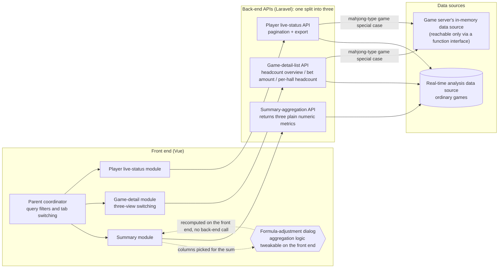

## Background

The legacy version was a single page component (712 lines) with five years of accumulated patches, plus a 232-line auxiliary settings file. One tangled API returned three kinds of data — summary, game list, and player list — all mixed together, so a problem in any one block broke the whole page, and none of them could be paged or cached independently. Worse, the summary values were not plain numbers but color-coded HTML strings (e.g. `<span style="color:red">123</span>`), and figures from different versions were joined by direct string concatenation, leaving the front end unable to do any arithmetic on them.

And the surface this one page has to cover is not small: 116 games with up to 11 distinct multipliers, all of which had to fit into the same fixed set of table columns.

Four teams each raised very different pain points:

- **CEO**: to preview everything at a glance on a phone, all games' headcount and bet amounts were crammed into a single row — information density too high, hard to read.
- **Operations director**: the report used color strings (`<span style="color:red">123</span>`) to distinguish parameters, figures from different versions were concatenated as strings, and the output was unrecognizable — impossible to tell what each number meant.
- **Tech lead**: the columns were originally designed for only four multiplier slots, which could not even hold the multiplier variants the existing games already had; combined with five years of patches, the data structure was unreadable and badly needed a refactor.
- **Risk-control**: needs to report figures regularly, but because column meanings were unclear, often had to ask a developer to confirm what a column meant.

> [!IMPORTANT]
> The legacy tangled API returned summary, game list, and player list all in one response, and summary values came back as color-coded strings — leaving the front end unable to handle any one block independently.

## Goals

Split the "online member" page into three independent modules (summary / game detail / member live status), each with a dedicated API, independent pagination logic, and column definitions; and make the summary formula adjustable on the front end, so the back end no longer has to change on every request.

Out of scope: the auto-refresh countdown (requirement withdrawn, removed).

## Highlights

- **Four teams satisfied in one release**: the CEO's mobile-friendly row, operations' clear columns, the tech lead's structural refactor, and risk-control's explicit numbers — all shipped in the same release.
- **Batch filtering by hall category**: the game selector can batch-filter by "hall category" (multiplier / type), far better for analysis than ticking games one by one, sharply cutting the cost of filtering.
- **Front-end-adjustable summary formula**: the CEO frequently changes the definition of "total lobby headcount"; a formula-adjustment dialog lets anyone tweak the aggregation logic live in the UI, no code change needed.
- **Multi-view game detail**: added a per-hall headcount (game detail) mode where each of the 116 games shows four per-hall headcount columns (multiplier columns 1-4), padded with 0 when fewer than four, with card-and-board games excluded automatically.
- **Color coding removed**: summary values changed from color strings to pure numeric columns, so the front end does arithmetic directly and the string-concatenation corruption is gone.

## Quantified Results

| Metric | Before | After |
|------|--------|--------|
| Front-end main file lines | 712 lines (single page component) | ~190 lines (parent) + 7 sub-modules |
| Auxiliary settings file | 232 lines (mixed into one file) | 3 independent column-definition files |
| API count | 1 (all-in-one) | 3 (each with a clear responsibility) |
| Supported multiplier columns | 4 (hard-coded) | dynamic multiplier columns 1-4 (auto-padded with 0) |
| Summary formula adjustment | change back-end code | live front-end UI adjustment |
| Color-coding dependency | yes (no arithmetic possible) | none (pure numbers) |
| Export coverage | player list only | player list + game detail |

## Solution & Architecture

After the split, each front-end module maps to exactly one API, and each API decides on its own which data source to reach for — the responsibility boundaries and data flow look like this:



### API Split (Laravel)

The legacy tangled API packed all three blocks into one response, so a problem in any one block affected the whole page and none could be paged or cached individually. After the split, each API has a single responsibility, with independent call timing, pagination logic, and error handling.

| Old API | New API | Responsibility |
|--------|--------|------|
| single tangled API (all-in-one) | summary-aggregation API | three-metric summary |
| same as above | game-detail-list API | game detail (supports headcount overview / bet amount / game detail — three views) |
| same as above | player-live-status API | player live-status list (with pagination + export) |

### Vue Component Split

The legacy version concentrated all logic in a single page component, so any change meant locating it within 700 lines; after splitting into sub-components, each module owns only its own template and columns, the parent only coordinates, and new requirements go into the relevant sub-module without affecting other tabs.

| Old structure | New structure | Responsibility |
|--------|--------|------|
| single page component (712 lines) | parent coordinator component | parent coordination |
| auxiliary settings file (232 lines) | summary-render component + summary-normalization module + column definitions | summary rendering and formula |
| same as above (game-detail part) | game-detail component + column definitions | game-detail three views |
| same as above (player-list part) | player-live-status component + column definitions | player live status |

## Onboarding a New Game: the Split Validated After the Fact

Two months after the refactor a real test case showed up: a new mahjong-type game had to appear on this page, but it **writes nothing** to the reporting side's real-time analysis data source — player state lives only in the game server's in-memory data source, reachable only through a function interface the game server exposes. It was the first game on this page whose data was not in the reporting database at all.

Because the three APIs were already independent, this heterogeneous data source only needed a special case at each API's own dispatch point, with no interference between them (interface segregation): the summary-aggregation API needed no change at all, while game detail and the player list each handled it at their own insertion point. **Onboarding a new game did not require touching anyone else's path** — with the original all-in-one API, the same job would have meant adding conditionals inside a single method that tangled three responsibilities together.

The four insertion points each needed different handling:

- **The game-detail list is a two-stage loop** (first build "game × multiplier" tuples, then query per tuple), so the special case has to "skip in stage one, inject only after stage two finishes" — otherwise it queries a table that does not contain this game at all.
- **Headcount-overview mode** injects the actual at-table headcount; **bet-amount mode** simply fills 0 — the function interface has no bet amount, so there is no point issuing the call at all.
- **Per-hall headcount mode** intercepts and fills only the matching column, padding the rest with 0.
- **Player live status** attaches the rows by player ID and then reuses the existing column-enrichment pipeline entirely, without opening a second path.

## Error Handling & Operations

- **Graceful degradation**: the envelope coming back from the function interface is guarded layer by layer with `is_array()` + `isset()`, so a missing key from the game server degrades to a headcount of 0 rather than a whole-page 500 (the full story is in the pitfalls below).
- **Observability**: both parse-failure points log the raw envelope alongside the failure — otherwise all that survives is "0 people", with no way to tell "genuinely nobody" from "the query interface is down".
- The three refactored APIs themselves have no dedicated monitoring or alerting.

## Difficulties & Pitfalls

**Worst pitfall — summary values were concatenated as strings**

- *Symptom*: the operations director reported that "the total game headcount is sometimes `123456`, sometimes a weird long string starting with `1234`."
- *Misdiagnosis*: assumed an intermittent API response-format anomaly; checked the server log and confirmed the numbers were correct.
- *Real root cause*: the legacy summary value was assembled directly into `"<span>123</span><span>456</span>"`, and the front-end `+` operator joined the two strings instead of adding them.
- *Fix*: the back end returns pure numbers only, and the front end does the aggregation uniformly.

```js
// Symptom: the back end returned tagged strings, not numbers
const a = '<span style="color:red">123</span>';
const b = '456';
a + b;            // "…123…456" → a weird long string on screen, not 579
Number(123) + Number(456); // 579 → fix: back end returns pure numbers, front end does the math
```

Because the back-end logs showed correct numbers, it was first misdiagnosed as an intermittent API glitch, and it took a detour to trace the real cause to a front-end type issue; that is exactly why the fix hardened the rule that summary values may only be returned as `number` and must never carry any HTML tag.

A few other pitfalls cleared along the way:

- **Removing color strings**: the legacy summary values were strings carrying `<span>` tags, so splitting them required changing the Laravel response format, the Vue display logic, and the aggregation calculation all at once — three places that had to move together.
- **Asymmetric multiplier columns**: the multiplier list length varies across games (1–11); the old version padded some with 0 and simply didn't show others, an inconsistent logic. This was unified to output multiplier columns 1-4, always padding with 0 when fewer than four, mapped by the multiplier list's index (not by value name, since the same index maps to different multiplier values across games).
- **Excluding card-and-board games**: card-and-board games have more than four multiplier values and must be silently filtered in game-detail mode (excluded on the back end, still selectable in the UI), but the filtering must not affect the headcount-overview mode.

**Two pitfalls from onboarding a heterogeneous data source**

The first: **`empty()` does not stop "non-empty but missing a key", and the result is a whole-page 500 instead of degradation**. Under `error_reporting(-1)`, Laravel 5.7's `HandleExceptions` turns an `E_NOTICE` into an `ErrorException`, so when the envelope from the game server is missing a key, what you get is not the "degrade to a headcount of 0" the spec expected but a straight API 500 — writing `empty()` had merely created the illusion that the case was already guarded.

```php
// Schematic: the wrong way — the envelope is non-empty but missing a key,
// so the next line's key access raises E_NOTICE → ErrorException → whole-page 500
if (!empty($envelope)) {
    $tables = $envelope['data']['list'];
}

// The fix: guard layer by layer with is_array() + isset(); on a missing key,
// degrade to a headcount of 0 and log the raw envelope with it
if (is_array($envelope) && isset($envelope['data']) && is_array($envelope['data'])
    && isset($envelope['data']['list']) && is_array($envelope['data']['list'])) {
    $tables = $envelope['data']['list'];
} else {
    $tables = [];  // degrade: treat as 0 people instead of taking the page down
    Log::info('Unexpected response shape from the query interface, raw envelope: ' . json_encode($envelope));
}
```

When parsing an envelope-style external API, `empty()` only covers null and empty arrays; the moment the next step reaches into it for a key, it has to be `is_array()` first and `isset()` second. And the raw envelope must be recorded on failure — otherwise, once it degrades, all that is left on screen is a 0, with no way to tell afterwards whether nobody was there or the parse failed.

The second: **the field documentation did not match the real join key**:

- *Symptom*: the new game's player rows **did come back, but every enriched column was `-`** (character name, unique code, IP, login time), while every other game was fine.
- *Why it went wrong*: the documented field table annotated one field as the "account guid", so reading it literally, that was obviously the one to join on; the field that actually matches the player master record's unique identifier was a different ID field.
- *Root cause*: the enrichment logic simply skips a row when the lookup finds nothing, leaving the pre-filled `-` untouched — **a miss raises no error**, so the symptom is empty columns rather than an exception.

When wiring up an external function interface, it is not enough to read the field descriptions' nouns; the join key has to be verified once against real data. Pre-filling `-` (rather than leaving cells blank) happened to buy a distinguishable symptom here: an all-`-` row points precisely at "the join missed" rather than "the interface returned nothing" — had the interface returned nothing, the row would not exist at all.

## Key Trade-offs

**Formula adjustment on the front end, not the back end**

- Rejected option: have the back end compute the "total headcount" and let the front end just display the result.
- Reason for rejection: the CEO frequently changes "which kinds of people count toward the total"; on the back end each change would mean a code change plus a deploy, whereas on the front end it is just a config change.
- Choice: a formula-adjustment dialog lets the user tick "which columns to sum" in the UI, with the result held in front-end state and reset on refresh (intentional design, since the CEO's adjustments are mostly ad hoc and don't need to be persisted).

**Game detail is not paginated**

- Rejected option: pagination + server-side sort (mirroring the existing headcount overview).
- Reason for rejection: the game-detail dataset is just the number of games (roughly 50–100 rows after excluding card-and-board), so a full front-end sort is more than enough; a paginated sort only sorts the current page, contrary to the user's expectation of sorting everything.
- Choice: the back end returns the full set at once and hides pagination, and the front end does the client-side sort.

**Currency filtering for the heterogeneous data source: joining two function calls in memory**

- Context: the mahjong-type game's "players at table" query returns **no currency field**, and that game runs two currencies over the same set of tables; this page's established definition excludes the halls of the other virtual currency (Q-Coin), which a separate flow handles independently. Skipping the filter raises no error — it just inflates the headcount, and "no error, just a wrong number" is the hardest kind to notice.
- Rejected option A: read the currency straight from the configuration table. What the player carries is a runtime-generated table id, which does not match the configuration table's primary key, so the join is impossible; and the configuration table and the in-memory data source can be out of sync anyway.
- Rejected option B: call per table, once for each table of the target currency. That turns into N HTTP calls.
- Choice: issue one extra "active tables" query (returning table id + currency), build a "table id → currency" lookup in memory, match the player's table against it, and keep only the target currency. Two HTTP calls, fixed; both datasets are runtime views of the same moment, so they cannot contradict each other; and wrapping it in one shared fetch helper lets all four insertion points share the same filter.

## Future Plans

- The per-hall headcount column labels (named by multiplier / hall) are currently hard-coded in the column-definition file, and would need updating in sync if the multiplier order changes in the future.
- The formula-adjustment dialog's checkbox state resets on refresh, which is an intentional design: the CEO's adjustments to the definition of "total lobby headcount" are mostly ad hoc (for a stretch of time, say, instant-play should not count), and persisting them would let a stale setting interfere with whoever looks at the page next — not persisting it is not an omission. If persistence is ever genuinely needed, the options are the user's own browser (localStorage) or a back-end user-settings table (which works across devices), to be added when the requirement actually appears.
- Game detail currently aggregates all member types (formal + offline + trial + no-account + personal-seat); splitting them out by type would require additional columns.

## File Structure

**Before (deleted)**

```
Online Member page/
├── single page component   (712 lines, everything mixed together)
└── auxiliary settings file (232 lines)
```

**After (added)**

```
Online Member page/
├── parent coordinator component    (~190 lines, coordination only)
├── summary module/
│   ├── summary-render component
│   ├── summary-normalization module
│   └── column definitions
├── game-detail module/
│   ├── game-detail component       (three-view switching)
│   └── column definitions          (headcount overview / game detail)
├── player-live-status module/
│   ├── player-live-status component
│   └── column definitions
└── formula-adjustment dialog       (formula-adjustment UI)
```

The single refactor touched 13 files with a net change of about +928 / -1068 lines, with the new structure fully replacing the old monolithic file.
