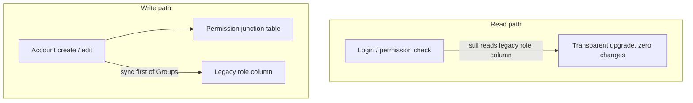

## Background

- In the legacy system, each back-office account could map to only one role (the legacy role column holds the permission-group number the account belongs to, matching a group number in the role-definition table, which determines the features and operations visible in the back office).
- Composite needs (e.g., planner + numbers + team-lead) forced creating a dedicated role each time, accumulating large numbers of one-off roles over the long run.
- People in the same position but with different feature combinations either shared one over-broad role, or incurred very high cost when managed separately.
- "All permissions" (group number 0) could not be mixed with other roles, leaving its boundary behavior ill-defined.

## Goal

Add a junction table so one account can bind multiple roles; the back end merges each role's rule string and sends the whole set to the front end. The legacy role column is kept to stay compatible with existing read paths, leaving the current login and permission-verification flow untouched.

## Highlights

- Created a permission junction table (`sn`, `account`, `groupNum`, `unique(sn, groupNum)`) so one account can bind multiple role groups.
- Implemented the `mergePermissions()` algorithm on the back end: it unions the suffix characters of multiple rule strings and sends the merged `ruleMerged` to the front end, so the front end no longer parses rules itself.
- A Seeder automatically migrates every account's existing role value into the new table — a zero-downtime upgrade with legacy data fully preserved.
- Front-end multi-select UI: groups switched to checkbox multi-select; "all permissions" can only be selected alone — once chosen, no other group can be added (intercepted by a UI dialog).
- The legacy role column keeps being written in sync (with the first group number), so existing code that reads it upgrades seamlessly.

## Quantified Results

| Aspect | Before | After |
|--------|--------|-------|
| Max roles per account | 1 | Unlimited (deduped by unique(sn, groupNum)) |
| New role needed for composite needs | Required | Not needed — just pick an existing combination |
| Front-end rule parsing | Front end looks it up itself | Back end pre-builds `ruleMerged`, used directly |
| Upgrade downtime | — | 0 (Seeder hot upgrade) |

## Solution & Architecture

### Database layer

| Table | Change | Notes |
|-------|--------|-------|
| Back-office account table | Legacy role column retained | Compatible with old paths; synced to the first group number on write |
| Role-definition table | Unchanged | Role definitions and rule format stay the same |
| Permission junction table | **New** | Account ↔ role many-to-many; unique(sn, groupNum) prevents duplicates |

```sql
CREATE TABLE account_role_map (
  id         BIGINT AUTO_INCREMENT PRIMARY KEY,
  sn         INT NOT NULL,
  account    VARCHAR(...) NOT NULL,
  groupNum   INT NOT NULL,
  created_at TIMESTAMP DEFAULT CURRENT_TIMESTAMP,
  UNIQUE KEY uq_sn_group (sn, groupNum)
);
```

### Back-end layer

| Method | Purpose |
|--------|---------|
| `getAccountGroups($account)` | Query the junction table; fall back to the legacy role column if empty |
| `setAccountGroups($account, $groups)` | Clear-old-write-new in a transaction + sync the legacy role column (taking `$groups[0]`) |
| `mergePermissions($groupNums)` | Read multiple roles' rules, union the suffix characters, and reassemble |
| `getGroupNames($groupNums)` | Return a groupNum → name lookup map |

**Core of the rule-merge algorithm:**

```
rule format: "1-1_A,1-2_,1-4_AB"
each segment = key_suffix; every character in the suffix is an independent sub-permission

merge steps:
1. explode each group's rule string → ["1-1_A", "1-4_B"]
2. split key / suffix on _
3. union the suffix characters for the same key (dedupe + sort)
4. reassemble → "1-1_A,1-4_B" (if both have 1-1 with suffixes A and B → "1-1_AB")
5. special case: ["all_"] outputs "all"
```

### Front-end layer

| Component | Change |
|-----------|--------|
| Account list page | Reads `Groups[]`; the permission column now shows group names joined by ", " |
| Group-selection component | Removed the "unassigned (-1)" option; disabled the old management field (replaced by multi-select) |
| Account create / edit component | Groups switched to multi-select; validates that "all permissions" (group number 0) cannot be selected alongside other groups |
| Front-end store | Removed deprecated merge state |

### Compatibility strategy



## Difficulties

- Merging rule strings required hand-parsing the format (a character-level union over `key_suffix`), with many edge cases (empty suffix, multiple characters, the special all-permissions value).
- The junction table's unique key had to account for both `sn` (the account table's primary key) and the account string, to avoid trouble from the rare case of the same account under different `sn`.

## The Most Painful Pitfall

### Symptom 1: all permissions (group number 0) would not persist to the junction table

"All permissions" is not "unassigned" in this system — it is a real, meaningful value whose role-group number happens to be `0`. Early in the revamp, setting all-permissions simply would not persist: checking it did nothing. The first instinct was to look at the front end — was the checkbox failing to send the value? Only after adding logs did it become clear the value *was* reaching the back end, which was silently swallowing it.

The root cause was the initial filter `return $g > 0;`: `0 > 0` is false, so the legitimate "all permissions" value was discarded as noise.

```php
// Pitfall: 0 > 0 is false, so "all permissions" (group number 0) gets filtered out entirely
$groups = array_filter($input, fn($g) => $g > 0);

// Fix: check for null / empty string instead, letting the legitimate 0 through
$groups = array_filter($input, fn($g) => $g !== null && $g !== '');
```

That is why any field where `0` carries business meaning should be guarded by null / empty checks rather than a magnitude comparison like `$g > 0` — in PHP's `array_filter`, `0` is itself falsy.

### Symptom 2: all permissions merged to "all_" instead of "all"

For "all permissions", the role-definition table stores the rule as `"all"` (no underscore), but `mergePermissions` parses by the `key_suffix` format: `"all"` with no underscore → key = "all", suffix = [] → reassembled as `"all_"`, which front-end validation rejects because it expects `"all"`. The fix special-cases the merged result, restoring `["all_"]` back to `["all"]` — when a string-format algorithm meets a special value that doesn't follow the format, special-casing it is steadier than forcing the general logic on it.

## Key Trade-offs

| Decision | Choice made | Rejected alternative | Rationale |
|----------|-------------|----------------------|-----------|
| Migrating legacy accounts | One-time Seeder migration | Lazy-init on first read | A Seeder lets you verify data integrity right after deploy; lazy-init carries a "first read is stale" race |
| Fate of the legacy role column | Kept and kept in sync | Rip it out, switch everything to the new table | Many code paths read it directly; ripping it out has too large a blast radius. Keeping it synced means existing read paths change nothing and upgrade transparently |
| Where permissions are merged | Server-side | Front-end parsing | Front-end rule parsing carried legacy baggage and was hard to maintain; a single server-side merged output is cleaner, and the front end just consumes it |

The common thread across all three is trading "rewrite + big change" for "compatibility + sync", keeping the seam between old and new systems as small as possible — which is what makes the zero-downtime hot upgrade achievable.

## Future Plans

- The permission-change API currently batch-updates only the legacy role column; supporting batch multi-select assignment would require updating the junction table in sync.
- Permission loading after back-office login still reads only the legacy role column plus a single role's rule; making multi-role truly effective would require the login flow to call `getAccountGroups` + `mergePermissions`.
- The permission junction table currently has no `updated_at`; it can be added if an audit requirement arises.
- The business meaning of "all permissions" (group number 0) should be pinned down with a DB comment or documentation, to avoid mistakenly removing the check for `0` later.

## Appendix

**Reusable takeaway:** the PHP "suffix-character union" algorithm on rule strings can be dropped into any system with a similar ACL `key_suffix` format; for integer fields that may legitimately be `0`, `$g !== null && $g !== ''` is a safer filter than `$g > 0`.

**API contract (post-revamp)**

- Account list API → returns `Groups[]`, `GroupNames[]`, `ruleMerged`.
- Create / edit account API → receives `Groups[]`, triggering `setAccountGroups`.
- Permission-change API → still only updates the legacy role column (multi-group batch not yet supported).
