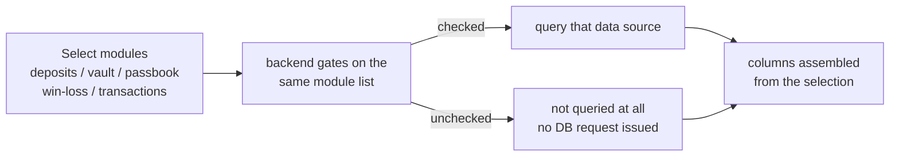

## Background

> [!IMPORTANT]
> **Core pain point: risk-control needs a net-café's top-20 players' full-month cash flow, but the data is scattered across 5 pages in inconsistent formats.**

- **Tedious lookup steps**: every player required opening five pages — account passbook, character win/loss, transfer center, mail center, and member lookup — each queried and consolidated by hand.
- **Top-20 = at least 20 rounds of manual work**: the net-café ranking lists 20 players at a time, each needing at least 5 pages, making the manual cost for risk-control extremely high.
- **Inconsistent field definitions**: the APIs mixed OpenID / GUID / accountId as primary keys, making it easy to match the wrong player.
- **No batch export**: none of the existing pages supported exporting multiple players to CSV at once.

## Objective

Build a player-centric cash-flow report page that integrates 6 data sources — replacing the page-by-page manual lookup across 5 back-office pages — supporting single lookups, batch queries (up to 20 players), and a cross-page "Top-20 one-click export" from the net-café ranking page; every result downloads as one CSV.

## Highlights

1. **One row consolidates 6 data sources**: OpenID, GUID, character name, deposit points, C-coin obtained after deposit conversion, total game win/loss (with per-game detail), transfer-in total and detail, and transfer-out total and detail — all on the same page in the same row.
2. **Batch query**: paste or import a list of GUIDs / character names (up to 20), query all players at once, and produce a multi-row CSV.
3. **Net-café Top-20 one-click export**: click the button on the ranking page → pass parameters via sessionStorage → auto-navigate → auto batch query → auto-download last month's CSV; fully hands-off.
4. **Backend reuses existing logic**: win/loss consolidation calls the existing game win/loss Controller and transfer consolidation calls the existing transfer-query logic, with no reimplementation.
5. **Multi-line CSV cells don't get truncated**: per-game detail and transfer-in/out detail are joined with `\n` and escaped with standard double quotes (not the `="..."` Excel-formula format), so cells render line breaks correctly in Excel.
6. **Batch-query performance tuning (all three phases batched)**: after `pcntl_fork` proved useless under the production web SAPI (see Pitfall 2), all three phases moved to batched IN-clause queries: Phase 1 batched member lookup (1 JOIN), Phase 2.5 batched transfer summary (2 IN-clause queries replacing N×4), Phase 3 batched win/loss (statistics-table batch + sequential fallback for real-time gaps). A 20-player batch on production dropped from 4–5 minutes to **15–20 seconds**.

## Quantified Results

| Metric | Before | After |
|------|--------|--------|
| Look up top-20 players' cash flow | 5 pages × 20 players ≈ 100 manual operations | 1 click, CSV downloads after a short wait |
| Batch cap | none (single lookup only) | 20 on the frontend, 100 backend safety valve |
| Data-source integration | 5 scattered pages | 1 CSV, 1 row = 1 player |
| 20-player batch time (production) | sequential foreach: **4–5 min** | three-phase batch: **15–20 s** (production) / **1.8 s** (QA) |

> [!NOTE]
> Measurement basis: the adopted IN-clause batch approach measured QA sequential 5.9s → batch 1.8s (**3.2×**). Evidence for the rejected `pcntl_fork` approach: 20 players × 3 DB queries, ≈ 10,500ms I/O per player, ~210,000ms sequential vs ~10,700ms forked; but the production web SAPI cannot fork, so it was not adopted (see Pitfall 2).

## Solution & Architecture

### Frontend (Vue 2)

| Component | Responsibility |
|------|------|
| Cash-flow report main page | `activated()` reads sessionStorage for cross-page triggering, consolidation, and CSV export |
| Batch-query dialog | holds type / text state, CSV parsing, 20-item cap UI |

**Single-lookup flow:**

1. Look up member identity (Type=2 GUID / Type=3 character name) → obtain GUID, OpenID, and account ID (accountId).
2. `Promise.all` in parallel: deposit summary / game win-loss / transfer summary.

**Cross-page trigger (net-café ranking page → cash-flow report page):**


- The ranking page writes `{type, list, startTime, endTime}` to sessionStorage, then navigates.
- On read, the report page's `activated()` **removes the item immediately** (to prevent a keep-alive re-activation from re-triggering), runs the batch query, and calls export automatically on `$nextTick`.

### Backend (Laravel)

| Component | Responsibility |
|------|------|
| Cash-flow report Controller | deposit summary, transfer summary, and batch summary endpoints |
| Recharge-log Model | queries the recharge-log table (monthly partition), WHERE account ID (populated for both recharges and system manual top-ups) |
| Money-change Model | queries the cash-flow detail table (daily partition), WHERE player ID (= GUID) |

**Batch processing** (`pcntl_fork` removed, everything now batched IN-clause):

- **Phase 1 batched member lookup**: 1 "account table JOIN player table WHERE name / guid IN (...)" replaces N sequential queries.
- **Phase 2 ClickHouse**: `curl_multi` sends every player's deposit-points and coin-exchange SQL in parallel batches.
- **Phase 2.5 batched transfer summary**: 2 IN-clause queries (transfer-record table + system-letter table) replace N×4 sequential queries.
- **Phase 3 batched win/loss**: statistics-table 2× IN-clause batch + sequential fallback for the real-time gap.
- `set_time_limit(480)` / `ini_set('max_execution_time','480')`.
- After trimming and de-duplication, a 100-item backend safety valve; the frontend dialog caps at 20 (button disabled + text turns red).

**Win/loss statistics schedule:**

- Statistics run at :40 each hour over the **previous hour** (a 14:40 run tallies 13:xx).
- The real-time gap = from the last tallied hour's :59:59 to now, at most about **1h40m**.
- Batch segmentation logic: query the statistics table once for the last tallied time to get the statistics boundary; within the boundary → batch IN-clause; the gap beyond it → sequential top-up (only the gap segment, without re-tallying the statistics table); for last-month data the gap is null, so it's pure batch.

**Transfer merge**: sum amounts by the counterparty's GUID (falling back to character name) and filter out incomplete transfers.

## Follow-up Evolution: From Fixed Columns to Toggleable Modules

Collapsing five pages into one row solved the page-by-page lookup, but going live exposed a different class of problem — **this report could neither grow nor be seen through**:

- **"C-coin obtained after deposit conversion" was a black box**: one column mixed vault and passbook flows of several kinds, so risk-control saw a number with no way to break down where that C-coin came from.
- **Cash-flow item types were hard-coded as backend constants**: every new money-change type (scratch cards, free games, squad gift packs…) required a code change and a release before it showed up in the report, so maintenance could not keep pace with the game shipping new features.
- **Every query hit everything**: whether the user wanted only deposits or only transfers, the backend queried all data sources regardless — especially wasteful in batch mode.
- **Deduction items displayed as positive**: bets, purchases, and gifts — money going out — showed positive values in the detail, and the total simply summed everything, so the net figure was invisible.
- **The code legend grew without bound**: the code explanations stacked in a single column, so with many items it stretched into one long strip, in a jumbled order and with no way to download it.
- **Hard to investigate when numbers didn't reconcile**: when a stakeholder said "this column is wrong," an engineer had to read the code by hand to answer "what SQL did it actually run, against which table?"

The second phase reshaped the report into a **modular, self-extending, self-serve-verifiable** system, and its audience widened from risk-control alone to risk-control (the report), QA, and operations (self-serve reconciliation). Deliberately left untouched: the batch and cross-page export skeleton that phase one had already stabilized.

### Toggleable modules = a performance switch

The query form gained a multi-select: deposits, vault, passbook, game win/loss, and transactions — **5 modules**. The frontend assembles columns from the selection, and the backend gates on that same module list — **an unchecked module is not queried at all**, letting a batch run skip the most expensive pieces (game win/loss and the day-partitioned passbook detail) outright.



### Splitting the black-box C-coin into three meaningful columns

The single "C-coin obtained" column became three: **vault detail** (10 curated item types), **passbook detail** (44 curated item types), and **passbook total**. Each column lists "item: amount" line by line, sorted by signed magnitude, so the composition of the C-coin is visible rather than just a lump sum.

Four of those items — scratch-card purchases / prizes and purchased / versus free games — are required to "appear in the detail but not count toward the total," so the detail lines **deliberately** do not add up to the total column. The legend marks those four with an asterisk and notes "inconsistent with the total, not an error" — the wording deliberately stays direction-neutral, because those four are a mix of positive and negative, so the detail may come out either above or below the total.

### Deductions display negative, totals become net

The displayed sign is now derived from the code (a negative code means a deduction), and the total changed from "sum everything" to a signed net sum — additions add, deductions subtract. The mechanism, and the formula that holds under either storage convention, is in Pitfall 8.

### A self-extending item list: new codes need zero code changes

Passbook detail and total now automatically pick up any item in the code-definition table that is "of the money-change type and whose code falls in the reserved positive range `[118, 1000)`" — **add one row to the definition table and the report grows that item on its next query, with no code change and no release** (open-closed principle / configuration-driven).

The implementation deliberately merges *strings* rather than switching the whole query over to filtering by integer code: the definition table's name column happens to equal the cash-flow detail table's change-description column, so it is enough to merge the in-range names into the existing `whereIn` list — the query structure needs no rewrite at all. Because a batch run resolves the item map once per player, the map is memoized once per request so it cannot degrade into N queries; and if the definition table can't be read, a try/catch falls back to empty — the report still renders, only the dynamic items are temporarily missing (graceful degradation), instead of the whole report blowing up.

### The code legend: from a stacked list to a usable tool

The legend went from one column stacking downward to a **CSS grid with multiple columns** (column count decided by container width), sorted **descending** by code, **downloadable as CSV**, and showing the numeric codes alongside the names; the 4 detail-only exceptions are asterisked and placed last. The whole block was extracted into a **page-private component** (same folder, locally registered, kept out of the shared component library — see Trade-off 6), with its data consolidated into a single legend endpoint the component loads itself.

### Export query SQL: a self-serve reconciliation spec for QA

A new "export SQL" endpoint returns, for the current query, which API each module called and what SQL it ran, with bound parameters always inlined into syntax that **pastes straight into a MySQL client** (even for a module that actually runs on ClickHouse, it emits the equivalent MySQL with a note). The whole value is that "pasting it into the DB reproduces the screen": QA and operations can verify how each column was computed without asking an engineer to read the code. The approach was later distilled into a reusable internal procedure for other multi-module reports to follow.

### Before / after the modularization

| Metric | Before modularization | After |
|------|--------|--------|
| Readability of C-coin sources | 1 mixed column, impossible to break down | 3 columns (vault / passbook detail / passbook total) + per-item detail |
| Getting a new cash-flow code onto the report | change a backend constant + release | in the reserved range → **appears automatically, 0 code changes** |
| Wanting only some modules | all 5 modules queried regardless | only what's checked; unchecked modules **never touch the DB** |
| Deductions and totals | shown positive, total not a net figure | deductions shown negative, total = signed net |
| Legend as item count grows | one column growing without bound | multi-column grid, codes descending, downloadable |
| Reconciling report numbers | engineer reads the code by hand | QA hits "export SQL" and reconciles against the DB themselves |
| Batch transfer correctness | batch disagreed with single lookup (over- / under-counting) | single = batch (one shared de-duplication rule) |

### What's next

- Dynamic items currently mean "one hit on the definition table per query"; the items change very rarely, so a short-TTL cache is only worth adding if that changes.
- Automatic pickup of deduction (negative) codes waits until the game side's code semantics settle.
- The grid's column count currently follows the popover width; if the item count explodes further, scrollable category tabs are the next step.

## Most Painful Pitfalls

### Pitfall 1: sequential batch query too slow

**Symptom**: a 20-player batch over last month's data took **4–5 minutes** with the backend's sequential `foreach`.

**Root cause**: each player runs multiple DB queries (transfer + winOrLose + deposit), ~10–15s/player on production; 20 players sequentially totals 200–300s. PHP is single-process, so `foreach` can only run one player after another.

**Misjudgment 1**: assuming `set_time_limit(480)` was enough by solving the timeout — but the timeout only lets it "finish"; the wait was still unacceptable.

**Misjudgment 2**: assuming `pcntl_fork` could parallelize it → in reality the production PHP-FPM web SAPI cannot fork (see Pitfall 2); after deploy the log showed `fork=no` with no speed-up.

**The real fix**: turn "each of N players queries transfer separately" into 1 IN-clause batch query (2 DB calls instead of N×4), combined with the ClickHouse-mode win/loss query (~250ms/player × 20 ≈ 5s), bringing total time down to **15–20 seconds**. Truly parallelizing in the future would require Laravel Queue + job dispatch or the `parallel` extension, not `pcntl_fork`.

### Pitfall 2: pcntl_fork is completely inert under the production web runtime

**Symptom**: added a `pcntl_fork` fan-out; after deploy the log showed `fork=no`, it fell entirely to the sequential fallback, and there was no speed-up.

**Root cause**: by design the `pcntl` extension is CLI-SAPI-only. PHP-FPM never puts pcntl into the function table at startup, so `function_exists('pcntl_fork')` returns false. This is not something `disable_functions` controls — it is a SAPI-level restriction.

**Why it looked viable**:

| Test | Result | Problem |
|---|---|---|
| `php -r "var_dump(function_exists('pcntl_fork'));"` | `bool(true)` | this is CLI SAPI, not FPM |
| checking that `disable_functions` is empty | looks un-disabled | disable_functions can't block a function that was never loaded |

**The reliable check**: log a line inside the controller and fire a real HTTP request — you cannot test this from CLI:

```php
Log::info('pcntl=' . (function_exists('pcntl_fork') ? 'yes' : 'no'));
```

### Pitfall 3: `parameters() on null` crash (manually built Request)

**Symptom**: when the backend calls the existing game win/loss Controller with a manually built `new Request()`, `isset($req['player'])` triggers `Request::offsetExists()` → `$this->route()->parameters()`, but a hand-built Request has no route resolver, so `route()` returns null → fatal error.

**Misjudgment**: assumed it was a `$req->merge()` key issue and adjusted the merge order and key names; the problem persisted.

**Root cause**: `offsetExists()` calls `route()->parameters()`, and a manual `new Request()` has no `routeResolver`, so `route()` is null.

**Fix**: when manually building a Laravel Request object, if downstream code reads values via `isset($req['key'])`, you must supply a route resolver:

```php
$req->setRouteResolver(function () {
    return new class {
        public function parameters() { return []; }
    };
});
```

### Pitfall 4: the recharge-log table returns empty when keyed by player ID

**Symptom**: some players' "deposit points" kept returning 0 even though the backend account passbook clearly had data.

**Root cause**: the recharge-log table's player-ID column is not recorded (null) for ordinary recharges; OpenID is null for system manual top-ups; only the account-ID (accountId) column is populated in both scenarios.

**Misjudgment path**: the first revision switched to OpenID, found that system manual top-up data still couldn't be found, and only then confirmed it had to key off account ID.

**Fix**: the deposit-points sum keys off account ID in its WHERE clause, with account ID taken from the member-lookup API.

### Pitfall 5: the shared CSV-escaping helper auto-wraps multi-line values as `="..."`, which Excel truncates

**Symptom**: after CSV export, the "per-game win/loss detail" cell showed only its first line in Excel; the rest was truncated.

**Root cause**: the shared CSV cell-escaping helper normally escapes with standard double quotes `"..."` (a dozen-plus reports rely on it, and it's fine as-is). But it has a "force as text" check `/[,\r\n]/.test(str)` — **any value containing a newline `\n` is classified as needing forced text and wrapped in the `="..."` Excel-formula format**. That `="..."` formula doesn't support in-cell line breaks, so multi-line content collapses to its first line. The very trait of "being multi-line" triggered the truncation branch.

**Background: what each "force as text" rule was originally guarding against** (all guarding against Excel over-interpreting / structurally breaking CSV):

| Rule | Problem it prevents |
|---|---|
| `/^\d+:\d+$/` (digit:digit) | Excel parses `1:100` (odds) as **time** |
| `/^0\d+/` (leading 0) | Excel **eats the leading 0** (phone `0912…`→`912…`) |
| `/^\d{11,}$/` (long number) | Excel converts to **scientific notation** (order no.→`1.23E+13`) |
| `/^=/` (leading =) | Excel evaluates it as a **formula** (`=1+1`→`2`) |
| `/[,\r\n]/` (comma, newline) | CSV **structural chars**: comma = field separator, newline = row separator; unquoted, they split fields / rows |

**Fix**: this page's multi-line cells bypass the shared helper and use a page-local escaping function that only does standard double-quote escaping (`"..."` wrapping, doubling inner `"`, no `=`), so `\n` inside the quotes is correctly recognized by Excel as an in-cell line break. The shared utility is left untouched, since doing so requires confirming the other dozen-plus reports don't depend on the `="..."` forced-text effect. Plain values are safe to hand to the shared helper, but any cell that may contain `\n` (multi-line detail) must use the `=`-free standard escape.

### Pitfall 6: try/catch-based CSV-import encoding detection fails — Big5 doesn't throw on garbage

**Symptom**: importing a Big5-encoded character list worked, but importing a UTF-8 CSV turned all the Chinese character names into garbage.

**Misjudgment**: the old code wrote `try { TextDecoder('big5') } catch { TextDecoder('utf-8') }`, assuming a "try Big5 first, auto-fall-back to UTF-8 on failure" smart fallback. In reality that catch almost never fires.

**Root cause**: `TextDecoder('big5').decode()` **does not throw** on bytes it can't read — it silently emits the replacement character `�` (U+FFFD). The catch only fires when "the browser doesn't support the Big5 decoder at all," and mainstream browsers do → the catch never fires → it always force-decodes everything as Big5, so UTF-8 multi-byte Chinese gets misread as Big5 and comes out garbled.

**The key asymmetry**:

| Decoder | Correct decode | Wrong decode |
|---|---|---|
| UTF-8 | fine | surfaces `�` (strict byte rules; illegal sequence → replacement char, detectable) |
| Big5 | fine | silently garbled, **no `�`** (almost any byte can be forced into a character) |

Only the "strict" UTF-8 decoder honestly surfaces `�` when it decodes wrong, so the detection order must be "UTF-8 first."

**Fix**: reverse it — decode UTF-8 first, check for `�`, and only switch to Big5 if present:

```js
text = new TextDecoder("utf-8").decode(bytes);
if (text.indexOf("�") !== -1) {          // not valid UTF-8
  text = new TextDecoder("big5").decode(bytes);
}
```

Verified correct for all three sources: UTF-8, UTF-8+BOM (BOM stripped automatically), and Big5. Text-encoding detection can't rely on `try/catch` (most decoders don't throw); it has to rely on "whether the decoded content is sensible": try the strict encoding (UTF-8) first, fall back to the lenient one (Big5) when `�` appears — never the reverse, because a lenient encoding fails silently and gives you nothing to catch.

### Pitfall 7: batch and single-lookup transfers disagreed — one extra layer of IP filtering

**Symptom**: for the same player, the single lookup and the batch query returned different transfer-in / transfer-out amounts, the batch sometimes over-counting and sometimes under-counting.

**Misjudgment (with the direction backwards, too)**: I initially assumed the single lookup was the broken path and wanted to make it delegate to the batch version; in fact the single lookup was the correct baseline and the batch path was the wrong one.

**Root cause**: the transfer-record table holds several rows per order — the sender's perspective has a source IP with the target IP empty, the recipient's is the mirror image, and each side additionally has a "created" and a "completed" row; the amount column is identical on every row. The batch version had added "source / target IP IS NOT NULL" on top of that, combined with per-column `MAX()`: if the row for that particular direction happened to be missing its IP, the entire order was dropped (under-counting); or `MAX()` took each column's maximum independently and assembled a field combination that never existed on any single row (picking the wrong stage). Direction should have been decided by the character identifier, which is populated on every row, not by an IP that may be empty.

**How it surfaced**: walking two real multi-row samples row by row confirmed that "the row with the latest event time has an empty IP" → the IP filter was guaranteed to miss it.

**Fix**: make the batch mirror the single lookup — a subquery pulls order IDs by the direction's character identifier (**no IP filter**), and the outer query orders by event time DESC, then groups by order ID to take each order's latest **whole row**. After the change, single = batch.

**Reusable takeaway**: when the same data has two paths (single and batch), one seemingly harmless extra WHERE clause is enough to make them non-equivalent. The batch version should be a set-based rewrite of the single version, not a re-implementation of its semantics — and per-column `MAX()` deserves particular care, since it returns each column's maximum with no guarantee those values came from the same row.

### Pitfall 8: cash-flow values store magnitude with the sign in the code — a raw SUM makes deductions positive

**Symptom**: deduction items such as bets, purchases, and gifts displayed positive in the detail, and the passbook total was "everything added up" rather than a net figure, so it wouldn't reconcile.

**Root cause**: the amount column stores the magnitude only; the meaning of the sign lives in the cash-flow code (a negative code means a deduction). This is classic sign-magnitude storage — the value itself carries no direction.

**Fix**: derive the displayed sign from the code and make the total a signed net sum:

```php
// the code decides direction, the raw value contributes magnitude only;
// correct under either storage convention
$display = ($code < 0) ? -abs($raw) : abs($raw);
$total  += $display;   // additions add, deductions subtract = net
```

That formula is correct whether the raw value is already signed or stored as an absolute value — when it is already signed, `-abs(negative)` equals the original, so it never double-flips. That means there is no need to first establish which convention each table uses.

**Reusable takeaway**: for any cash-flow table that separates magnitude from a direction code, always derive the displayed sign from the code; never SUM the raw values and call it a net figure.

### Pitfall 9: (type, code) in the code-definition table is not unique

**Symptom**: building a "code → display name" map keyed by code collides on keys.

**Root cause**: (type, code) is merely a composite index on that table, not a unique one — one negative code, for instance, maps to the bet names of two different lottery variants. (This is also why the existing curated lists have always keyed off the change-description string rather than the code.)

**Fix**: the dynamic lookup **de-duplicates by name**, taking the first row per name, and never assumes code-to-name is one-to-one. Fortunately the duplicated code sits outside the positive range used for dynamic pickup, so it doesn't affect the automatic results.

**Reusable takeaway**: before using a DB column as a map key, confirm that column combination actually carries a uniqueness constraint — "there is a composite index" does not mean "it is unique."

## Key Trade-offs

### Trade-off 1: passbook totals go through a new backend Controller, everything else uses existing APIs

**Choice**: deposit consolidation is summed in a new backend endpoint; win/loss and transfers still call existing APIs.

**Rejected option**: have the frontend call all the raw APIs directly.

**Reason for rejection**: the existing recharge-record API's return value and data structure are overly complex, costly and error-prone to handle on the frontend; simplifying it, the redesigned deposit-summary endpoint returns just two summed values — a clean structure that the batch query can reuse via the same model method.

### Trade-off 2: IN-clause batching rather than pcntl_fork / curl_multi

**Problem**: processing 20 players sequentially over last month's data measured **~210 seconds (3m30s)**, an unacceptable wait.

**Rejected option A (curl_multi)**: win/loss and transfers are direct PHP/DB calls, not HTTP requests; `curl_multi` can only parallelize HTTP, not DB calls.

**Rejected option B (pcntl_fork)**: measured ~10.7s under CLI (19.6×), but the production PHP-FPM web SAPI never loads pcntl, so `function_exists('pcntl_fork')` returns false and after deploy the log shows `fork=no` — entirely inert (see Pitfall 2).

**Current approach**: all three phases batched IN-clause — member lookup (1 JOIN), transfers (2 IN-clause replacing N×4), win/loss (statistics-table batch + gap fallback); **15–20s** on production, **1.8s** measured on QA (3.2×).

### Trade-off 4: batch queries deliberately bypass the cache in favour of a single JOIN

**Context**: the back office runs a Redis cache layer, and member data already sat behind a cache-aside layer — keyed on the player identifier, a hit skips the database entirely; that path also offers batched cache reads. The **single-player** cash-flow lookup goes through exactly that.

**Choice**: batch lookups do *not* use it. They run one member-table x character-table JOIN with `whereIn` and **never touch the cache**.

**Reasoning (it should never have been cached — not "the cache wasn't fast enough")**:

- **The key space is effectively unbounded**: this path is parameterized by "player list x date range", a combination that differs on every single run. Such a query has **no key that will ever be hit twice** — the premise of caching, that the same key gets read again, simply does not hold here.
- **It would only add memory pressure**: every entry written is a single-use key with a hit rate approaching zero — spending memory for a return that never materializes.
- **One JOIN is already fast enough**: 20 players in a single `whereIn` JOIN is **one** database round trip; going through the batched cache instead means one cache read *plus* another database call for the misses — an extra layer that is also slower.

> [!TIP]
> A reusable test: **ask "will this key ever be read twice?" before asking "is it fast?"**
> When the parameters are arbitrary user-supplied combinations (a list crossed with a date range), the answer is no — such queries call for SQL and index work, not a cache.
> The counter-example sits in the same feature: caching member data for single lookups *is* worth it, precisely because the same player gets queried over and over, so keys do get reused.

**The cost**: single and batch lookups now follow two different paths, so changing the selected fields on one means changing them on the other too — field drift is the inherent risk of this structure.

### Trade-off 3: cross-page parameters via sessionStorage, not Vuex / query params

**Choice**: `sessionStorage`.

**Rejected option A (Vuex)**: requires store wiring, and the existing project's Vuex may not have a matching module.

**Rejected option B (query params)**: stuffing 20 GUIDs into the URL pollutes the address bar and risks length limits.

**Reason for rejection**: sessionStorage needs no extra store wiring, survives navigation, and makes a one-shot removal a simple way to prevent re-triggering.

### Trade-off 5: dynamic pickup covers the positive range only; deductions get added by hand later

**Choice**: automatic pickup scans only items "of the money-change type whose code falls in `[118, 1000)`" (the curated list tops out at code 117, hence starting at 118; that whole range is positive = additive).

**Rejected option**: automatically pick up negative (deduction) codes as well.

**Reason for rejection**: the semantics of a new deduction item need a human call — should it count toward the total, is it detail-only — and there is currently no way to decide that from the code alone, so forcing the automation would sweep things into the net figure that don't belong there. The stakeholder's ruling was "add them when they actually show up," which means hand-adding them to the curated list later. The automation boundary therefore sits at "unambiguously additive items," and the part that requires judgement stays with a human.

### Trade-off 6: the legend is a page-private component, not a shared-library one

**Choice**: the legend component lives in the report's own folder and is registered locally, staying out of the shared component library's reference list.

**Rejected option**: put it in the shared components directory and register it globally.

**Reason for rejection**: the test is "is there a second caller *today*," not "might there be one later." This legend's content — the curated passbook / vault / transaction items and its dedicated legend endpoint — is only useful to this one report; making it shared would only drag it into the shared components' regression scope, so every future edit would mean regression-testing a pile of unrelated pages. If a second caller ever appears, promoting it is cheap: move the file and switch to global registration.

### Trade-off 7: build the multi-column layout, rather than copying "how the existing page does it"

**Context**: the request was for the legend to "split into columns like the account-passbook page does." Checking that page revealed that **it has no legend at all** — it prints the Chinese change description on each row; nor did the frontend project contain any existing multi-column text layout.

**Approach**: report the false premise honestly first, then build to the request's actual **intent** (a compact multi-column presentation): the legend list moved from a single flex-wrap row to a CSS auto-filling grid, with the popover widened to match.

```css
/* column count follows container width: more items grow rightward
   instead of dragging the popover into one long strip */
grid-template-columns: repeat(auto-fill, minmax(180px, 1fr));
```

When there is no template to copy, don't pretend there is — building against a nonexistent "existing approach" only produces something nobody recognizes.

### Trade-off 8: the exported SQL is always MySQL syntax

**Choice**: even for a module that actually runs on ClickHouse (the passbook detail routes by date), the exported SQL is emitted as equivalent MySQL with an explanatory note.

**Rejected option**: emit each database's native dialect verbatim.

**Reason for rejection**: QA and operations have a MySQL client in front of them; a ClickHouse dialect simply won't run for them, and the spec loses its purpose. The value of this output is that "pasting it into the DB has to reproduce the screen," so the syntax accommodates the reader's tooling rather than the implementation.

## Engineering Principle

> [!TIP]
> **Drive down the number of DB round-trips; loop freely in the PHP layer.** A for-loop is essentially free; what's slow is firing a DB request every iteration. When you see a performance problem, count DB queries first, not loop iterations. A for-loop only needs batching when "every iteration fires a DB request"; pure PHP array loops don't need touching.

## Notes

- **Older PHP version constraints**: no arrow functions `fn =>`, no typed properties, no `??=`; anonymous classes must be written out in full (the Pitfall 3 `setRouteResolver` fix uses this).
- **Monthly / daily partition tables**: the recharge-log table partitions by year-month and the cash-flow detail table by day; each must confirm the table exists before querying (`hasTable` / `SHOW TABLES LIKE`).
- **Vue 2 multi-line cells**: slots need the `slot` + `slot-scope` attribute syntax (not `v-slot` / `#`), and multi-line divs need special newline handling on CSV export.
- **CSV-import encoding auto-detection**: decode UTF-8 first, then switch to Big5 if `�` is detected (see Pitfall 6).
- **Scoped styles inside a popover**: the legend is popover content, so its DOM is relocated under `body`, yet `<style scoped>` still applies (the nodes carry the scope attribute with them); the same page must also avoid arrow functions and `??` / `?.`, which this build chain does not transpile.
- **Connection and degradation for dynamic items**: the code-definition table lives in a different database, so the query must target the matching connection and fall back to empty in a try/catch — one unreadable dictionary table must never stop the whole report from rendering.

## Appendix

### API Reference

| Function | Primary key | Notes |
|------|------|------|
| Player identity lookup | GUID or character name | obtains GUID, accountId, OpenID |
| Deposit points + C-coin | GUID + accountId | new backend, queries recharge-log table + cash-flow detail table |
| Batch consolidation | GUID list | three-phase batch, 8-minute timeout |
| Game win/loss | GUID | currency parameter set to the in-game coin |
| Transfer (out) | GUID | role parameter set to "sender" |
| Transfer (in) | GUID | role parameter set to "recipient" |
| Vault detail | GUID | grouped and summed by signed code, 10 curated items |
| Passbook detail + total | GUID | grouped and summed by change description, 44 curated items + dynamic pickup |
| Code legend | none | single data source for the legend component; carries the "detail-only, excluded from total" flag |
| Export query SQL | current query parameters | returns each module's API plus inlined, runnable MySQL |

### Key Field Notes (recharge-log table)

| Column | Ordinary recharge | System manual top-up | Conclusion |
|------|--------|-----------|------|
| Player ID | null | populated | **unreliable** |
| OpenID | populated | null | **unreliable** |
| Account ID (accountId) | populated | populated | **the only reliable one** |

### File Structure

- Backend: cash-flow report Controller + four Models (recharge log, cash-flow detail, vault detail, code definitions). The Controller also holds a detail-shaping helper shared by passbook and vault, which applies the sign, excludes "detail-only" items from the total, and sorts by signed magnitude.
- Frontend: cash-flow report main page + batch-query dialog + legend component (page-private) + net-café ranking page (the entry point that triggers the cross-page export).
- Spec: the openspec change's design / tasks documents.
