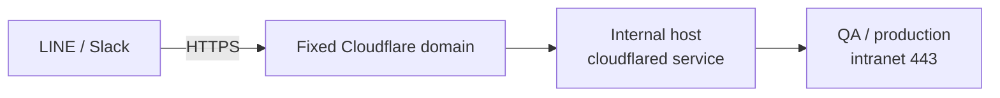

## Background

> [!IMPORTANT]
> **Core pain point: fully manual, highly repetitive, requirements with no record.**

- **Interval-odds monitoring was fully manual**: risk-control periodically pulled data by hand → assembled it in Excel → reported back via LINE, all manual.
- **High-frequency and highly repetitive**: rotating day/night shifts, **5 times a day, ~10 minutes each**.
- **Requirements passed verbally, unrecorded**: the statistical time windows and game types were decided by the CEO and changed often; requirements were relayed purely by word of mouth (CEO → special assistant → risk-control), with no history and no way to compare data.
- **Operations data scattered in a separate app**: it originally required opening a separate app that demanded constant re-logins and gave no notifications, so the latest data was easily missed.

## Goal

Full automation with scheduled multi-platform push, settings and content recorded/comparable, and proactive notifications.

## Highlights

1. **Risk-control manual work to zero**: the day/night-shift routine of 5×/day at ~10 minutes each (pull + assemble + report) became **scheduled automatic push** by bots (LINE 4×/day, Slack hourly), with no human effort.
2. **Multi-platform integration, settings and content in sync**: LINE + Slack push from the same source, with setting records and push content consistent across platforms and **easy to query/compare historically** (replacing the old verbal relay).
3. **Proactive notifications, nothing missed**: scheduled notifications mean the latest operations data is no longer missed because you "had to open an app, re-login, with no prompt."

## Solution & Architecture

| Module | Purpose | Key mechanism |
|--------|---------|---------------|
| Interval-odds monitoring (LINE) | Scheduled push of interval-odds detail | **Chained trigger** after the hourly-stats cron finishes (no more fixed-offset standalone cron — see the nastiest pitfall) |
| Operations data live update (Slack) | Hourly push of operations statistics | Server-rendered PNG snapshot + bot upload |
| LINE member pool + Webhook | Self-service member join/authorization | LINE Webhook receives messages → builds a member pool, authorized via back-office account/password (sha1) |
| SDK | LINE push | LINE Bot SDK (a version chosen for compatibility with the production environment) |

**External connectivity route (bypassing the QA/production firewall)**:

- The LINE Messaging API Webhook **only accepts HTTPS**.
- Production: fixed Cloudflare domain + a `cloudflared` tunnel on an internal host into the intranet.
- Development: an **ngrok** reverse proxy for temporary HTTPS.

## Challenges

1. **Webhook must be HTTPS**: the LINE Messaging API mandates HTTPS; the local machine has no public domain → ngrok reverse proxy in development.
2. **Both QA and production sit behind firewalls**: unreachable from outside → routed through a fixed Cloudflare domain + cloudflared tunnel (see the route above).
3. **Large format differences across platforms**: the Slack push format evolved (plain data → Markdown → Block Kit), but **iOS does not support some of Block Kit's CSS**; pushing images to LINE via URL incurs CDN latency. (Decisions in Key Trade-offs.)

## The Nastiest Pitfall

### Scheduling race: row-by-row stats writes vs. scheduled push — LINE "sent only partial data" with no error

- **Symptom**: production LINE scheduled push sent only part of the statistics; Slack was fine, the stats page was fine, **a manual re-push was perfectly fine**, and the log was spotless; QA could not reproduce it at all.
- **Root cause**: the hourly-stats cron inserts one row as soon as each interval finishes (each interval scans months of win-score report data, getting slower as intervals accumulate); the push picks the latest eventId with `MAX(endTime)` — **the instant a new event's first row is written it becomes "the latest"**, and the push reads a half-written event. Pushing half the data still returns HTTP 200, so there was no error at all.
- **Why it was hard to diagnose (a triple fog)**:
  1. failures only printed to console, and the scheduled `runInBackground()` discards stdout → the application log was always clean;
  2. `modifyTime` merely copied `endTime`, and the DB never recorded the actual write moment → afterward there was no way to tell "when the stats finished writing," destroying the time evidence;
  3. QA data is small and the stats finish writing in seconds → QA was always fine; intuition was misled toward a "truncation / message-count limit" problem (a single message was only ~1,500 chars, far from LINE's 5,000 limit).
- **How it was cracked**: first verified the splitting logic was lossless + all 506 historical events were single-message → ruled out truncation; "manual fine, scheduled short" pinned it to timing; comparing the :10/:11 schedule against the row-by-row inserts clinched it.
- **The fix**: switched to a **chained trigger** (call the push directly after the stats finish, removing the fixed-offset standalone cron) + a **single batched multi-row INSERT** (atomically visible, so no reader — including LINE's interactive query — can ever see a half-set) + a Log for every push (status/body/char count) + recording the actual write moment in `modifyTime` (with the rerun delete-range switched to `endTime`, or historical reruns would fail to delete and produce duplicates).
- **The second pitfall it flushed out — DB host clock skew, "finish time" earlier than "start time"**: `modifyTime` initially used `DEFAULT CURRENT_TIMESTAMP` (stamped by the DB), and QA showed an inversion where modifyTime (13:01:56) was **19 seconds earlier** than endTime (13:02:15). Measuring with NTP as the referee:

  **Root cause: the QA MySQL host clock was ~30 seconds slow**

  | Clock | Deviation from NTP standard time | Verdict |
  |---|---|---|
  | Work machine (the PHP running artisan) | **-2.4 s** | accurate |
  | QA MySQL host | **~-30 s** | slow (the culprit) |

  The 19-second inversion = 30-second offset − (~10-second stats duration), a perfect match. `endTime` used PHP's clock and `modifyTime` used the DB's clock; two unsynchronized clocks produce the inversion. Measurement method: PHP bracketed a `SELECT NOW()` before and after to measure the relative PHP-vs-DB offset, then `w32tm /stripchart` measured the absolute deviation against NTP. The fix: `modifyTime` is now stamped by **PHP the instant before insert**, sharing endTime's clock source, so their difference is always the real duration; environments with an accurate clock (production) are unchanged, and the schema DEFAULT is kept as a fallback for other writers. A side finding: **every** `NOW()`/`CURRENT_TIMESTAMP` column on that QA MySQL was 30 seconds slow, now on the infra time-sync to-do list.

A few general principles crystallized from this incident: chaining a "produce data" schedule and a "consume data" schedule with a **fixed time offset** plants a time bomb that data growth will eventually trip — either chain the trigger or make the write atomic, ideally both; multi-row data needs a notion of "the whole set is done," since the intermediate state of row-by-row inserts is visible to every reader; inside a `runInBackground()` command a console error effectively does not exist, so anything important must go through `Log::`; a table should keep an "actual write moment" column or there is nothing to investigate after the fact; when "QA is fine but production isn't," suspect **data-volume/timing differences** before code-version differences; and any timestamp columns you intend to subtract or compare must come from the same clock source — stamping across hosts (PHP vs. DB) lets clock skew fabricate "effect-before-cause" data, so when a clock is suspect, use NTP as the referee rather than guessing.

### Two cloudflared configs (installed as root) — editing the wrong file the whole time

- **Symptom**: after setting up the tunnel/DNS by the book, config changes simply **had no effect**.
- **Root cause**: cloudflared had been **installed under the root account**, so **two config.yml files existed**; I kept editing the root one while **the running instance actually read the other file**.
- **How it was found**: stuck for a long time, until **a reinstall finally threw an error** revealing the yml in use was elsewhere; after fixing it, the tunnel successfully reached QA/production through cloudflared + an internal host.
- This is why, when cloudflared changes don't take effect, the first step isn't to keep editing `~/.cloudflared` but to confirm **which config the *running* service actually reads** (tracing the path the systemd / `cloudflared service` points to), or you'll keep circling a file that has no effect.

**Two more pitfalls**:

- **Pushing LINE messages via URL routes through a CDN → latency**: `pushMessage` via URL/image incurs CDN latency → ultimately **switched to plain-text push** to avoid it (see Key Trade-offs).
- **Fonts / icons must live in the host's storage**: both the Slack and LINE bots use fonts and icons, and the host storage throws an **error** if the corresponding files aren't placed there → they must be staged together at deploy time.

## Key Trade-offs

### 1. Slack push format: why PNG in the end?

- Evolution: plain data → Markdown → **Block Kit** → (carousel changed to vertical blocks) → **PNG**.
- Block Kit looks clean, but **iOS doesn't support some of its CSS** (layout breaks) → rejected.
- Switched to **server-rendered PNG images uploaded directly** (server computes the layout → renders a PNG → bot uploads), consistent across platforms.

### 2. LINE push: why plain text instead of URL / image?

- URL / image push routes through a **CDN → latency**, hurting immediacy.
- Switched to plain-text push (merged messages + lossless splitting at newline boundaries, ≤4,900 chars each; the earlier hard truncation was retired), instant and smooth.

## Quantified Impact

| Item | Before | After |
|------|--------|-------|
| Interval-odds reporting | Risk-control manual: rotating day/night shifts, **5×/day × ~10 min** | Bot **scheduled automatic push** (LINE 4×/day) |
| Manual time saved | — | **~50 min/day × 365 days ≈ 304 hours/year** (up to ~608 hours/year across both shifts) |
| Operations data | Separate app, re-login required, no notifications | Slack **hourly** auto-push + proactive notifications |
| Requirements / settings | Verbal, unrecorded | Settings recorded, synced across platforms, historically comparable |

## Error Handling & Ops Planning

- **Slack error alert**: when a sync schedule fails or a bot push fails, a Slack error message automatically notifies the engineer (this was also how it surfaced that production couldn't reach ClickHouse / GCP and needed permissions opened).
- **Knowledge transfer**: the operating logic and architecture have been written up as internal documents and folded into the team knowledge base, accessible to the whole team.

## Future Plans

- Further strengthen back-office self-service configuration of push content / timing (reducing engineering involvement).
- A push-failure retry mechanism (the existing Slack error alert already allows manual intervention; automatic retry can be added on top).
- Binding LINE members to game accounts (currently the `U`-prefixed userId can't be mapped to a real identity).

## Appendix

**Reusable takeaways**:

- Third parties (LINE/Slack) reaching a firewalled intranet → **fixed Cloudflare domain + cloudflared tunnel** (ngrok in development).
- Cross-platform display inconsistency (especially iOS) → **pushing a PNG image** is the most robust.
- Watch for latency on any push that goes through a CDN; use plain text for time-sensitive needs.
- When cloudflared changes don't take effect → first confirm which config the running service reads.
