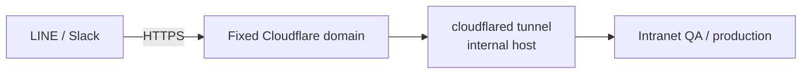

## Background

Interval-odds monitoring was fully manual: risk-control staff rotated day/night shifts, pulling data by hand 5 times a day at ~10 minutes each — querying data, assembling Excel, and reporting back via LINE. The statistical time windows and game types were decided verbally by the CEO and relayed to risk-control through his special assistant, with no record kept anywhere, making historical comparison impossible. Operations data, meanwhile, required opening a separate app that demanded constant re-logins and gave no notifications, so the latest updates were easily missed.

## Scope

Converted interval-odds monitoring and operations statistics into scheduled multi-platform bot push: LINE 4×/day and Slack hourly, with settings and push content synced consistently across both platforms, historically queryable and comparable, and actively raising notifications.

## Challenges

The LINE Messaging API Webhook mandates HTTPS, while both the QA and production machines sit behind firewalls and cannot be reached from outside. Separately, the Slack push format evolved from plain data through Markdown to Block Kit — only to reveal that iOS does not support some of the CSS Block Kit relies on, breaking the layout; and pushing images to LINE via URL routes them through a CDN, degrading immediacy.

## Contributions

- Designed the external connectivity route: LINE/Slack → fixed Cloudflare domain → cloudflared tunnel on an internal host → QA/production intranet; for development, used an ngrok reverse proxy to obtain temporary HTTPS.
- Resolved the pitfall of cloudflared having been installed under the root account, leaving two copies of `config.yml` on the system — edits kept going to the copy that "wasn't running" with no effect; only an error thrown during reinstallation revealed that the running instance was actually reading the other file.
- After trade-offs, switched Slack to server-rendered PNG images uploaded directly, ensuring cross-platform display consistency, and switched LINE to plain-text push to avoid CDN latency.

## Impact

Risk-control manual reporting dropped to zero — ~50 minutes/day saved per shift, up to ~608 hours/year across both shifts (conservatively ~304 hours/year counting a single shift). Settings and push content are synced across platforms and historically comparable, and operations data is no longer missed because of a separate app, forced re-logins, or absent notifications.

## Key Technical Decisions & Pitfalls

### External connectivity route

To let third parties (LINE/Slack) reach an intranet behind a firewall, the route uses a "fixed domain + tunnel" pattern, with ngrok providing temporary HTTPS in development:

### The nastiest pitfall: two cloudflared configs, editing the wrong one

After setting up the tunnel and DNS, config changes simply had no effect. It took a long time to trace: cloudflared had originally been installed under the root account, so **two `config.yml` files existed** on the system. I kept editing the one that "wasn't running," while the live service was reading the other file. Only an error thrown during a reinstall finally exposed the path the running service actually read.

**Lesson**: when cloudflared changes don't take effect, the first step isn't to keep editing `~/.cloudflared` — it's to confirm which config the *running* service actually reads (tracing back from the path the systemd service points to), or you'll keep circling a file that has no effect.

### Trade-off 1: Slack settled on server-rendered PNG

The Slack push format evolved through plain data → Markdown → Block Kit → PNG. Block Kit looks clean, but iOS doesn't support some of the CSS it relies on, breaking the layout. Weighing cross-platform consistency, I switched to having the server compute the layout and render a PNG image that is then uploaded, so it displays identically on iOS and desktop alike.

### Trade-off 2: LINE switched to plain-text push

Pushing images to LINE via URL routes them through a CDN, adding latency and hurting immediacy. For monitoring messages, seeing the data instantly matters most, so images were dropped in favor of plain-text push (with per-message length kept within limits to avoid rejection), trading richness for the most direct delivery speed.
