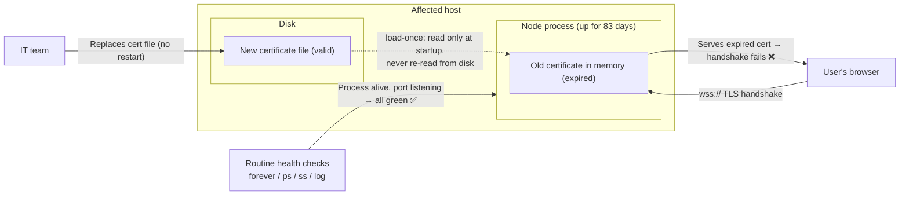
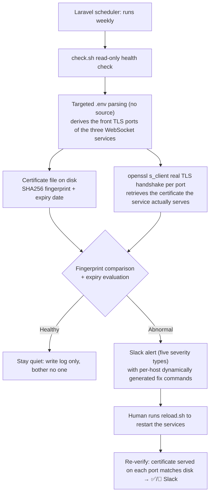

## Background

> [!IMPORTANT]
> **Core pain: "features work + the process is running" is nowhere near enough to call a service healthy.** Right after the infrastructure (IT) team swapped the certificate, every feature in the test environment checked out fine and all three back-office real-time services (customer-service chat / metric alerting / version notification) were running — yet the services were already doomed to fail three days later, and no monitoring could see it coming.

- **A certificate swap without a restart = a time bomb**: the IT team replaced the certificate file but did not restart the services. The running Node processes still held the old certificate loaded into memory at startup; that old certificate expired in the small hours of a Saturday → by Monday morning every front-end wss connection was dead, with a full two-day blind window.
- **Every routine check was green at the moment of failure**: `forever list` showed running, `ps` showed a healthy process state, `ss` showed every port listening, log timestamps were minutes old and still processing traffic, memory was plentiful with no OOM. **The only clue was `WebSocket connection failed` in the browser console.**
- **A missing certificate degrades silently**: the code is `if (existsSync(KEY) && existsSync(CERT)) https else http` — with a wrong path or missing file, Node raises no error and starts plaintext http on the same port. The service keeps listening, keeps logging `Client connected`, but the browser's `wss://` simply cannot connect.
- **The same unexploded bomb existed in production**: production held a certificate of the same type, due to expire a few months later, on an architecture identical to the test environment — a renewal without a restart would replay the incident in full.
- **Zero proactive monitoring**: nothing warned before a certificate expired, and nothing could detect "the file was replaced but never took effect."

The failure mechanism in one picture:



**Stakeholders**:

- **Operations / customer service**: real-time features (online reporting etc.) suddenly stopped working, yet the backend showed everything healthy — hard to explain, harder to localize.
- **IT team**: assumed the job was done after swapping the file; nobody knew the backend also had to restart the services.
- **Backend**: the failure hit early Saturday morning and was only discovered Monday — a two-day gap.

## Goal

Build proactive monitoring that catches "the service is alive but the certificate is broken," plus a repeatable recovery procedure. This phase covers **monitoring and alerting only** (every restart stays manual) — no auto-restart, no automatic certificate renewal, no changes to the Node code.

## Highlights

- **Catches the "all-green fake healthy" failure**: an actual `openssl s_client` handshake retrieves the certificate the service *really serves*, and compares its SHA256 fingerprint against the file on disk — the only method that pierces the all-green facade of forever/ps/ss/log.
- **Detection moved from "after the fact" to "before it happens"**: previously the team learned about it only after expiry, from front-end errors (2 days late this time); now a weekly proactive comparison runs, with a 14-day advance expiry warning.
- **Alerts carry their own fix, so non-engineers can act**: each of the five alert types includes a copy-pasteable "how to fix" command, **generated dynamically per host** (the test environment shows `forever restartall`, production shows `sudo pm2 restart all`, paths follow the script's location).
- **No per-host manual operations**: the job hangs off the Laravel scheduler and deploys with each release (each environment already had a scheduler entry point) — no per-machine crontab edits.
- **Debunked the "just switch to pm2" belief**: hands-on inspection proved production's pm2 exhibits the exact same load-once behavior; its certificate was only valid because the process happened to have restarted recently — stopping the team from investing in the wrong direction.
- **Caught its own defects before launch**: during real-machine acceptance, reproduced and fixed a staging false-alarm landmine (3 alerts → 0) and a relative-path resolution semantics bug, preventing alert fatigue from day one.

## Quantified Impact

| Aspect | Before | After |
|---|---|---|
| How certificate failure was discovered | Reported after front-end errors (**2 days** after expiry this time) | Weekly proactive detection; warning **14 days** before expiry |
| "File replaced but not in effect" detection | **None** (no mechanism at all) | Fingerprint comparison; alert within at most 1 week of the swap |
| Plaintext-downgrade detection | **None** (port still listening, invisible) | Judged by an actual TLS handshake |
| Time to localize a failure | Ruling out multiple wrong directions one by one | `check.sh --status` shows disk and per-port expiry in one line |
| Correctness of the fix command | Passed by word of mouth, and wrong (`forever restart all` is a no-op) | Correct command embedded in the alert; script auto-detects forever/pm2 |
| Staging false alarms | First design: **3 per run** | **0** (explicit declarative monitoring switch) |
| Production unexploded bomb | Unknown | Identified (same-type certificate, expiring in a few months) and under monitoring |
| Deployment cost | — | 0 hosts needing manual cron (ships with each release) |
| Rollout scope | — | Test/staging/production — **all three environments live**, identical content |
| Certificate-renewal SOP | Word of mouth, wrong commands, missing version-restore step | Documented 5-step SOP in the internal doc library; full acceptance checklist included |

## Solution & Architecture

**Core insight: certificate health can only be judged by "what the service actually serves," never by "whether the service is alive."** Compare the SHA256 fingerprint of the certificate on disk with the certificate the service actually serves (= the one in process memory) — a mismatch means IT installed a new certificate, but the service has not reloaded it yet.



| Component | Responsibility |
|---|---|
| `cert-common.sh` | Shared functions: targeted `.env` parsing (no `source`), certificate path resolution, TLS handshake capture, fingerprint/expiry, Slack delivery, host labeling, process-manager detection |
| `check.sh` | Read-only health check (weekly schedule). Quiet when healthy (log only), Slack only on trouble. `--status` is the manual query mode |
| `reload.sh` | Run manually: auto-detects forever/pm2, restarts the three services → verifies each port now serves the on-disk certificate → ✅/🔴 Slack |
| Laravel scheduler | Runs `check.sh` at a fixed weekly time, `withoutOverlapping` + background execution, deploys with each release |

**Five alert types** (each with a "how to fix"): 🔴 no TLS on handshake (plaintext downgrade) / 🔴 port not listening / 🔴 certificate expired / 🟠 new certificate pending activation / 🟠 fewer than 14 days remaining.

**Monitor front (TLS) ports only**: each of the three WebSocket services opens two ports — a front port on wss (TLS, browser-facing) and a back port on plain ws (internal, inherently certificate-free). Only front ports are monitored; the port list is derived dynamically from `.env`, so a port change needs no script edit. Resilience: every network call is wrapped in `timeout`, the whole script is guarded by `flock` against overlapping runs.

## Rollout Status

**Fully live everywhere (verified by file-content diff, not commit hash — see Pitfall 9 for why)**:

| | check.sh | reload.sh | cert-common.sh | Weekly schedule |
|---|---|---|---|---|
| Test environment | ✅ | ✅ | ✅ | ✅ |
| Staging environment | ✅ | ✅ | ✅ | ✅ |
| Production environment | ✅ | ✅ | ✅ | ✅ |

The three scripts are **byte-identical across all three environments**; the only difference lives in the scheduler file, and it is a pre-existing production-only schedule unrelated to this project.

**Acceptance results (real-machine tests on test + staging environments)**:

| Item | Result |
|---|---|
| A `--status` query mode | ✅ Host label / disk and all three front-port expiry dates correct |
| B Quiet when healthy | ✅ 0 alerts, log written correctly |
| C Slack channel | ✅ Three 🟠 alerts actually delivered to the channel |
| D Plaintext downgrade 🔴 | ✅ Used an internal port that natively runs plain ws as a natural control sample for downgrade detection |
| E New certificate pending 🟠 | ✅ Temporary self-signed certificate simulated a fingerprint mismatch, confirming the core trigger logic |
| F Skipping non-monitored hosts | ✅ Verified on the real staging machine |
| **G reload live test** | ✅ Auto-detected forever, all three port expiry dates correct, ✅ Slack delivered |
| Static checks | ✅ `bash -n` ×3, `php -l`, LF / no BOM |

> Item G yielded an unexpected bonus: precisely because the version number reset to empty after the restart (see Pitfall 7), it proved the **process really did restart** — otherwise the in-memory state would not have been wiped. (Since the disk and in-memory certificates happened to match at the time, the fingerprint comparison alone could not distinguish "restarted or not.")

**Documentation**: the mechanism, the 5-step certificate-renewal SOP, and an itemized acceptance checklist were written up and pushed to the internal documentation library; the push was preceded by a secret scan (webhook as a placeholder, no passwords/tokens/private keys).

## Challenges

- **A constrained remote environment**: the target hosts had no sshpass, no way to install SSH keys, and sudo required a password — solved with OpenSSH's `SSH_ASKPASS` mechanism for non-interactive authentication, credentials living only in memory and passed via environment variables, never touching disk; remote commands travel double-encoded in base64 to sidestep quoting and CRLF escaping issues at every layer.
- **Judging whether a service is "really serving"**: all four routine tools — `forever list` / `ps` / `ss` / logs — were useless; the only effective probe turned out to be "handshake and capture the certificate," which had to be designed from scratch.
- **Alerts must have zero false positives**: back ports natively have no TLS, and the staging environment natively runs no wss — mis-including either would spray false alarms on every run, breeding alert fatigue until a real incident gets dismissed as noise.
- **Acceptance testing must not damage the environment**: designed `ENV_FILE`/`WSS_PORTS`/`EXPIRY_WARN_DAYS` environment-variable overrides so that all six acceptance tests (including plaintext downgrade, pending certificate, and expiry warning) run **read-only, with no restarts, and without touching the production `.env`** — the overrides point the script at temporary self-signed certificates and port lists, instead of bending the environment to fit the test, leaving zero residue afterwards.

## The Worst Pitfalls

### Pitfall 1: every health check was lying (the core one)

- **Symptom**: front-end wss completely dead, yet `forever list` running, `ps` state healthy, `ss` showing every port listening, logs still processing traffic minutes earlier, no OOM.
- **Wrong directions (ruled out in order)**:
  1. **"redis is unreachable"** (a `ConnectionException` in the error logs) → a closer look showed the stack trace contained paths from a separate Windows development machine, impossible on the Linux host in question → unrelated; the affected host's redis tested perfectly healthy.
  2. **"Certificate errors" in the system log** → those came from antivirus signature updates over plain HTTP (port 80), with no TLS involved at all — irrelevant noise.
  3. **"The three services crashed"** → tested: all alive and processing traffic.
  4. **"Production won't have this problem because it uses pm2"** → see Pitfall 3.
- **Actual root cause**: a real `openssl s_client` handshake against the three front TLS ports returned a certificate whose `notAfter` was **two days in the past** — the served certificate had expired. The disk told the other half: the certificate file had been replaced days earlier with an expiry half a year out → **the disk was new, the memory was old**.
- **Why it happens**: `https.createServer({ cert: fs.readFileSync(...) })` reads the certificate into memory **only at startup** and never looks at the disk again. The process had been up for 83 days, long before the file swap; restarting is exactly what forces a re-read. This is why "is the service really serving" can never be judged from process state — you must **send a real request from the outside and inspect what actually comes back**; any service that loads config/certificates/keys into memory at startup carries this same class of "file replaced but not in effect" invisible failure.

### Pitfall 2: a missing certificate silently degrades to plaintext

- The code is `if (existsSync(KEY) && existsSync(CERT)) https else http`. With a wrong path or missing file, Node **raises no error** and starts plaintext http on **the same port**.
- The result — "port listening, connections in the log, but browsers can't connect" — is just as invisible as Pitfall 1. This is why the monitoring must perform a **real TLS handshake**: checking "is the port listening" catches none of it.

### Pitfall 3: switching to pm2 does not fix load-once (debunking a shared belief)

- The team believed "production won't fail because it runs pm2." Inspection showed production's pm2 runs in **fork mode with watch disabled** — behavior identical to forever.
- Production's certificate was only valid because the process **happened to have restarted recently**: the certificate file had been replaced half a year earlier, and only took effect at that later restart — **for six months in between, the old certificate was being served**.
- The problem lives in the **application layer** (read-once-at-startup), not in the daemon manager; swapping forever for pm2 changes nothing. The real cure is terminating TLS at a reverse proxy in front, or hot-reload support in the application.

### Pitfall 4: the fix command itself was wrong

- `forever restart all` (with a space) **does nothing**; the correct form is `forever restartall` (confirmed via `forever --help`).
- Production's services hang under **root's pm2**; a regular system account's own pm2 list is empty — an empty `pm2 list` does not mean the services aren't running, and `pm2 restart all` without sudo **restarts nothing**.
- Nobody wants to dig through documentation mid-incident, which is why the correct command is **embedded directly in the alert message**, generated per host.

### Pitfall 5: the staging false-alarm landmine (reproduced live during acceptance)

- The first design skipped non-monitored hosts when "`.env` has no certificate path or the certificate file doesn't exist," on the reasoning that "staging doesn't run wss."
- **Reality disagreed**: staging's disk still held a **usable old certificate file**, so the skip condition never fired → the script kept checking → found none of the three front ports listening → **fired 3 🔴 false alarms**.
- It stayed harmless only because staging's scheduler entry point happened to be disabled — the moment someone enabled it, the trap would spring.
- **Fix**: an explicit `CERT_MONITOR_ENABLED=false` declared in `.env`; measured 3 alerts → 0. Inferring "should this host be monitored" from environmental circumstances is unreliable — **whether to monitor must be an explicitly declared setting**, not a guess.

### Pitfall 6: relative-path resolution with the wrong semantics

- The certificate path in `.env` is relative (of the form `CERT=./x.crt`). The first version resolved it against the **script's own directory** — which looked perfectly correct in real deployments, where the script and `.env` sit in the same directory.
- The correct semantics resolve against the **`.env` file's directory** (= the Node process's cwd, which is how Node itself resolves it). Only running the script from a different directory during testing exposed it: the certificate resolved to the wrong location and the host was misjudged as "not running TLS." When emulating an existing program's behavior, replicate its **resolution baseline**, not just its literal configuration.

### Pitfall 7: version number resets to empty after restart — a second instance of the same "in-memory state" class

- **Symptom**: `reload.sh` completed, every certificate check ✅ — yet back-office users saw a permanent red error, "failed to fetch version number."
- **Root cause**: the version-notification service keeps its version number **only in memory**; the sole writer is the front-end build process, which reports a version timestamp once, to a loopback-only (`127.0.0.1`) reporting port, upon build completion. A restart resets it to an empty string; every front end connecting afterwards receives the empty value and raises a non-dismissing error notification.
- **Key detail**: the report only targets `127.0.0.1`, so the front-end build must run **on the same machine as the Node service** — running it elsewhere has no effect.
- **Fix**: the renewal SOP gained an extra step — rerun the front-end build on the same machine after restarting; the reminder is baked into `reload.sh`'s output and the ✅ Slack message.
- This is the **same problem class** as the certificate — loaded into memory at startup, lost on restart, with no automatic restore. The only difference: the certificate "updates only on restart," while the version number "vanishes on restart." Before any restart-based maintenance, inventory **all state that exists only in memory**, not just the one item being fixed; the lasting cure is persisting the version number to a file and reading it back at startup.

### Pitfall 8: copying a plaintext `.env` to /tmp during remote testing (my own mistake)

- To set up a test, I filtered only a line or two out of the full `.env` and wrote the rest to the remote host's `/tmp` — effectively leaving DB credentials and other secrets on disk. Wiped completely once discovered.
- It changed how I prepare test fixtures: extract **only the few lines needed** (e.g. just the certificate-related settings) via grep — never copy the whole file and filter afterwards.

### Pitfall 9: judging "is it deployed" by commit hash → false negative

- **Symptom**: at wrap-up, `git branch -r --contains <sha>` on the monitoring commits reported "absent" for both the staging and production branches, so I reported "not pushed yet, local only" — when in fact everything was already live.
- **Root cause**: test → staging promotion works by **cherry-pick**, which lands as a **different sha**. Querying `--contains`/`--merged` with the original sha is guaranteed to miss, producing a false negative.
- **Correct approach**: judge by **content** — `git cat-file -e <ref>:<file>` for existence, `git show <ref>:<file> | grep` for key lines, `git diff --stat <refA> <refB> -- <files>` for content equality. Measured: the three scripts were byte-identical across all three environments.
- In a cherry-pick-based branch flow, **commit identity (sha) carries no meaning across environments — only content does**. Before reporting "not deployed yet," always run a content comparison first; a false report makes people believe work was left undone.

### Pitfall 10: grep over remote source code wandering into a minified bundle

- A recursive grep over the remote project directory descended into the front-end build-output directory and hit a 79MB minified JS file (`Object.keys` matching a `.key` pattern), exploding the output and timing out the SSH session. Remote greps now always carry `--exclude-dir` for node_modules and build artifacts, or target explicit files.

## Key Trade-offs

| Decision | Choice | Rejected alternative and why |
|---|---|---|
| Trigger condition | **Disk vs in-memory certificate fingerprint comparison** | ❌ "Auto-restart N days before expiry": races against IT's file swap — restarting before IT swaps just re-reads the same old certificate, drops connections for nothing, and the condition still holds the next day → **daily restarts forever**. Fingerprint comparison fires "only after a swap, and stops by itself after a reload." Days-to-expiry survives only as a safety-net alert for "nobody renewed at all." |
| Degree of automation | **Phase 1: all restarts manual; monitoring notifies only** | ❌ Auto-reload on detection: an unattended production auto-restart, if the new certificate file itself is broken, upgrades "certificate expiring soon" into "service down right now." Let detection and alerting run stably for a while before discussing automation. |
| Scheduling | **Laravel scheduler** | ❌ Manual crontab per host: each environment already has a scheduler entry point; living in the Laravel schedule means it deploys with each release, no per-host maintenance; staging naturally never runs it because its scheduler entry point is disabled. |
| Monitoring scope | **Front (TLS) ports only** | ❌ Monitoring every port: back ports are internal plaintext ws by design, inherently certificate-free — including them sprays false alarms every run → alert fatigue → **real incidents get dismissed as noise too**. |
| Config reading | **Targeted `grep` parsing of `.env`** | ❌ `source .env`: executes arbitrary content inside `.env`, and values with spaces/special characters break. |
| Non-monitored hosts | **Explicit `CERT_MONITOR_ENABLED=false` declaration** | ❌ Inferring from "does a certificate file exist": staging kept an old certificate around, and testing proved it misfires (see Pitfall 5). |
| Failure handling | **Notify IT only — no self-healing, no retry, no rollback** | ❌ Auto-retry: when the certificate file itself is broken, retrying is pointless and can spiral into a restart loop that repeatedly interrupts production — better to have a human act on the alert than let a script improvise unattended. |
| The lasting cure | **Deferred**; monitoring ships first | ❌ Moving TLS termination to the reverse proxy immediately: touches proxy config + front-end connection URLs + three services + three environments — a large blast radius. Ship the low-risk monitoring safety net first. |

## Future Plans

- **Phase 2**: in the test environment, auto-run `reload.sh` when a new certificate is detected (production stays manual).
- **The lasting cure**: terminate TLS at the reverse proxy (Apache `mod_proxy_wstunnel`) — production already runs Apache with the same wildcard certificate on HTTPS — leaving Node on plain ws bound to `127.0.0.1`, **never touching certificates at all**. Renewals then need only a graceful reload; Node never restarts, and the monitoring can retire into a simple expiry reminder.
- **Persist the version number**: write the version-notification service's version number to a file and read it back at startup (~3 lines), removing the "must rebuild the front end after every restart" step (see Pitfall 7).
- **Production's certificate expires in a few months**: after renewal, the services **must** be restarted (unless the lasting cure has landed by then).

## Operational Notes

- **`.env` never enters git**: the Slack webhook, certificate paths, host label, and monitoring switch are all **set manually per host** — a machine swap means redoing them.
- **CERT maps to `.crt`, KEY maps to `.key`**: certificate directories differ per environment; swapping them means TLS fails to start and degrades silently.
- **Staging and production share the same hostname**: before any manual SSH work, confirm which machine you are on first.
- Scripts must be **LF + UTF-8 without BOM**; CRLF triggers `bad interpreter` on the target Linux hosts.
- A restart **momentarily drops** every ws/wss connection; production restarts must be scheduled at off-peak hours.

## Appendix

**Reusable lesson**: any service that "loads config/certificates/keys into memory at startup" carries the invisible-failure class of "file replaced but not in effect"; a health check can never stop at process state — it must **send a real request from the outside and compare what actually comes back against the source on disk**.

**Key commands** (generic form):

```bash
# The expiry date of the certificate the service ACTUALLY serves
# (this — and only this — tells you whether the file swap took effect)
echo | openssl s_client -connect 127.0.0.1:$PORT 2>/dev/null | openssl x509 -noout -enddate

# The certificate file on disk
openssl x509 -noout -enddate -in /path/to/cert.crt

# A mismatch = the file was replaced, but the service has not reloaded it
```
