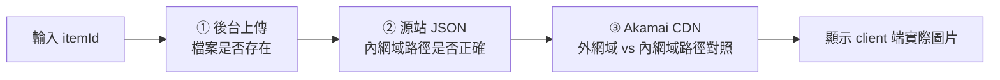

## 背景

道具圖片「顯示不出來」時,過去要人工逐段排查:進後台確認圖片是否上傳、連進源站確認 CDN JSON 是否更新、確認 client 端外網實際顯示的圖片、判斷是否需要推 Akamai purge cache——症狀都是「圖看不到」,但可能是上傳失敗、JSON 沒更新、或 cache 未 purge 三種完全不同的根因,排查一次常常要超過 1 小時,還得拉後端工程師介入。

問題的本質是:一張圖片要正確顯示,必須跨越三個彼此獨立、卻又前後相依的環節,而任何一環出錯都呈現同一個症狀。缺乏工具時,排查者只能憑經驗猜測是哪一段壞掉,再手動逐段確認。

## 專案內容

在道具設定後台新增驗證功能,輸入 itemId 即可依序回報三段狀態,並直接顯示 client 端實際看到的圖片:

1. **後台上傳**——圖片是否確實上傳到後台儲存路徑。
2. **源站 JSON**——源站(內網域)的 JSON 設定檔是否已把該 itemId 對應到正確的圖片路徑。
3. **Akamai CDN**——外網域 edge 節點回傳的圖片路徑,是否已與源站(內網域)一致。

最後直接把 client 端實際看到的圖片渲染出來,確認的是玩家最終看到的結果,而非中間某一段的推論。

## 專案挑戰

最關鍵的設計取捨,是**用路徑對照取代 HTTP status 判斷**。CDN 對一個路徑回 200 只代表「這個路徑抓得到某張圖」,並不代表「這張圖是對的」——一份還沒更新的舊 JSON 指向錯誤路徑時,CDN 照樣回 200,很容易被誤判成正常。因此第三段不看狀態碼,而是拿外網域(client 看到的)路徑對照內網域(源站)路徑,兩者一致才算 CDN 已同步。

三段之間「獨立卻相依」也影響了展示順序。JSON 若沒更新,CDN 路徑本身就是錯的,先驗 CDN 沒有意義。所以刻意把 JSON 排在 CDN 之前呈現——展示順序本身就在教使用者理解這條依賴鏈:先有正確的 JSON,才談得上 CDN 是否反映最新圖片。

此外,Akamai edge 節點的 purge 更新時間不固定,驗證結果需提示「剛 purge 請等數分鐘再重驗」,避免使用者把「尚未傳播完成」誤讀為「修復失敗」。

## 個人貢獻

實作後台三段診斷驗證功能:以外網域路徑對照內網域路徑判斷 CDN 是否已反映最新圖片,而非依賴 HTTP status;三段分開回報、失敗點一目了然,並在結尾直接渲染 client 端實際圖片。功能以環境判斷閘控,僅在類正式與正式機啟用(本機沒有 CDN 架構,驗證沒有意義)。

## 專案結果與影響

| 指標 | 優化前 | 優化後 |
|------|--------|--------|
| 排查時間 | 1 小時以上(人工逐段確認) | 輸入 itemId 即時查詢 |
| 需要介入人員 | 後端工程師(需連進源站) | 客服/運營自行操作 |
| 根因定位 | 全靠猜測與經驗 | 三段分開回報,直接顯示失敗點 |
| 無效 purge | 常見(猜是 cache 問題就推) | 先驗 JSON,根因明確再操作 |

排查時間由 1 小時以上降至輸入 itemId 即時定位,三段失敗點分開回報,客服與運營可以自行排查、不需要拉工程師介入,也避免了「猜是 cache 問題就先推 purge」但實際上 JSON 根本沒更新的無效操作。

## 關鍵技術決策與踩坑

- **為什麼不看 HTTP status**:狀態碼只能證明「路徑抓得到東西」,不能證明「路徑是對的」。舊 JSON 指向錯誤路徑時 CDN 一樣回 200——這是最容易踩的誤判坑,也是整個驗證邏輯改用「外網域 vs 內網域路徑對照」的原因。
- **展示順序即知識傳遞**:把 JSON 排在 CDN 之前,不只是流程順序,更是讓非工程背景的客服/運營看懂「JSON 沒對之前,推 purge 是白費工」。
- **先驗 JSON 再決策,避免無效 purge**:過去第一直覺是遇到圖片問題就推 cache purge,但 JSON 未更新時 purge 完全沒用。改成先確認 JSON、根因明確後再決定是否 purge,省下大量無效操作。
- **環境閘控**:本地無 CDN 架構,功能僅在類正式與正式機啟用,避免在無意義環境誤觸。
- **可複用**:外網域 vs 內網域路徑對照的驗證架構,可套用到其他有 CDN 資產管理的設定頁(活動 banner、遊戲 icon 等)。
- **未來規劃**:整合 Akamai Fast Purge API,讓後台在確認源站 JSON 正確後直接觸發 purge,無需另外登入 Akamai 控制台;並在 purge 後 polling purge status,等 edge 刷新後自動重驗 CDN 層,形成完整的「修復閉環」。
