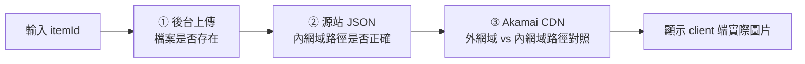

## 背景

> [!IMPORTANT]
> **核心痛點：道具圖片「顯示不出來」，排查要超過 1 小時，且全程靠人工逐段猜。**

- **三段排查缺乏工具**：過去發生圖片異常時，需要手動：
  - 進後台確認圖片是否有上傳
  - 確認源站 CDN JSON 檔是否已更新
  - 確認 client 端（外網）是否顯示正確圖片
  - 判斷是否需要推 Akamai purge cache
- **CDN 端點與源站圖片難以同步**：Akamai 有 cache 層，源站更新後 edge node 不一定立即生效，過去靠人工等待或手動 purge。
- **無法從症狀區分三段失敗**：「圖看不到」可能是上傳失敗、JSON 沒更新、或 cache 未 purge，症狀相同但解法完全不同。
- **僅類正式與正式機有 CDN 架構**：本地開發環境無法重現此問題，只能在特定環境排查。

**利害關係人**：

- **客服／運營**：收到玩家回報圖片異常，現在後台直接輸入 itemId 查，不需要拉後端介入。
- **後端工程師**：省去反覆連進源站手動確認 JSON 的重複性步驟。

## 目標

在道具設定後台新增驗證功能，讓使用者輸入 itemId 即可查詢目前 CDN 圖片狀態，並明確指出失敗在哪一段（上傳／JSON／Akamai cache）。定位為診斷工具、不做自動修復，自動 purge 留給後續的 Akamai API 整合。

## 成果亮點

- **輸入 itemId 即時定位**：後台新增驗證功能，輸入 itemId → 系統依序確認三段狀態，取代原本超過 1 小時的人工逐段排查。
- **三段式診斷，失敗點一目了然**：(1) 後台圖片是否上傳成功、(2) 源站 JSON 是否對應正確路徑、(3) Akamai CDN 端點是否已反映最新圖片，三段分開回報，根因清楚。
- **外網域 vs 內網域路徑對照**：驗證方式以「外網域（client 看到的）vs 內網域（源站）路徑對照」判斷 CDN 是否已同步源站，而非單純看 HTTP status。
- **Client 端圖片直接顯示**：驗證結果直接渲染 client 端實際看到的圖片，確認的是玩家最終看到的結果，而非中間某一段的推論。
- **快速定位，避免無效 purge**：過去第一直覺是推 purge，但 JSON 未更新時 purge 沒用；現在先驗 JSON 再決策，避免無效操作。

## 量化成效

| 指標 | 優化前 | 優化後 |
|------|--------|--------|
| 排查時間 | 1 小時以上（人工逐段確認） | 輸入 itemId 即時查詢 |
| 需要介入人員 | 後端工程師（需連進源站） | 客服／運營自行操作 |
| 根因定位 | 全靠猜測與經驗 | 三段分開回報，直接顯示失敗點 |
| 無效 purge | 常見（猜是 cache 問題就推） | 先驗 JSON，根因明確再操作 |

## 解法與架構

驗證功能拆成三個獨立回報的層級，輸入 itemId 後依序走過，任一段失敗都能直接指出根因：

| 驗證層 | 對象 | 驗證方式 | 代表失敗 |
|--------|------|----------|----------|
| 後台上傳 | 後台儲存路徑 | 確認檔案存在 | 圖片從未成功上傳 |
| 源站 JSON | 源站 JSON 設定檔 | 讀取 JSON 確認 itemId → 圖片路徑對應正確 | JSON 未同步更新 |
| Akamai CDN | Edge node（外網域）vs 源站（內網域） | 路徑對照，外網域與內網域圖片路徑是否一致 | Cache 尚未 purge，edge 還在回舊圖 |

**核心邏輯**在道具設定後台的驗證功能裡：以外網域路徑對照內網域路徑做比對，而非單純依賴 HTTP status 判斷正確性。

> [!NOTE]
> 本功能僅在**類正式與正式機**啟用（本地環境無 CDN 架構，驗證沒有意義），Vue 端以環境判斷控制顯示。

## 困難點

- **Akamai edge 回應延遲**：purge 後 edge node 更新時間不一定，驗證說明需提示「剛 purge 請等數分鐘再重驗」，避免使用者把「尚未傳播完成」誤讀為「修復失敗」。
- **三段獨立但有依賴**：JSON 未更新時，CDN 路徑本身就是錯的，若 CDN 回 200 容易誤判為正常；驗證設計刻意把 JSON 排在 CDN 之前呈現，展示順序本身就在教使用者理解依賴關係——先有正確的 JSON，才談得上 CDN 是否反映最新圖片。

## 未來規劃

- **Akamai Fast Purge API 整合**：串接 Akamai API，讓後台在確認源站 JSON 正確後，直接在頁面觸發 purge，無需另外登入 Akamai 控制台。
- **Purge 狀態追蹤**：呼叫 purge 後 polling purge status，等 edge 刷新後自動重驗 CDN 層，給運營一個完整的「修復閉環」。

## 附錄

> [!TIP]
> **可複用**：外網域 vs 內網域路徑對照的驗證架構，可套用到其他有 CDN 資產管理的設定頁（活動 banner、遊戲 icon 等）。

延伸參考：Akamai [Fast Purge API](https://techdocs.akamai.com/purge-cache/reference/api)。
