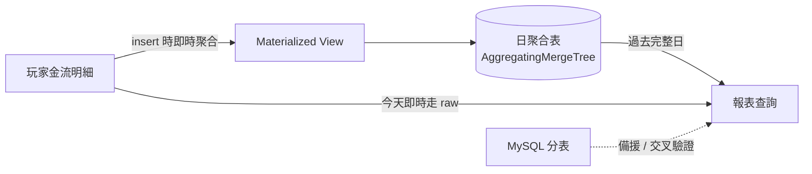

## 背景

原有總勝分報表建立於 MySQL 分表架構,隨資料量成長查詢效能明顯下降,玩家整月彙總查詢動輒約 104 秒;且舊報表數字來自預先算好的統計表,會掉 log、需人工重跑,長期被多部門反覆質疑「數字不對」。查得慢、數字又不可信,兩者都是痛點。

## 專案內容

主導資料庫遷移,改採 ClickHouse 並設計 Materialized View + AggregatingMergeTree 架構重建報表運算邏輯,讓報表數字直接來自源頭明細即時聚合(不再養那批「寫統計」的排程與補救邏輯),同時保留 MySQL 分表作為備援與交叉驗證來源。



## 專案挑戰

遷移必須確保新舊系統資料完全一致、零停機切換;過程中在正式環境遇到「報表間歇性全為 0 / 缺遊戲」的詭異問題——本地與測試環境打同一個 ClickHouse 卻都正常,最後才鎖定是某台正式機的 libcurl 版本較舊,與 `curl_multi` 併發查詢的驅動迴圈不相容。

## 個人貢獻

- 取某一完整日的真實資料,逐款遊戲、逐項統計指標(押注額、輸贏、jackpot、局數、人數)比對新舊系統數值,確認完全一致後才切換上線。
- 設計新舊系統雙軌並行機制,切換時 MySQL 不停機、兩邊同時供數,確認無誤才切換報表來源,達成零停機並可快速回復(程式層 revert 即回舊路徑)。
- 定位並修正 `curl_multi` 在舊版 libcurl 下提前退出迴圈造成的間歇性空回應。

## 關鍵技術決策與踩坑

**最痛的坑:`curl_multi` 遇到舊版 libcurl 提前退出**

舊版 libcurl 在「還不需要等 I/O、可以立刻往下推」時,`curl_multi_exec` 會回傳 `CURLM_CALL_MULTI_PERFORM`(值為 -1),要你「馬上再呼叫一次」;新版則永遠只回 `CURLM_OK`。原本的驅動迴圈條件寫成 `while ($running && $status === CURLM_OK)`,在舊 libcurl 上第一次就判 false、整個迴圈一次都沒進去,transfer 還沒跑完就退出 → 拿到空回應,報表就間歇性缺數。修法是內層先把 `CURLM_CALL_MULTI_PERFORM` 排乾:

```php
do {
    $status = curl_multi_exec($mh, $running);
} while ($status === CURLM_CALL_MULTI_PERFORM);
// 之後才用 curl_multi_select 等 I/O、用 curl_multi_info_read 取真實結果
```

> 教訓:跨環境只差在系統函式庫版本時,程式層要對舊版本健壯,而不是去動線上機器的系統庫(牽動範圍太大)。

**關鍵取捨:人數去重用近似而非精確**

不重複人數若用精確去重(`uniqExact`)要建完整 hash set,記憶體高、狀態龐大、無法跨日/跨來源合併;改用 HLL 近似(`uniqCombined64`),誤差約千分之一——營運統計容許這個誤差,換來的是「小而可合併的聚合狀態 + 大幅提速」。實測人數那段從整段掃描約 24 秒降到日表狀態合併後約 0.1 秒。

## 專案結果與影響

玩家整月查詢時間由約 104 秒降至約 5 秒(約 21 倍),報表數字零誤差;跨部門「數字不對」的回報從源頭消失,同時省下維護一整批「寫統計」排程的成本,大幅提升客服與營運的查核效率與系統穩定性。
