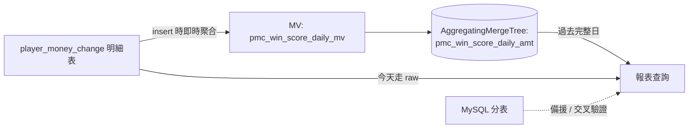

## 背景

公司原有總勝分報表建立於 MySQL 分表架構,隨資料量成長查詢效能明顯下降,玩家整月彙總查詢動輒約 104 秒,影響客服與營運查核效率。

## 專案內容

主導資料庫遷移,改採 ClickHouse 並設計 Materialized View + AggregatingMergeTree 架構重建報表運算邏輯,同時保留 MySQL 分表作為備援與交叉驗證來源。

## 專案挑戰

遷移過程需確保新舊系統資料完全一致、零停機切換,且排查過程中發現 libcurl 版本差異會造成批量查詢間歇性錯誤,須逐一定位修正。

## 個人貢獻

- 取某一完整日的真實資料,逐款遊戲、逐項統計指標(押注額、輸贏、jackpot、局數、人數)比對新舊系統數值,確認完全一致後才切換上線。
- 設計新舊系統雙軌並行機制,達成零停機上線並可快速回復。
- 定位並修正因 libcurl 版本差異造成的批量查詢間歇性錯誤。

## 專案結果與影響

玩家整月查詢時間由約 104 秒降至約 5 秒(約 21 倍),報表數字零誤差,大幅提升客服與營運的查核效率與系統穩定性。
