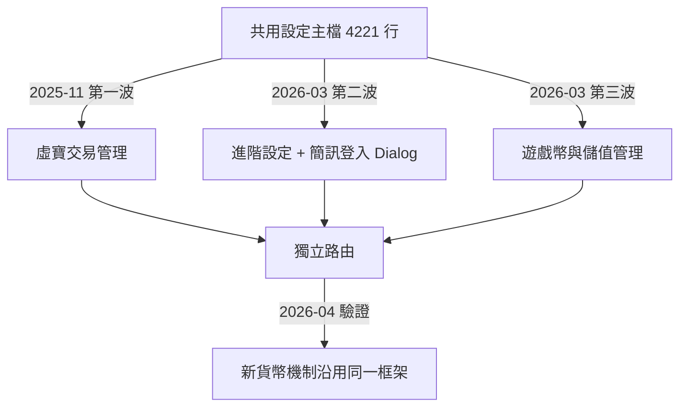

## 背景

- 共用設定主檔長年是全站共用設定的「垃圾桶」——凡是跨遊戲的設定都往裡塞，最終膨脹到 **4221 行**。
- 進階設定、遊戲幣與儲值管理、各種 Dialog 全部混在同一支檔案，修改任一功能都必須在 4000+ 行中翻找。
- 高耦合導致 merge conflict 頻繁：多人同時修改同一檔案，衝突難以收拾。
- Dialog 邏輯夾雜在主檔中，無法單獨測試或複用，每次擴充都更難讀懂。
- 新人（或未來的自己）接手維護成本極高，等同於讀一份沒有目錄的長篇文件。

## 目標

將共用設定主檔按功能職責拆分為獨立模組，降低單檔行數與耦合度；本次為**階段性成果**，後續仍以此框架持續推進。

## 成果亮點

- **主檔縮減 54%**：主檔從 4221 行壓到 1963 行，閱讀與搜尋成本大幅下降。
- **拆出獨立路由模組**：虛寶交易管理、進階設定、遊戲幣與儲值管理各有自己的路由，功能邊界清晰，日後可授予不同權限。
- **模組化不是臨時起意**：早在 2025-11-06 就先拆出「虛寶交易管理」試水（第一波），驗證可行後才在 2026-03 大規模拆進階設定與儲值管理，屬有計畫的漸進式重構。
- **Dialog 元件化**：5 個彈窗各自獨立成元件，不再藏在主檔深處，可單獨開啟、搜尋與修改。
- **降低 merge conflict 風險**：功能分散於多檔，多人並行開發時衝突範圍縮小。
- **建立可沿用的拆分框架**：模組與 Dialog 的目錄結構已確立，後續新增設定只需對號入座。
- **框架立即被驗證**：2026-04 新貨幣機制(Q 幣)功能直接沿用新框架，新增為獨立 Dialog，無需再改主檔結構，證明拆分策略正確。

## 量化成效

| 指標 | 模組化前 | 模組化後（階段性） |
|------|----------|-------------------|
| 主檔行數 | 4221 行 | 1963 行（**-54%**） |
| 檔案數 | 1 個 | 10 個（4 主模組 + 5 Dialog + 1 邏輯 js） |
| 獨立路由 | 1 個 | 4 個 |
| Dialog 元件 | 0（全夾主檔） | 5 個獨立元件 |
| 單檔最大行數 | 4221 | 1963 |

> [!NOTE]
> **1963 行是 2026-04 的快照，不是終點。** 模組化後主檔仍持續被加入新功能——例如同期的新貨幣機制(Q 幣)新手特殊機制，就往主檔又加了約 +105 行。換言之，若沒有這次拆分，主檔早已遠超 4221 行；54% 的縮減是在「業務持續擴充」的前提下達成的，實際避免的膨脹更大。

## 解法與架構

**拆分策略**：依「功能職責」而非「程式結構」切割，確保每個模組邊界清楚。



| 模組 | 行數 | 說明 |
|------|------|------|
| 共用設定主檔 | 1963 | 原核心功能保留 |
| 虛寶交易管理 | 704（+ 邏輯 js 234） | 2025-11 第一波拆出，獨立路由 |
| 進階設定 | 1260 | 2026-03 拆出，獨立路由 |
| 遊戲幣與儲值管理 | 1326 | 2026-03 拆出，獨立路由 |
| Dialog 元件 | 共 5 支 | 分別歸屬進階設定與儲值管理，各自獨立成元件 |

**拆分順序**（三波、漸進式）：

1. **2025-11 第一波試水**：把「虛寶交易管理」從主檔抽出成獨立模組（含一支邏輯 js），主檔小幅縮減，並新增獨立路由，先驗證拆分模式可行。
2. **2026-03 第二波**：拆「進階設定」為獨立模組，並把第一個 Dialog（簡訊登入設定）抽出，建立進階設定的 Dialog 目錄。
3. **2026-03 第三波**：拆「遊戲幣與儲值管理」為獨立模組，並建立其 Dialog 目錄。

## 困難點

- 原始 4221 行的高度耦合：函式、data、computed 彼此交叉引用，直接剪貼容易斷線。
- Dialog 的資料流（props / emit）需要重新設計，讓彈窗可以從主檔解耦而不依賴父層 data。
- 路由新增需同步確保原有 URL 不斷線（路由設定檔同步修改）。

## 最痛的坑

拆分過程中最耗時的一關，是把彈窗抽成獨立元件。這些 Dialog 原本並不是真正的 Vue 元件，而是直接內嵌在主檔的 template 裡，因此它們用 `this.xxx` 讀到的其實是**父層元件的 data**。

一開始誤判方向，以為只要把 template 搬進獨立元件、再 `import` 進來就好——結果資料傳遞完全失效，彈窗打開後一片空白。真正的根因是：一旦成為獨立元件，`this` 就指向元件自己，再也讀不到父層的資料。

解法是逐一把每個 Dialog 依賴的資料改成 **props 傳入**、把要寫回父層的動作改成 **emit 回傳**：

```js
// Before：Dialog 內嵌在父層 template，直接吃父層 data
// （元件自己並沒有這些欄位，靠的是 this 指向父層）
this.settingData.amount = 100
this.saveSetting()

// After：抽成獨立元件後，資料流顯式化
props: { settingData: { type: Object, required: true } }
// 修改後回傳父層，不直接改 props
this.$emit('update', { ...this.settingData, amount: 100 })
```

因此在把任何 Dialog 從巨型主檔抽出來之前，會先列出它依賴了哪些 `this.xxx`，再把這些逐一轉成 props——這個前置盤點做完，抽元件才會一次成功，而不是抽完才發現資料全斷。

## 關鍵取捨

- **選擇：分三波漸進拆，不做一次到位的大爆炸重構**
  - 被否決方案：一次把所有功能全部拆光。
  - 否決理由：4221 行高度耦合，函式、data、computed 彼此交叉引用，一次全動風險極大、也難以驗證；改採「先在一個模組證明模式可行 → 上線驗證 → 再拆下一批」，把風險攤平在時間軸上，也符合「階段性成果」的定位。
- **選擇：依功能邊界拆，不按程式結構拆**
  - 理由：功能邊界對應實際業務需求，未來還能依功能授予不同權限；按程式結構拆（methods／computed 各自集中）只有工程意義、對業務無感，也無法對應到「哪個團隊該看哪一塊」。這個決策讓後續新貨幣機制能直接對號入座，新增設定不必再回頭改主檔結構。

## 未來規劃

- 現有框架（目錄結構、Dialog 元件化原則）已確立，後續可持續將主檔中剩餘的功能區塊拆出。
- 1963 行的主檔仍有縮減空間，可按「設定分類」再切一輪。
- 考慮把進階設定的 Dialog 也補足元件化，對齊已元件化的做法。
- 長期目標：每個模組控制在 800 行以內，讓任何人接手都能在 10 分鐘內定位問題點。

## 附錄

**可複用心法**：拆大型 Vue 的順序——先確認功能邊界 → 抽 Dialog 元件（先處理 `this` 斷線問題）→ 新增路由 → 主檔刪除對應區塊。

## 檔案結構整理

**Before（2025-11 前）**：

```
共用設定/
└── 共用設定主檔.vue          # 巨型單檔（虛寶交易拆出後量到 4221 行，之前更大）
```

**After（階段性，2026-04）**：

```
共用設定/
├── 虛寶交易管理.vue          # 704 行（第一波 2025-11 拆出，獨立路由）
├── 虛寶交易管理.js           # 234 行（虛寶交易邏輯）
├── 共用設定主檔.vue          # 1963 行（-54%）
├── 進階設定.vue              # 1260 行（進階設定，獨立路由）
├── 進階設定 Dialog 目錄/
│   └── 各 Dialog.vue         # 例：簡訊登入設定、特殊模式設定
└── 遊戲幣與儲值管理/
    ├── 遊戲幣與儲值管理.vue   # 1326 行（獨立路由）
    └── Dialog 目錄/
        └── 各 Dialog.vue     # 例：儲值獎勵、每日獎勵
```
