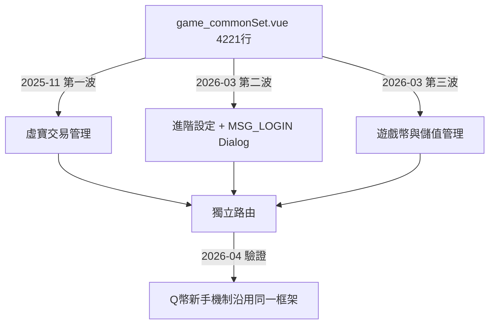

## 背景

`game_commonSet.vue` 長年是全站共用設定的「垃圾桶」——凡是跨遊戲的設定都往裡塞,最終膨脹到 4221 行。進階設定、遊戲幣與儲值管理、各種 Dialog 全部混在同一支檔案,改任一功能都要在 4000+ 行裡翻找;高耦合也導致多人同時修改時 merge conflict 頻繁,Dialog 邏輯夾雜在主檔裡無法單獨測試或複用。

## 專案內容

依功能職責,分三波漸進式把 `game_commonSet.vue` 拆分為 10 個檔案(4 個主模組 + 5 個 Dialog 元件 + 1 個共用邏輯 js),每個功能區塊有自己的路由,可獨立維護。

## 專案挑戰

原始 4221 行高度耦合,函式、data、computed 彼此交叉引用,直接剪貼容易斷線;Dialog 原本直接用 `this.xxx` 存取父層 data,拆成獨立元件後 `this` 完全斷掉,一開始以為 `import` 進來就好,結果資料傳遞整個失效,才發現要逐一改成 props 傳入 + emit 回傳。同時要確保原有路由不斷線,不能一次把所有功能全部拆光(風險太大),必須邊拆邊上線、邊驗證。

## 個人貢獻

- 先於 2025 年 11 月拆出「虛寶交易管理」試水驗證可行,確認拆分模式沒問題後,才在 2026 年 3 月大規模拆出「進階設定」與「遊戲幣與儲值管理」。
- 依「功能職責」而非「程式結構」切割——功能邊界對應實際業務需求,未來也能依功能授予不同權限;按程式結構拆(methods/computed 分開)則只有工程意義、業務無感。
- 建立可沿用的目錄結構與 Dialog 元件化原則(逐一排查 `this.xxx` 改成 props/emit),讓後續每個從主檔拆出的元件有明確範本可循。

## 專案結果與影響

主檔案從 4221 行縮減至 1963 行(−54%),且這是在「業務持續擴充」的前提下達成的縮減幅度,實際避免的膨脹更大;新框架在 2026 年 4 月被 Q 幣新手機制直接沿用(新增 Dialog 不需再改主檔結構),證明拆分策略正確,是持續推進中的階段性成果。
