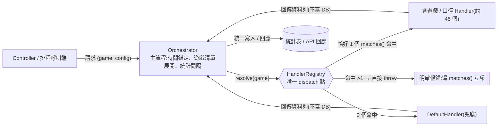
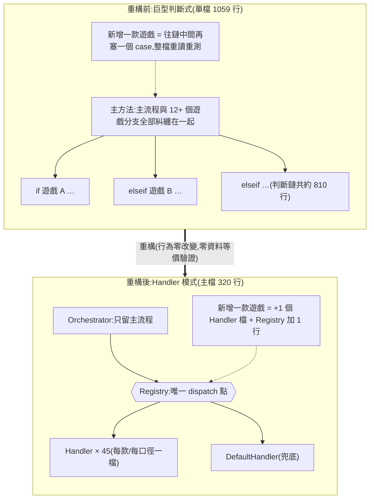

## 背景

> [!IMPORTANT]
> 這次真正解掉的痛,不是「多加一款遊戲」,而是**這些統計邏輯爛到「明知很爛卻沒人敢維護」、機台資訊的算法亂到「打開根本看不懂在寫什麼」**。重構把它們從「不敢碰」變成「可安心維護、一眼看懂」。

- **統計邏輯難維護到「不敢動」**:總勝分/角色輸贏/機台活躍度這些報表的後端核心,都是一支動輒上千行、十幾個遊戲分支擠在一起的巨型 `if/elseif`(勝分統計模組主檔 **1059 行**、if/elseif 鏈約 **810 行**)。它們是**財務/營運統計的寫入與讀取端**,改錯就污染報表數字;偏偏所有遊戲共用同一支方法、改 A 遊戲的分支可能誤傷 B,又沒有安全的驗證手段——結果就是典型的「知道很爛,但沒人敢碰」。
- **機台資訊亂到「看不懂在寫什麼」**:機台資訊模組的一支主方法裡塞了 **3 個各自獨立的 `switch`**,同一款遊戲的邏輯散在三個 switch;讀的人根本拼不回「這款到底怎麼算」,改一款要在三處同步改、漏一個就錯。
- **每加一款遊戲只會更爛**:這種 switch「永遠長不完」,每款新遊戲往中間再塞一個 case,越長越沒人敢動——惡性循環。
- **觸發點**:一款麻將類新遊戲接入,要動到這 7 支巨型判斷式;與其再塞 7 個 case 延續惡性循環,不如順勢一次重構掉。

## 目標

- 把新遊戲接入牽涉到的 7 支巨型判斷式重構成 Handler 模式(Contract + Registry 唯一 dispatch + 每款遊戲/口徑一個 handler),讓「新增遊戲」不再需要碰主流程;**重構本身不得改變任何既有遊戲的行為**;新遊戲的邏輯以獨立 handler 加入。

## 成果亮點

1. **新增遊戲的成本從「動主方法」降到「加一個檔」**:新增一款特規遊戲 = 新增 1 個 Handler class + Registry 加 1 行,主流程(orchestrator)零改動。觸發本次重構的麻將類新遊戲就是以這個方式加入全部 7 個模組的。
2. **God class 大幅瘦身**:勝分統計模組主檔 **1059 → 320 行**(orchestrator 只留主流程/統計間隔/寫入/共用 helper);巨型共用模型檔靠遊戲紀錄查詢(列表與明細)、機台清單、角色輸贏、入座率統計等陸續移出,累計卸下 **1550+ 行**查詢邏輯。
3. **同款遊戲邏輯集中**:原本散在多個 switch 的同一款遊戲邏輯,收斂到單一 handler class,一眼看得出「這款跟別款差在哪」。
4. **行為零改變、且可證明**:沉澱出一套**不需真實 DB 資料**也能驗證的方法論——dispatch 等價 + body 逐字包含 + 唯讀 smoke;唯讀查詢再加「新舊實體並跑、輸出深度全等」的行為級證明;即時查詢改用「`DB::listen` 攔 SQL 做 byte 等價」——詳見[驗證方法論](#驗證方法論)。
5. **方法論可複用**:7 次實戰心得沉澱成可複用的重構 SOP 與回歸 QC 清單(per-game/per-category 判準、Default 當基底的適用邊界、順序敏感 dispatch 的處理、執行型 handler 的驗證法),下一支巨型判斷式直接照做。

## 量化成效

| 模組(原巨型判斷式) | 拆法 | 主要數字 |
|---|---|---|
| 遊戲紀錄查詢(列表) | per-category(3 分類 + Base) | 巨型共用模型檔移出約 623 行;新模組 811 行 |
| 機台資訊 | per-game(擴充既有 Registry) | +468 行;麻將類新遊戲 handler 170 行 |
| 角色輸贏(含明細合併) | per-game(4 款 + Default) | 巨型共用模型檔移出約 230 行 |
| 機台活躍度 | per-game(2 款 + Default)+ 查詢器 237 行 | 巨型共用模型檔移出 184 行 |
| 勝分統計 | per-口徑(12 handler) | 主檔 1059 → 320 行(23 檔,+1841/−1063) |
| 遊戲紀錄查詢(單筆明細/盤面回放) | per-category(4 分類 + Default 兜底) | 再移出約 314 行;完全搬遷、原方法刪除不留委托殼(21 檔,+854/−296) |
| 入座率統計 | per-game(7 款 + Default,順序敏感 Registry) | 移出 254 行 → 6 行委托殼;新模組 13 檔 695 行 |

- **合計**:**7** 支巨型判斷式 → 7 個 Handler 模組、約 **45** 個 handler class;巨型共用模型檔累計卸下 **1550+ 行**。
- **驗證覆蓋(重點數字)**:勝分統計 dispatch 等價 **237 案例 0 分歧**、body 逐字包含 **12/12**;遊戲紀錄明細**新舊並跑 9/9 全等**(含例外訊息逐位元組相同)、dispatch 等價 199 案例;入座率統計 **SQL byte 等價 492/492**、dispatch 等價 206/206(198 款真實遊戲 + 8 個合成的順序敏感邊界)。
- **模組收納對稱化**:遊戲紀錄查詢模組拆為「列表」與「明細」兩個對稱子模組,主資料與明細一眼分清;兩份 README 互相指路。

## 解法與架構

三件套(每個模組都是這個骨架):

| 角色 | 說明 |
|---|---|
| **Contract** | 把原 switch 每個 case「做的事」抽成介面方法(一件事一個方法,不塞一個大方法) |
| **Registry** | **唯一 dispatch 點**:`resolve($game)` → 對應 handler;主流程完全不認識任何一款遊戲 |
| **Handler**(每款遊戲/口徑一個) | 只覆寫跟預設不同的部分;未列出的遊戲落 `DefaultHandler` 兜底 |

dispatch 資料流(每個模組同構):



- **per-game vs per-category**:重複軸線是「每款遊戲(或口徑)規則不同」用 per-game(機台資訊、角色輸贏、機台活躍度、勝分統計、入座率統計);是「每種資料形狀/來源不同」用 per-category(遊戲紀錄列表:3 分類;遊戲紀錄明細:4 分類 + 兜底)。
- **orchestrator 留主流程**:時間錨定、連線檢查、遊戲清單展開、統計間隔機制、DB 寫入、共用 helper 留在原 class;handler 只回傳資料列、**不寫 DB**。
- **Registry 有兩種形態,依原始碼行為選**:
  - 預設**順序無關**:`resolve()` 問全部 handler、恰好 1 命中則用、0 回 Default、**>1 直接 throw**;每個 handler 的正確性只取決於自己的 `matches()`,不取決於它在清單中的位置。
  - 但當原始碼的**判斷順序本身就是行為**(旗標條件與字面遊戲名重疊、靠「先寫先贏」決定優先權)時,必須改用「**有序清單 + 第一個 `matches()` 命中**」的順序敏感版——**不可**退化成 `gameName => class` 的 hashmap,那會丟失旗標分支與優先序。
- 自動化寫入端本就有排程重跑機制,重構不影響該保護。

重構前後的結構對比:



## 驗證方法論

> [!IMPORTANT]
> **這是本次最核心的可複用資產:怎麼在「一筆真實資料都沒有」的情況下,證明一支財務統計的重構沒改壞任何數字。**
> 勝分統計模組是**財務統計的寫入端**——把每款遊戲的總投注/總得分/局數算出來寫進日報表。重構它最怕「SQL 悄悄變了、報表數字從此錯掉還沒人發現」。難點在:**這支不能「跑跑看對不對」**(一跑就寫 DB、污染統計表),QA 環境又常常**根本沒有該遊戲的資料**可以對值。

**關鍵轉念:不驗「值對不對」,改驗「與可信的原版是否位元級等價」。**
「值正確」需要真實資料+已知正確答案來對帳;但重構的正確性其實是另一個命題——**新 code 是否產生與舊 code 完全相同的行為**。舊版在線上跑了多年是對的,只要證明新版逐位元等價於舊版,正確性就繼承過來,全程**零真實資料**。這把「需要資料的對帳」轉成「不需要資料的等價證明」。

三層(缺一不可,各抓不同錯,全部零真實資料):

| 層 | 抓什麼錯 | 怎麼做 |
|---|---|---|
| **① dispatch 等價** | 選錯 handler(順序敏感重構最大風險) | 把原 if/elseif 的判斷順序**照抄**成一支對照函式;用「真實遊戲清單 × 幣別 × 合成變體」窮舉每個 (game, config),斷言對照函式與 `Registry::resolve()` 選中的 class 完全一致(勝分統計 **237 案例 0 分歧**、入座率統計 **206/206**) |
| **② body 逐字包含** | SQL/組列邏輯轉錄錯 | 從版本庫切出重構前的原分支 body → 正規化(去註解+已知變數代換+去所有空白)→ 斷言它是對應 handler 方法正規化後 body 的**子字串**。**比 `toSql()` diff 更嚴**:連 where 鏈、array key 都逐字比(**12/12 PASS**) |
| **③ 唯讀 smoke** | 欄位選錯但剛好沒報錯/語法能不能跑 | handler 只有 SELECT(寫入留在 orchestrator),可直接對真表跑、零副作用,確認可執行、回列欄位數正確(兩種輸出口徑分別 19/22 欄) |

- **為什麼不能用標準的 `toSql()` diff**:勝分統計各分支是查詢執行完**就地組列**,中途沒有可比對的 query builder,乾跑模式也會因結果為空、後續取值而爆——所以才改用「② body 逐字包含」直接比原始碼字串,繞過「要執行才有 SQL」的死結。
- **別直接整跑會寫 DB 的 orchestrator**:要跑主流程驗 scaffolding,就餵「無匹配的遊戲過濾條件」讓它跑完全流程但零寫入。

**升級一(唯讀查詢限定):新舊實體並跑、輸出深度全等(golden-master)。**
若被重構的是**唯讀查詢**(不寫 DB),可在刪舊方法前做最強一層——**行為級**證明:同一組輸入分別呼叫舊 monolith 與新模組,輸出經 JSON 正規化後**深度比對全等**,而且**連例外路徑也比**:查無資料時丟出的例外類別與訊息字串都要求逐位元組相同。遊戲紀錄查詢模組(單筆明細/盤面回放)以 **9 組案例**(6 組真實紀錄編號、橫跨 4 個資料分類 + 3 組刻意查無的假編號)**全數通過**,其中一組假編號案例連資料庫例外的訊息都逐位元組一致——證明的是「行為完全不變」,不只是結構等價。寫入端(勝分統計)不能這樣做(新舊並跑會雙寫、污染統計表),才退而用上面的結構三層。

**升級二(即時資料限定):時間無關的「SQL byte 等價」。**
入座率統計回傳的是**即時在座人數**,新舊並跑會因資料每秒漂移而永遠比不出相同結果——「值比對」在這裡天生不可行。解法是把比對對象從「查詢結果」換成「查詢本身」:同一支腳本內連續呼叫新舊實作,用 Laravel 的 `DB::listen` 攔下**實際送出的 SQL 與 bindings**,逐位元組比對兩邊送出的查詢是否完全相同(**492/492 全等**)。比的是 SQL 文字而非結果,**完全不受 live 資料漂移影響**;至於走外部 HTTP 介面、不下 SQL 的分支,則以 body 逐字包含補上。

這整套流程(lint → autoload → Registry 順序 → dispatch 等價 → SQL byte 等價 → body 逐字包含 → 唯讀 endpoint smoke)已沉澱成可複用的回歸 QC 清單,之後每一支同型重構直接照表操課。

## 困難點

- **dispatch 條件會重疊且順序敏感**:某 slot 遊戲家族有基礎列、額外押注列、特殊加成列三種合成列,旗標條件(是否有對戰、是否有額外押注)與字面遊戲名交錯;原 if/elseif 靠「先寫先贏」隱性決定優先序,改 Handler 要把這個隱性順序顯性化又不改行為。另一例:某款遊戲同時滿足機種旗標、又符合另一分支的字面遊戲名,原碼先命中旗標分支——這正是入座率統計的 Registry 必須用「有序清單 + 第一個命中」而不能用 hashmap 的原因。
- **handler「執行查詢」而非「回傳 builder」**:勝分統計各分支是查詢執行完就地組列,中途沒有可比對的 query builder,導致標準的「`toSql()` diff」驗證法不適用(見驗證方法論的替代作法)。
- **各分支結構性異質**:表名慣例不一致(不同 infix/prefix,某款甚至少一條底線)、欄位集、SQL 全不一致,且寫入靠「各分支欄位集不同 + DB 預設值補缺欄」——無法用統一的 row normalizer。

## 最痛的坑

- **rebase 後直接 `git pull` → 分支長出重複 commit + merge node**
  - **症狀**:對整合分支 rebase 後,功能分支冒出一個「自己 merge 自己」的 merge commit,同一批 5 個 commit 變成新舊各一份共 10 個。
  - **根因**:rebase 改寫了 commit hash,本地與遠端(還是舊 hash)分岔;此時 `git pull` 無法 fast-forward,預設**自動 merge**,把新舊兩條線接起來。
  - **解法**:`git reset --hard` 回到 rebase 完的乾淨線,再 `git push --force-with-lease` 覆蓋遠端。
  - **可複用**:rebase 改寫歷史後,一律用 `push --force-with-lease` 對齊遠端,**絕不 `git pull`**(pull 只適用「純落後、沒改寫歷史」的情境)。

## 關鍵取捨

- **「Default 當共同基底、其他 extends 它」典型形態 ❌(用於勝分統計)→ 薄 abstract + 逐字轉錄 ✅**
  - 勝分統計各分支表名/欄位集/SQL 異質、且寫入靠「欄位集不同 + DB 預設值補缺欄」;硬讓大家 extends Default 要覆寫掉一大半,且任何共用化都可能悄悄改到送進寫入的欄位集 → 行為改變。
  - 改用薄抽象基底(只放 `matches()` 預設 + 常數)+ 每個 handler **逐字轉錄**自己的分支,Default handler 僅作兜底(非繼承基底)。犧牲一點 DRY,換到「每個 handler = 原分支 1:1 忠實搬移」,重構風險最低、逐字驗證最容易。
  - 反例對照:機台資訊/遊戲紀錄/角色輸贏/機台活躍度分支較同質,就適用「Default 當基底」的典型形態。

## 未來規劃

- 兩個早期模組還留在較舊的目錄分層(歷史包袱);新模組已統一放領域層,之後可獨立一次搬遷對齊命名空間。
- 勝分統計讀取端若要讓新遊戲也吃到日聚合快取表,需在 ClickHouse 補對應的 Materialized View 與 schema(本次刻意不做,列後續優化)。
- 其餘尚未 Handler 化的巨型 switch,可比照這套 SOP 陸續處理。

## 注意事項

- **順序無關 Registry 的前提**是「`matches()` 互斥」——新增 handler 時若條件與既有重疊,`resolve()` 會在該遊戲出現時 throw(設計如此,逼你改互斥),不是靜默選錯。
- **合成遊戲列的旗標由 orchestrator 強制**:特殊加成列的加成旗標被 orchestrator 主動關閉(原碼行為),這是兩種加成互斥的關鍵前提;若哪天那段被改,會 throw 提醒而非寫錯數字。
- **驗證證明的是「結構等價 + 唯讀路徑的行為等價」**(SQL/dispatch/列形狀逐字相同、唯讀輸出深度全等),非對 production 資料逐值比對(刻意不跑真實寫入,避免污染統計表);值正確性建立在 SQL 位元組相同上。

## 附錄

**可複用經驗**:

- 拆巨型 `switch($game)`/`if-elseif` 前,先定「重複軸線」:每款遊戲規則不同 → per-game;每種資料形狀不同 → per-category。
- 驗證方式依 handler 型態選:回傳 builder → `toSql()` diff;執行查詢+就地組列 → body 逐字包含;唯讀查詢 → 新舊並跑輸出全等;即時資料 → `DB::listen` 攔 SQL 做 byte 等價。
- 這 7 次實戰的完整心得(含 Default-as-base 的適用邊界、順序敏感 dispatch、強制 README 慣例)已沉澱成可複用的重構 SOP 與回歸 QC 清單;每個新模組都內建 README 說明架構與分支對照,接手的人可直接跳讀。

## 檔案結構整理

以勝分統計模組為代表,整理前 → 後:

```
整理前:
勝分統計領域/
└── 勝分統計主檔.php            ← 1059 行;主方法內 12 分支 if/elseif 鏈約 810 行

整理後:
勝分統計領域/
├── 報表讀取端(不動)
└── 勝分統計模組/               ← 模組資料夾(與讀取端隔離)
    ├── orchestrator             (1059→320 行;主流程/統計間隔/寫入/共用 helper)
    ├── HandlerContract          (matches() + collect())
    ├── Context                  (每次迭代的共享上下文)
    ├── HandlerRegistry          (唯一 dispatch;順序無關、恰一命中,>1 throw)
    └── Handlers/
        ├── README.md
        ├── AbstractHandler      (薄基底:只放 matches() 預設 + 常數)
        ├── 12 個口徑各一個 Handler(棋牌、百人場、刮刮樂、樂透、
        │   對戰加成、額外押注、麻將類新遊戲 …)
        └── DefaultSlotHandler   (兜底)
```

另一例:遊戲紀錄查詢模組的「單筆明細」拆解 + 模組收納,整理前 → 後:

```
整理前:
巨型共用模型檔.php               ← 單筆明細方法 305 行、5 分支 if/elseif
遊戲紀錄查詢模組/                ← 「列表」的 7 個檔 + README 平鋪根目錄

整理後:
巨型共用模型檔.php               ← 單筆明細方法整支刪除(-314 行,完全搬遷不留委托殼)
遊戲紀錄查詢模組/
├── 列表/                        ← 紀錄「列表」(原檔全數搬入,namespace 對齊)
└── 明細/                        ← 單筆「明細/盤面回放」
    ├── README.md
    ├── Querier                  orchestrator(共用前導 + dispatch)
    ├── HandlerContract          (matches() + query())
    ├── HandlerRegistry          (順序無關:恰 1 命中→用、0→Default、>1→throw)
    └── Handlers/
        ├── 棋牌類 Handler        (9 款棋牌,雙表 join)
        ├── 捕魚類 Handler        (子彈掃描 + 跨表接續)
        ├── 特殊捕魚 Handler      (訂單編號錨定、跨多日分表)
        ├── 麻將類新遊戲 Handler  (盤面回放:局號對表 + 資料補強)
        └── DefaultSlotHandler   (兜底:slot 通用 + 特例後製)
```

「主資料(列表)與明細分不清」的痛一併解掉:「列表」與「明細」兩個子模組對稱、README 互指,找檔案不用再猜。
