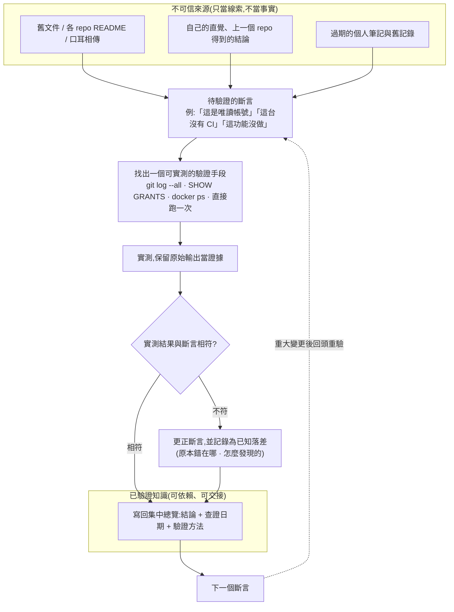

## 背景

> [!IMPORTANT]
> **核心痛點:接手另一條產品線的後台系統——六個 repo(後端 API、管理前端、Node WebSocket 服務、Electron 客服桌面程式、部署設定、獨立帳號平台)橫跨兩台主機,原開發者已不在團隊。手上有舊文件與各 repo README,但多處與現況不符,而且沒有任何方式能「預先知道」哪幾句是對的、哪幾句是錯的。**

- **零基準信任度**:舊文件記載的主機拓樸、金鑰、資料庫連線資訊,實測後發現**大量跟現況相反或已失效**。問題不是「文件有錯」——文件有錯很正常;問題是**錯與對混在一起、外觀完全一樣**,所以整份文件的可信度只能歸零重建。
- **多 repo 各自邏輯不一致**:六個 repo 表面上看起來架構類似(都是 Git + GitLab CI),但分支合併方向、CI 觸發規則、部署機制**每個都不一樣**。套用同一套假設不只是「猜錯」,而是會直接做錯事(例如把保護機制裝在反方向的分支上)。
- **沒有人可以隨時問**:原開發者已不在團隊,能交叉確認的只有目前還在維護周邊的同事(也不一定知道所有細節),大部分問題只能靠實測自己查出答案。

這頁記錄的不是「我寫了一份文件」,而是**在零可信基準的情況下,用什麼流程把「猜測」一條一條換成「可依賴的事實」**。方法論是這個專案真正的產出,文件只是它的載體。

## 核心方法論

> [!NOTE]
> 這七條不是憑空歸納的最佳實踐,是這個過程裡**至少 10 次「文件或直覺被實測打臉」之後**才沉澱出來的。
> 每一條都對應下方[踩坑實例](#具體踩坑實例)裡一次真實發生過的錯誤——這也是它可攜、可驗證的原因:
> 讀者可以自己回頭對照「哪一條規則救了哪一次錯」,而不是只能相信我的說法。

1. **文件只當線索,不當事實(evidence-based exploration)**——任何文件裡的斷言(「這是唯讀帳號」、「這台機器沒有 CI」、「這個 hook 的方向是 X」)在真正要依賴它做決策**之前**,都要先找到一個方法親手驗證一次:`SHOW GRANTS`、`git log --all`、SSH 進去看 `docker ps`。關鍵在於「依賴之前」——事後才發現斷言是錯的,代價已經付出去了。(對應踩坑 #1、#2、#4)
2. **不要把「查不到」跟「不存在」混為一談**——找不到某件事的證據時,預設假設應該是「我查的方法不對」,而不是「這功能沒做」。實際發生過兩次:一次以為某個控制功能沒實作,後來發現只是連線設定的名稱對不到服務端實際位置;一次以為某個入口在管理後台裡,實際上它在另一個服務自己的獨立介面。(對應踩坑 #6、#9)
3. **每個 repo 各自驗證,不要複製貼上上一個 repo 的結論**——四個看起來同構的 repo 裡,有一個的分支合併方向**完全相反**。這是最危險的一類錯誤,因為前三個 repo 驗證正確會給人「規則已經摸清楚」的錯覺;若沒有逐一查證,保護機制會裝在反方向的分支上,而且裝好當下不會報錯。
4. **用時間戳做鑑識分析,不要只看 commit 訊息**——`git log --format="%ad"` 抓出的精確時間戳,能分辨「這幾個 tag 是同一次 CI 除錯時密集打出來的」還是「真的是穩定間隔的正常發版節奏」。這個判斷單看 commit 訊息看不出來,而它直接決定了「這個 repo 的發版節奏該怎麼描述給下一個接手的人」。(對應踩坑 #3)
5. **命名與目錄會被人改掉,操作前先重新列出現場確認**——同一個位置在短時間內被改名兩次,而錯誤訊息完全不會提示「這是舊名字」,只會顯示「找不到路徑」。**失敗訊息本身不具診斷性**,所以只能靠操作前重新列一次目錄,而不是靠記憶。
6. **抓到自己判斷錯了,直接認錯修正**——這個過程裡至少 **3 次**先給出了錯誤結論(某個映像倉庫位置該不該改、某個風險的嚴重度分級、威脅模型的存取範圍假設),每一次都是重新用證據交叉檢查後**主動更正**,而不是替原判斷找理由。這條之所以要寫進方法論而不是藏起來:在零可信基準的探索裡,先給出錯誤結論幾乎是必然的,真正決定文件最終可信度的是**發現後多快改掉、以及有沒有把「原本錯在哪」一起記下來**。只留正確結論的文件,下一個人無法判斷哪些結論是被驗證過的。
7. **邊查邊寫回一份集中文件,不要只留在對話或腦袋裡**——每查到一件事、每做完一個決策,立刻寫回同一份總覽,並附上**查證日期與驗證方法**。這樣做有三個效果:同一件事不用查第二次;交接的人看得到判斷依據而不只是結論;而且日後回頭核對時,能一眼看出哪幾條結論已經舊到需要重驗。

## 斷言驗證迴圈

上面七條規則實際運作起來是同一個迴圈。每一條寫進總覽文件的事實,都必須從左邊的「不可信來源」走完這一圈,才能進到右邊的「已驗證知識」:

- **邊界的意義**:左邊的方框裡沒有任何東西可以直接拿來做決策,包括我自己上一個 repo 才剛驗證過的結論;右邊方框裡的每一條都帶著「什麼時候、用什麼方法驗的」。這條邊界是整套方法唯一的實質產出——**文件的價值不在於它寫了多少,而在於讀者能不能分辨哪一句被驗證過**。
- **「不符」不是丟掉重寫,而是留下落差記錄**:更正後的結論會連同「原本以為是什麼、怎麼發現不對」一起寫進總覽。錯誤的假設本身就是有用的資訊——它標示出「這個地方直覺會出錯」,下一個接手的人在同一個坑前面會看到警告。
- **迴圈是有回邊的**:右邊的「已驗證知識」也會過期。虛線那條回邊是刻意畫的——重大變更後要回頭重驗,否則這份總覽自己就變成下一份「不可信的舊文件」。

## 成果亮點

- **一份 1700+ 行、持續維護的架構總覽**:涵蓋六個 repo 各自的角色、資料庫地圖、主機與網路拓樸、已知風險清單、部署流程。關鍵不在行數,而在**每一條資訊都標註了查證日期與驗證方法**,不是憑印象寫的——這也讓文件本身可以被稽核。
- **抓出並修正 10+ 處文件與現實不符的斷言**(詳見下方踩坑實例)。每一處都足以在真正需要時造成誤判或誤操作,而它們在被實測之前,外觀跟正確的敘述完全一樣。
- **建立六個 repo 的分支與部署規則文件**,明確標出**哪一個 repo 的方向是相反的**,避免下一次有人(包含未來的我)沿用錯誤假設。
- **把重複性的維運動作沉澱成可重用工具**:一支對帳維運工具的操作流程被寫成可重複執行的 playbook,下次遇到同樣狀況不必重新翻程式碼決定該怎麼做。
- **順手修掉一個 CI 型別檢查失效的 bug**:從舊文件裡「待決策」的狀態,變成「查完成因、評估風險與工程量後直接修掉」。這件事本身不大,但它示範了探索的副產品——**把現況查清楚之後,原本看起來像技術債的東西常常只是沒人去看**。

## 具體踩坑實例

下表每一列的重點是**第二欄的「錯誤類別」**,而不是任何一列具體查到了什麼。具體事實只在這個系統裡有效;錯誤類別可以直接搬到下一個陌生系統當檢查清單。

| # | 錯誤類別 | 一開始的斷言 | 實測結果 | 驗證手段 |
|---|---|---|---|---|
| 1 | 環境拓樸想當然 | 兩個環境之間的網路是隔離的 | 文件對兩個環境之間可達性的描述與實測不符 | 直接嘗試連線 |
| 2 | 憑證假設未驗證 | 手上一把個人金鑰可以用 | 該金鑰未登記在目標主機的 `authorized_keys` 裡,連不上 | 直接 SSH 測試 + 比對 `authorized_keys` 內容 |
| 3 | 把過時註解當現況 | 某個 repo 的映像倉庫位置記錯了、該去修文件 | 現況其實是正確的,文件裡那行只是一句沒清掉的過時註解 | 與熟悉該系統的同事交叉確認 + 比對 commit 時間戳 |
| 4 | 權限範圍沒實際查 | 遊戲資料庫用的是唯讀帳號(文件如此記載) | 實測後,權限範圍與文件記載不符 | `SHOW GRANTS FOR CURRENT_USER()` |
| 5 | 威脅模型套用錯 | 主機共用其他專案,代表非相關人員也碰得到 | 實際可存取範圍遠比假設窄,威脅模型判斷錯了 | 與熟悉該系統的同事交叉確認 |
| 6 | 找錯地方就當沒做 | 某支對帳維運工具的手動觸發入口在管理後台裡 | 不在管理後台,而在 Node WebSocket 服務自己的獨立、僅內網介面 | 分別 grep 兩個前端 repo 的原始碼 |
| 7 | 分支關係想當然 | 後端 API 與管理前端的 `qa` 分支只是被動同步 `main` | 兩邊 `qa` 上各自卡著 2 個從沒進過 `main` 的獨立 commit,已經真的分岔過 | `git log origin/main..origin/qa` |
| 8 | 跨 repo 複製結論 | 獨立帳號平台跟其他三個 repo 一樣以 `main` 為主線 | **完全相反**,`qa` 才是主線,`origin/HEAD` 預設分支也指向 `qa` | 逐一查證分支圖 + 與同事交叉確認 |
| 9 | 「查不到」被當成「藏在別處」 | 官網的架構文件應該藏在某個地方 | 根本沒人寫過;根目錄 README 只涵蓋 API,官網程式碼是後來加進來、從沒回頭補文件 | 直接翻 README 全文 + 目錄結構 |
| 10 | 把小問題想成大債務 | CI 型別檢查壞掉是複雜的相容性債務 | 只是版本升級 + 一個設定值錯誤,清出來的錯誤也只有 **5** 個未使用變數 | 直接跑 `npx vue-tsc --noEmit` 拿真實錯誤訊息 |

幾列特別值得單獨講:

- **#8 是最危險的一列**。前三個 repo 的分支方向驗證正確,會給人「規則摸清楚了」的錯覺;第四個完全相反。如果沿用前三個的結論,`pre-commit` hook 會裝在反方向的分支上——而且**裝好當下不會報錯**,要等到有人真的往錯誤分支 commit 才會發現保護根本沒生效。這一列直接支撐了方法論第 3 條。
- **#6 與 #9 是同一種錯的兩個方向**。#6 是「查不到就以為沒做」(其實在另一個服務裡),#9 是「查不到就以為藏在別處」(其實真的沒人寫過)。兩者都源於**把「我的搜尋沒命中」當成關於系統的結論,而不是關於搜尋方法的結論**。
- **#4 留下的是方法,不是答案**。這一列真正可複用的部分是「**權限這種東西一律用 `SHOW GRANTS` 實際問一次,不要相信文件的描述**」——文件說唯讀不代表就是唯讀,而這個驗證只需要一行指令,成本遠低於誤判的代價。
- **#10 的方向是反的**,值得一起收:探索過程中不只會低估問題,也會高估。原本被歸類為「複雜相容性債務、待決策」的項目,實測後是版本升級加一個設定值——真正的成本是**沒人去跑那一行指令**。

## 可重用產出

離開這個系統之後,留下來的是這些角色明確的產出,而不是散在對話裡的結論:

- **一份架構與維運總覽**:六個 repo 的角色、資料庫地圖、主機與網路拓樸、已知風險清單、部署流程,每條標註查證日期與驗證方法。
- **一份跨 repo 分支與發版規則**:六個 repo 各自的分支主線、合併方向、CI 觸發條件與部署機制,並標出方向相反的那一個。
- **一份官網的架構說明**:原本完全不存在,補寫進該 repo 讓下一個人不用重新逆推。
- **一份客服桌面程式的部署與發布指南**:Electron 桌面程式的打包與發布流程,原本只存在於原開發者的操作習慣裡。
- **一支對帳維運工具的可重用 playbook**:把重複性維運動作固定下來,不用每次重新讀程式碼決定步驟。
- **四個 repo 的本機 `pre-commit` hook**:擋掉往錯誤分支 commit 的操作,把「哪個 repo 主線是哪一條」這個容易記錯的知識,從人腦搬到工具裡。

## 困難點

- **沒有一套共通的「怎麼判斷這個 repo 的邏輯」檢查清單**——每個 repo 都要重新從頭查(分支列表 → `origin/HEAD` 預設分支 → CI 觸發規則 → 合併方向 → 部署機制),沒有一次到位的方法,只能一個一個查證。而正因為前一個 repo 的結論不能複製,這個成本是**乘上 repo 數量**的,無法靠熟練度攤平。
- **文件與記錄系統本身也會過期**——探索當時記下的路徑、金鑰、拓樸判斷,過一段時間又被實際的操作(目錄改名、換用新金鑰)打臉。這是最反直覺的一點:**我為了解決「不可信的舊文件」而產出的文件,如果沒有回頭核對機制,它自己就會變成下一份不可信的舊文件**。所以總覽裡的查證日期不是裝飾,是判斷「這條還能不能信」的唯一依據。
- **判斷錯誤的成本不對稱**——有些錯誤(查錯地方)只是浪費時間,有些錯誤(分支方向裝反、以為權限是唯讀)會留下靜默失效的保護機制。難的地方在於**兩者在被驗證之前看起來一樣**,所以只能對所有要拿來做決策的斷言一律驗證,不能靠「感覺這條應該沒問題」篩選。

## 未來規劃

- 把這裡歸納的探索檢查清單(分支列表 → `origin/HEAD` → CI 觸發規則 → 合併方向 → 部署機制 → 實測關鍵斷言)沉澱成一份通用流程,下次接手全新系統時直接照流程走,不必重新摸索方法論本身。
- 定期(例如每次重大變更後)回頭核對總覽與現況是否還一致,並更新查證日期——讓那條回邊真的被走過,而不只是畫在圖上。
