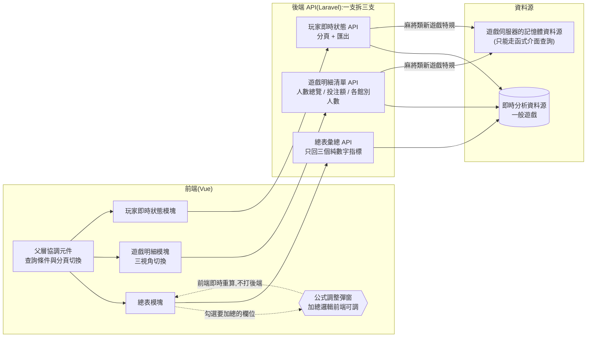

## 背景

舊版是一支累積五年補丁的單一頁面元件(712 行),加上一份 232 行的輔助設定檔。單一混亂 API 混雜回傳彙總、遊戲清單、玩家清單三塊資料,任何一塊出問題都會影響整頁,也無法個別分頁或快取。更麻煩的是彙總值不是純數字,而是帶顏色的 HTML 字串(例如 `<span style="color:red">123</span>`),不同代版本的數字還被直接字串相加,前端完全無法對它做算術。

而這一頁要覆蓋的範圍不小:116 款遊戲、最多 11 種不同倍率,全都得塞進同一組欄位固定的表格裡。

四個部門各自提出截然不同的痛點:

- **執行長**:為了在手機上一眼預覽,把所有遊戲人數與押注額壓在同一個 row 顯示,資訊密度過高、難以閱讀。
- **運營總監**:報表用顏色字串(`<span style="color:red">123</span>`)區分參數,各代版本數字直接字串相加,輸出面目全非,看不懂哪個數字代表什麼。
- **技術主管**:欄位原本只設計四個倍率欄,連現有遊戲的倍率種類都塞不下;加上五年補丁,資料結構無法辨識,有強烈重構需求。
- **風管**:需定期回報數值,但因欄位意義不明朗,常須詢問開發者才能確認欄位含義。

> [!IMPORTANT]
> 舊版單一混亂 API 一次混雜回傳彙總、遊戲清單、玩家清單,且彙總值用顏色編碼字串回傳,導致前端難以獨立處理任何一塊。

## 目標

將「線上會員」頁拆成三個獨立功能模塊(總表 / 遊戲明細 / 會員即時狀態明細),每個模塊有專屬 API、獨立分頁邏輯與欄位定義;同時讓總表公式在前端可調,無需每次改後端。

不做:自動刷新倒數(需求撤回,移除)。

## 成果亮點

- **4 部門一次收單**:執行長的手機友善 row、運營的清晰欄位、技術的結構重構、風管的明確數字,同一版本同時上線。
- **館別種類批次篩選**:遊戲選擇器可依「館別種類」(倍率 / 類型)批次篩選,比原本逐一勾選單一遊戲更利於分析判斷,大幅降低篩選操作成本。
- **總表公式前端可調**:執行長常調整「總大廳人數」的定義,公式調整彈窗讓任何人可在 UI 上即時調整加總邏輯,不需改 code。
- **遊戲明細多視角**:新增各館別人數(遊戲明細)模式,116 款遊戲各自顯示四個館別人數欄(倍率欄 1~4),不足四種補 0,棋牌遊戲自動排除。
- **拿掉顏色 coding**:彙總值從顏色字串改成純數字欄位,前端直接做算術,不再有字串相加亂掉的問題。

## 量化成效

| 指標 | 重構前 | 重構後 |
|------|--------|--------|
| 前端主檔行數 | 712 行(單一頁面元件) | 約 190 行(父層)+ 7 子模塊 |
| 輔助設定檔 | 232 行(混在單一檔) | 3 個獨立欄位定義檔 |
| API 數量 | 1(全包) | 3(各自職責清晰) |
| 支援的倍率欄數 | 4(硬編碼) | 動態倍率欄 1~4(自動補 0) |
| 彙總公式調整 | 改後端 code | 前端 UI 即時調整 |
| 顏色 coding 依賴 | 有(無法算術) | 無(純數字) |
| 匯出功能覆蓋 | 僅玩家清單 | 玩家清單 + 遊戲明細 |

## 解法與架構

拆分後,每個前端模塊只對應一支 API、每支 API 只決定自己要打哪個資料源——職責邊界與資料流如下:



### API 拆分(Laravel)

舊版單一混亂 API 把三塊資料混在同一回應,任何一塊出問題都影響整頁,也無法個別分頁或快取。拆開後每支 API 職責單一,呼叫時機、分頁邏輯、錯誤處理各自獨立。

| 舊 API | 新 API | 職責 |
|--------|--------|------|
| 單一混亂 API(全包) | 總表彙總 API | 三指標彙總 |
| 同上 | 遊戲明細清單 API | 遊戲明細(支援 人數總覽 / 投注額 / 遊戲明細 三視角) |
| 同上 | 玩家即時狀態 API | 玩家即時狀態清單(含分頁 + 匯出) |

### Vue 元件拆分

舊版所有邏輯集中在單一頁面元件,任何需求改動都要在 700 行裡定位;拆成子元件後各模塊只管自己的 template 與欄位,父層只做協調,新需求加在對應子模塊即可,不影響其他分頁。

| 舊結構 | 新結構 | 職責 |
|--------|--------|------|
| 單一頁面元件(712 行) | 父層協調元件 | 父層協調 |
| 輔助設定檔(232 行) | 總表渲染元件 + 彙總正規化模組 + 欄位定義 | 總表渲染與公式 |
| 同上(遊戲明細部分) | 遊戲明細元件 + 欄位定義 | 遊戲明細三視角 |
| 同上(玩家清單部分) | 玩家即時狀態元件 + 欄位定義 | 玩家即時狀態 |

## 新遊戲接入:拆分價值的事後驗證

重構完兩個月後出現一個實測案例:一款麻將類新遊戲要出現在這一頁,但它**完全不寫**報表側的即時分析資料源——玩家狀態只活在遊戲伺服器的記憶體資料源裡,只能透過遊戲伺服器提供的函式介面查。這是這一頁第一個「資料完全不在報表庫」的遊戲。

因為三支 API 已經各自獨立,這個異質資料源只需要在各自的 dispatch 點插特規、彼此互不干擾(介面隔離,interface segregation):總表彙總 API 完全不用動,遊戲明細與玩家清單各自在自己的插入點處理。**新遊戲接入不用動到別人的路徑**——如果還是原本那支全包 API,同一件事會變成在一個混雜三種職責的方法裡插判斷式。

四個插入點的處理各自不同:

- **遊戲明細清單是兩段式 loop**(先建「遊戲 × 倍率」的 tuple、再逐 tuple 查表),所以特規必須「第一段先跳過、第二段跑完才注入」,否則會去查一張根本沒有這款遊戲的表。
- **人數總覽模式**注入實際在桌人數;**投注額模式**直接填 0——函式介面沒有投注額,那就連呼叫都不必發。
- **各館別人數模式**攔截後只填對應的那一欄,其餘補 0。
- **玩家即時狀態**以玩家 ID 附加進資料集後,後續完全沿用既有的欄位補齊流程,不另開一條路。

## 異常處理與維運規劃

- **優雅降級(graceful degradation)**:函式介面回來的信封逐層 `is_array()` + `isset()` 防護,遊戲伺服器少回某個 key 時降級為 0 人,而不是整頁 500(來龍去脈見下方踩坑)。
- **可觀測性**:兩個解析失敗點記 log 時連原始信封一起印——否則事後只看得到 0 人,分不出是「真的沒人」還是「查詢介面掛了」。
- 重構主體的三支 API 本身沒有專屬監控或告警。

## 困難點與踩坑

**最痛的坑 — 彙總值字串相加**

- *症狀*:運營總監反應「總遊戲人數有時候是 `123456`,有時候是 `1234` 開頭的奇怪長字串」。
- *誤判*:以為是 API 回傳格式偶發異常,查了 server log 確認數字是對的。
- *真正根因*:舊版彙總值直接拼成 `"<span>123</span><span>456</span>"`,前端 `+` 運算把兩個字串接在一起而非相加。
- *解法*:後端只回傳純數字,前端統一做加總。

```js
// 症狀:後端回傳的是帶標籤的字串,不是數字
const a = '<span style="color:red">123</span>';
const b = '456';
a + b;            // "…123…456" → 畫面出現奇怪長字串,而非 579
Number(123) + Number(456); // 579 → 修正後:後端只回純數字,前端才做算術
```

因為後端 log 顯示的數字是對的,最初誤判成 API 偶發異常,繞了一圈才找到真正的根因在前端型別;這也是為什麼修正時把規則定死成彙總值只能回傳 `number`、絕不能帶任何 HTML 標籤。

其餘幾個一起處理掉的坑:

- **顏色字串清除**:舊版彙總值是帶 `<span>` 標籤的字串,拆開需同步改 Laravel 回傳格式、Vue 顯示邏輯、彙總計算,三處必須一起動。
- **倍率欄位不對稱**:不同遊戲的倍率清單長度不同(1~11 個),舊版有些補 0、有些直接不顯示,邏輯不一致。改成統一輸出倍率欄 1~4,不足四種一律補 0,依倍率清單的 index 映射(不能依值名稱,不同遊戲同一 index 對應不同倍率值)。
- **棋牌遊戲排除**:棋牌類遊戲的倍率超過 4 種,必須在遊戲明細模式中靜默過濾(後端排除,UI 層仍可選),但過濾邏輯不能影響人數總覽模式。

**接入異質資料源時的兩個坑**

第一個是 **`empty()` 擋不住「非空但缺 key」,結果是整頁 500 而不是降級**。Laravel 5.7 的 `HandleExceptions` 在 `error_reporting(-1)` 下會把 `E_NOTICE` 轉成 `ErrorException`,所以遊戲伺服器回傳的信封少了某個 key 時,拿到的不是規格期望的「降級成 0 人」,而是 API 直接 500——寫 `empty()` 反而給了一種「已經防到了」的錯覺。

```php
// 示意:錯誤寫法 —— 信封非空但缺 key,下一行取 key 就觸發 E_NOTICE → ErrorException → 整頁 500
if (!empty($envelope)) {
    $tables = $envelope['data']['list'];
}

// 修正:逐層 is_array() + isset(),缺 key 時降級為 0 人,並連原始信封一起記錄
if (is_array($envelope) && isset($envelope['data']) && is_array($envelope['data'])
    && isset($envelope['data']['list']) && is_array($envelope['data']['list'])) {
    $tables = $envelope['data']['list'];
} else {
    $tables = [];  // 降級:視為 0 人,而不是讓整頁掛掉
    Log::info('查詢介面回傳格式不符,原始信封:' . json_encode($envelope));
}
```

信封式外部 API 的解析,`empty()` 只夠擋 null 與空陣列;只要下一步還要往裡面取 key,就得先 `is_array()` 再 `isset()`。而失敗時一定要把原始信封記下來,否則降級之後畫面上只剩一個 0,事後分不出是真的沒人還是解析失敗。

第二個是 **欄位說明對不上真正的 join key**:

- *症狀*:新遊戲的玩家列**出得來,但補齊的欄位全是 `-`**(角色名稱、唯一碼、IP、登入時間),其他遊戲一切正常。
- *為什麼走錯*:文件的欄位表把其中一個欄位註記成「帳號 guid」,照字面讀顯然該拿它去 join;真正對得上玩家主檔唯一識別欄的是另一個 ID 欄位。
- *根因*:補齊邏輯查無資料就跳過,預填的 `-` 原封不動留著——**查無不報錯**,所以症狀是欄位空、不是拋例外。

接外部函式介面不能只讀欄位說明的名詞,要拿真資料把 join key 對過一次。這裡預填 `-`(而不是留空)意外換到一個可分辨的徵狀:全欄 `-` 精準指向「join 沒中」而不是「介面沒回」——介面沒回的話,整列根本不會存在。

## 關鍵取捨

**公式調整放前端而非後端**

- 否決方案:讓後端計算「總人數」,前端只顯示結果。
- 否決理由:執行長常改「哪幾種人算進總人數」,若放後端每次都需要改 code + deploy,前端調整只改設定。
- 選擇:公式調整彈窗讓使用者在 UI 勾選「哪些欄位加總」,結果存在前端狀態、刷頁重置(刻意設計,執行長的調整多半是臨時性的,不需要永久化)。

**遊戲明細不分頁**

- 否決方案:分頁 + server-side sort(仿現有人數總覽)。
- 否決理由:遊戲明細資料量是遊戲款數(去棋牌後約 50~100 列),全量前端排序足夠;分頁後 sort 只能排當頁,使用者預期是排全部。
- 選擇:後端一次回傳全量、隱藏分頁,前端 client-side sort。

**異質資料源的幣別過濾:兩支函式在記憶體裡 join**

- 背景:麻將類新遊戲的「玩家在桌」查詢回傳的欄位裡**沒有幣別**,而這款遊戲雙幣共用同一批桌;這一頁的既有口徑不含另一種虛擬貨幣(Q 幣)的館別(由另一支流程獨立處理)。不過濾不會報錯,只會讓人數偏大——這種「不報錯、只是數字錯」最難被發現。
- 否決方案 A:直接查設定表拿幣別。玩家身上帶的是 runtime 產生的桌號,對不上設定表的主鍵、join 不起來;而且設定表與記憶體資料源本來就可能不同步。
- 否決方案 B:對每一張目標幣別的桌逐桌呼叫。會變成 N 次 HTTP。
- 選擇:多打一支「活躍桌」查詢(回傳桌號 + 幣別),在記憶體裡建「桌號 → 幣別」的對照,再用玩家所在的桌對進去,只留目標幣別。固定 2 次 HTTP,而且兩份資料同屬 runtime 視角、不會互相打架;封裝成一個共用取數函式後,四個插入點共用同一套過濾。

## 未來規劃

- 各館別人數的欄位標籤(依倍率 / 館別命名)目前硬編碼在欄位定義檔,若未來倍率順序改變需要同步更新。
- 公式調整彈窗的勾選狀態刷頁重置,這是刻意設計:執行長調整「總大廳人數」的定義多半是臨時性的(例如某段時間不想把立即玩算進去),永久化反而會讓舊設定干擾下一個查看的人——沒存起來不是漏做。真要永久化的選項是存在使用者本地(localStorage)或後端的使用者設定表(可跨裝置),等需求真的出現再加。
- 遊戲明細目前聚合所有會員類型(正式 + 離線 + 試玩 + 無帳號 + 個人座);若需要拆開各類型,需擴充欄位。

## 檔案結構整理

**重構前(刪除)**

```
線上會員頁/
├── 單一頁面元件      (712 行,全部混在一起)
└── 輔助設定檔        (232 行)
```

**重構後(新增)**

```
線上會員頁/
├── 父層協調元件                (約 190 行,只做協調)
├── 總表模塊/
│   ├── 總表渲染元件
│   ├── 彙總正規化模組
│   └── 欄位定義
├── 遊戲明細模塊/
│   ├── 遊戲明細元件            (三視角切換)
│   └── 欄位定義                (人數總覽 / 遊戲明細)
├── 玩家即時狀態模塊/
│   ├── 玩家即時狀態元件
│   └── 欄位定義
└── 公式調整彈窗                (公式調整 UI)
```

單次重構涉及 13 個檔案、淨變動約 +928 / -1068 行,新增結構完全取代舊的單一大檔。
