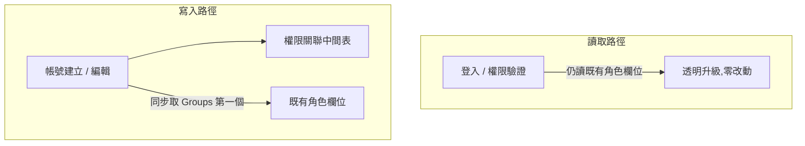

## 背景

- 舊系統每個後台帳號只能對應一種角色(既有角色欄位代表該帳號所屬的權限群組編號,對應角色定義表的群組號,決定後台可見功能與操作範圍)。
- 遇到複合需求(例如企劃 + 數值 + 組長)必須為此另外新建一個角色,長期累積大量「一次性角色」。
- 同職位但功能組合不同的人,共用同一角色會權限過寬,分開管理成本又極高。
- 「全部權限」(群組號 0)無法與其他角色混用,邊界行為不明確。

## 目標

新增一張中間表讓一個帳號可綁多個角色,後端合併各角色的 rule 字串後整份傳給前端;既有角色欄位保留以相容現有讀取路徑,不改動現有登入與權限驗證流程。

## 成果亮點

- 新建權限關聯中間表(`sn`, `account`, `groupNum`, `unique(sn, groupNum)`),一個帳號可綁定多個角色群組。
- 後端實作 `mergePermissions()` 演算法:將多個 rule 字串的 suffix 字元做 union,合併後把 `ruleMerged` 傳給前端,前端不再需要自行解析 rule。
- 以 Seeder 自動將所有帳號的既有角色值搬進新表,升級零停機、舊資料完整保留。
- 前端複選 UI:群組改為 checkbox 多選;「全部權限」只能單選,選了不能再加其他群組(UI 彈窗攔截)。
- 既有角色欄位持續同步(寫入第一個群組號),現有讀它的程式碼無感升級。

## 量化成效

| 面向 | 改前 | 改後 |
|------|------|------|
| 單一帳號最多角色數 | 1 | 不限(unique(sn, groupNum) 去重) |
| 複合需求需新建角色 | 必須 | 不需要,選已有角色組合即可 |
| 前端 rule 解析邏輯 | 前端自行查表 | 後端拼好 `ruleMerged` 直接用 |
| 升級停機時間 | — | 0(Seeder 熱升級) |

## 解法與架構

### 資料庫層

| 表 | 異動 | 說明 |
|----|------|------|
| 後台帳號表 | 既有角色欄位繼續保留 | 相容舊路徑;寫入時同步第一個群組號 |
| 角色定義表 | 不動 | 角色定義與 rule 格式不變 |
| 權限關聯中間表 | **新增** | 帳號 ↔ 角色多對多;unique(sn, groupNum) 防重複 |

```sql
CREATE TABLE account_role_map (
  id         BIGINT AUTO_INCREMENT PRIMARY KEY,
  sn         INT NOT NULL,
  account    VARCHAR(...) NOT NULL,
  groupNum   INT NOT NULL,
  created_at TIMESTAMP DEFAULT CURRENT_TIMESTAMP,
  UNIQUE KEY uq_sn_group (sn, groupNum)
);
```

### 後端層

| 方法 | 功能 |
|------|------|
| `getAccountGroups($account)` | 查中間表;若空則 fallback 讀既有角色欄位 |
| `setAccountGroups($account, $groups)` | Transaction 清舊寫新 + 同步既有角色欄位(取 `$groups[0]`) |
| `mergePermissions($groupNums)` | 讀多個角色的 rule,union suffix 字元後重組 |
| `getGroupNames($groupNums)` | 回傳群組號 → 名稱對照 map |

**rule 合併演算法核心**:

```
rule 格式:"1-1_A,1-2_,1-4_AB"
每段 = key_suffix,suffix 中每個字元為獨立子權限

合併步驟:
1. explode 各群組的 rule 字串 → ["1-1_A", "1-4_B"]
2. 以 _ 拆 key / suffix
3. 對同 key 的 suffix 字元做 union(去重 + sort)
4. 重組 → "1-1_A,1-4_B"(若兩個都有 1-1 且 suffix 為 A、B → "1-1_AB")
5. 特殊:["all_"] 改輸出 "all"
```

### 前端層

| 元件 | 異動 |
|------|------|
| 帳號列表頁 | 改讀 `Groups[]`;permission 欄改顯示群組名稱 join ", " |
| 群組選擇元件 | 移除「未指派(-1)」選項;停用舊 management 欄位(功能改由複選取代) |
| 帳號建立 / 編輯元件 | 群組改複選;驗證「全部權限(群組號 0)不可與其他群組同時選」 |
| 前端 store | 移除已廢棄的合併狀態 |

### 相容策略



## 困難點

- Rule 字串合併需手工解析格式(`key_suffix` 字元級 union),邊界情況多(空 suffix、多字元、全部權限特殊值)。
- 中間表的 unique key 設計需兼顧 `sn`(帳號表主鍵)與帳號字串,避免同帳號不同 sn 的罕見資料造成問題。

## 最痛的坑

### 症狀一:全部權限(群組號 0)存不進中間表

「全部權限」在系統裡不是「未指派」,而是一個有語意的真值——它的角色群組編號剛好是 `0`。改版初期,設定全部權限完全存不進去,選了等於沒選。第一直覺是往前端查:是不是 checkbox 沒把值送上來?加了 log 才發現值明明有送到後端,是後端自己把它吃掉了。

根因是最初的過濾器 `return $g > 0;`:`0 > 0` 為 false,合法的「全部權限」被當成雜訊濾掉。

```php
// 有坑:0 > 0 為 false,全部權限(群組號 0)整個被濾掉
$groups = array_filter($input, fn($g) => $g > 0);

// 修正:改成 null / 空字串判斷,讓合法的 0 通過
$groups = array_filter($input, fn($g) => $g !== null && $g !== '');
```

這也是為什麼凡是 `0` 帶有業務語意的欄位,守門條件都應該用 null / 空值判斷,而不是 `$g > 0` 這種大小比較——在 PHP 的 `array_filter` 裡,`0` 本身就是 falsy。

### 症狀二:全部權限合併後輸出「all_」而不是「all」

角色定義表對「全部權限」存的 rule 是 `"all"`(不含底線),但 `mergePermissions` 照 `key_suffix` 格式解析:`"all"` 無底線 → key = "all"、suffix = [] → 重組成 `"all_"`。前端驗證因為預期 `"all"` 而失敗。解法是在合併結果做一次特判,把 `["all_"]` 還原成 `["all"]`——字串格式演算法遇到不照格式走的特殊值時,直接特判會比硬套通用邏輯更穩。

## 關鍵取捨

| 決策點 | 最終選擇 | 否決方案 | 理由 |
|--------|----------|----------|------|
| 舊帳號資料升級 | Seeder 一次性遷移 | 首次讀取時 lazy init | Seeder 能在部署後立刻驗證資料完整性;lazy init 有「第一次讀到的是舊資料」的競態風險 |
| 既有角色欄位去留 | 保留並持續同步 | 直接移除、全面改讀新表 | 多處程式直接讀它,一次拔掉的影響半徑太大;保留同步後,現有讀取路徑零改動、透明升級 |
| 權限合併的位置 | 後端(server-side) | 前端解析 | 前端解析 rule 格式有歷史包袱、難維護;後端統一輸出合併結果更乾淨,前端只需消費 |

這三個決策共同的取向是用「相容 + 同步」換掉「重寫 + 大改」,把新舊系統的接縫控制在最小,才能做到零停機熱升級。

## 未來規劃

- 權限變更 API 目前是批次更新既有角色欄位,若要支援複選批次指派需同步更新中間表。
- 後台登入後的權限載入目前仍只讀既有角色欄位 + 單一角色的 rule;若要讓多角色真正生效,登入流程需改為呼叫 `getAccountGroups` + `mergePermissions`。
- 權限關聯中間表目前無 `updated_at`,若有稽核需求可再補。
- 「全部權限」(群組號 0)的業務語意建議在 DB 加註解或文件固定,避免日後誤刪對 `0` 的判斷。

## 附錄

**可複用經驗**:PHP rule 字串的「suffix 字元 union」演算法可直接搬到任何類似 ACL `key_suffix` 格式的系統;對可能合法出現 `0` 的整數欄位,`$g !== null && $g !== ''` 是比 `$g > 0` 更安全的 filter 條件。

**API 合約(改版後)**

- 帳號列表 API → 回傳 `Groups[]`、`GroupNames[]`、`ruleMerged`。
- 建立 / 編輯帳號 API → 接收 `Groups[]`,觸發 `setAccountGroups`。
- 權限變更 API → 目前仍只改既有角色欄位(尚未支援多群組批次)。
