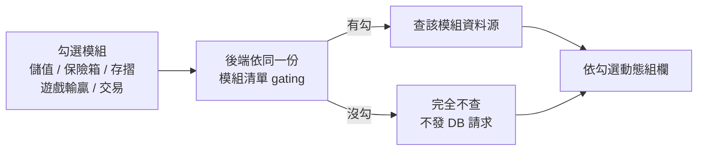

## 背景

> [!IMPORTANT]
> **核心痛點:風管要查網咖 Top20 玩家的整月金流,但資料分散在 5 個頁面,且格式不一。**

- **查詢步驟繁瑣**:每位玩家都要開「帳號存摺」「角色輸贏」「轉帳中心」「信件中心」「會員查詢」五個頁面,各自手查再彙整。
- **Top20 = 至少 20 輪手工操作**:網咖排行榜一次要查 20 位玩家,每人至少 5 個頁面,風管人工成本極高。
- **資料欄位定義不一致**:各支 API 主鍵混用 OpenID / GUID / accountId,手查時容易對錯人。
- **無法批量匯出**:現有頁面皆不支援多玩家一次 CSV 匯出。

## 目標

新增一支以玩家為主軸的金流報表頁,整合 6 支資料源、取代原本 5 個頁面的逐頁手查,支援單筆查詢、批量查詢(最多 20 筆),以及網咖排行頁「Top20 一鍵匯出」跨頁查詢;所有結果可一次下載 CSV。

## 成果亮點

1. **單列彙整 6 支資料源**:OpenID、GUID、角色名稱、儲值點數、儲值兌換後獲得的 C 幣、遊戲總輸贏(含各遊戲明細)、轉入合計與明細、轉出合計與明細,全在同一頁同一列。
2. **批量查詢**:貼上或匯入 GUID / 角色名稱清單(最多 20 筆),一次查詢所有玩家並產出多列 CSV。
3. **網咖 Top20 一鍵匯出**:排行頁點擊按鈕 → sessionStorage 傳參 → 自動導頁 → 自動批量查詢 → 自動下載上月 CSV;全程無需手動操作。
4. **後端重用既有邏輯**:輸贏彙整直接呼叫既有的遊戲輸贏 Controller,轉帳彙整直接呼叫既有的轉帳查詢邏輯,不重複實作。
5. **多行欄位 CSV 不截斷**:遊戲明細、轉入/轉出明細以 `\n` 串接後用標準雙引號跳脫(非 `="..."` Excel 公式格式),Excel 開啟後儲存格內可正常換行顯示。
6. **批量查詢效能優化(三個 Phase 全部 batch 化)**:`pcntl_fork` 在正式機 web SAPI 無效後(詳見最痛的坑 2),三個 Phase 改為批量 IN-clause:Phase 1 會員身份批量查詢(1 次 JOIN)、Phase 2.5 轉帳批量彙整(2 次 IN-clause 取代 N×4 次)、Phase 3 輸贏批量查詢(統計表 batch + 即時缺口序列 fallback)。正式機 20 人批量從 4~5 分鐘降至 **15~20 秒**。

## 量化成效

| 指標 | 改善前 | 改善後 |
|------|--------|--------|
| 查 Top20 玩家金流 | 手查 5 頁 × 20 人 ≈ 100 次操作 | 點 1 下,等待後自動下載 CSV |
| 批量上限 | 無(只能單筆) | 前端 20 筆、後端安全閥 100 筆 |
| 資料源整合 | 5 個分散頁面 | 1 份 CSV,1 列 = 1 位玩家 |
| 20 人批量查詢耗時(正式機) | 序列 foreach:**4~5 分鐘** | 三 Phase batch:**15~20 秒**(正式機)/ **1.8 秒**(QA) |

> [!NOTE]
> 實測依據:最終採用的 IN-clause batch 方案,QA 環境序列 5.9s → batch 1.8s(**3.2×**)。早期否決的 `pcntl_fork` 方案佐證:20 人 × 3 支 DB 查詢,每人 I/O ≈ 10,500ms,序列環境約 210,000ms、fork 環境約 10,700ms;但正式機 web SAPI 無法 fork,未採用(詳見坑 2)。

## 解法與架構

### 前端(Vue 2)

| 元件 | 職責 |
|------|------|
| 金流報表主頁 | `activated()` 讀取 sessionStorage 跨頁觸發、資料彙整與 CSV 匯出 |
| 批量查詢對話框 | 持有 type / text 狀態、CSV 解析、20 筆上限 UI |

**單筆查詢流程**:

1. 查會員身份(Type=2 GUID / Type=3 角色名稱)→ 取得 GUID、OpenID、帳號 ID(accountId)
2. `Promise.all` 並行:儲值彙整 / 遊戲輸贏 / 轉帳彙整

**跨頁觸發(網咖排行頁 → 金流報表頁)**:


- 排行頁把 `{type, list, startTime, endTime}` 寫入 sessionStorage 後路由導頁。
- 報表頁 `activated()` 讀到後**立即移除**(防止 keep-alive 重激時重複觸發),再執行批量查詢,完成後 `$nextTick` 自動觸發匯出。

### 後端(Laravel)

| 元件 | 職責 |
|------|------|
| 金流報表 Controller | 儲值彙整、轉帳彙整、批量彙整三支端點 |
| 儲值明細 Model | 查儲值明細表(月分表),WHERE 帳號 ID(儲值與系統手動補點都有值) |
| 金流異動 Model | 查金流明細表(日分表),WHERE 玩家 ID(= GUID) |

**批量處理**(已移除 `pcntl_fork`,改為全 batch IN-clause):

- **Phase 1 會員身份批量**:1 次「帳號表 JOIN 角色表 WHERE name / guid IN (...)」取代 N 次序列查詢。
- **Phase 2 ClickHouse**:`curl_multi` 批次並行送出所有玩家的儲值點數與兌幣 SQL。
- **Phase 2.5 轉帳批量彙整**:2 次 IN-clause(轉帳紀錄表 + 系統信件表)取代 N×4 次序列查詢。
- **Phase 3 輸贏批量查詢**:統計表 2 次 IN-clause batch + 即時缺口序列 fallback。
- `set_time_limit(480)` / `ini_set('max_execution_time','480')`。
- 去空白、去重後後端安全閥 100 筆;前端 dialog 限制 20 筆(按鈕 disabled + 字色變紅)。

**輸贏統計排程**:

- 每小時 :40 分統計**上一小時**資料(14:40 跑 → 統計 13:xx)。
- 即時缺口 = 最後統計小時的 :59:59 到現在,最大約 **1h40m**。
- 批量查詢分段邏輯:先查統計表取得最後統計時間,得到統計邊界;邊界內 → batch IN-clause;邊界後的缺口 → 序列補算(只補缺口段,不重算統計表);查上個月資料時缺口為 null,純 batch。

**轉帳合併**:依對方 GUID(無則角色名稱)合併加總金額,並篩掉未完成的轉帳。

## 後續演進:從固定欄位到可勾選模組

初版把五個頁面收斂成一列,解決了「逐頁手查」;但上線後暴露的是另一類問題 —— **這張報表長不大、也看不透**:

- **「儲值兌換後獲得的 C 幣」是一團黑盒**:一個欄位混了保險箱、存摺多種金流,風管看到數字卻無法拆解「這筆 C 幣是從哪來的」。
- **金流品項寫死在後端常數**:每新增一種金流異動類型(刮刮卡、免費遊戲、戰隊禮包…)都要改程式碼、重新上線才會出現在報表,維運跟不上遊戲上新功能的速度。
- **每次查詢都全打**:不管使用者只想看儲值還是只想看交易,後端一律把所有資料源查一遍,批量時特別浪費。
- **扣除類顯示成正數**:押注、購買、寄禮這些「錢出去」的品項在明細顯示正值,加總又只是把全部相加,看不出淨額。
- **代號對照會無限長**:代號說明是單欄往下疊,品項一多就拖成一長條,順序凌亂也無法下載。
- **數字對不起來時難查**:需求方說「這欄不對」,工程得手動翻程式碼才能回答「它到底下了什麼 SQL、走哪張表」。

第二階段把報表改造成**模組化、可自我擴充、可自助核對**的系統;使用方也從風管一個部門,擴到風管(看報表)、QA 與營運(自助對帳)。刻意不動的是初版已穩定的批量與跨頁匯出骨架。

### 可勾選模組 = 效能開關

查詢條件加一組複選:儲值、保險箱、存摺、遊戲輸贏、交易共 **5 個模組**。前端依勾選動態組出欄位,後端依同一份模組清單 gating —— **沒勾的模組完全不查**,批量時可直接跳過最貴的遊戲輸贏與逐日存摺明細。



### 把黑盒 C 幣拆成三個語意欄位

原本一個「獲得 C 幣」欄位,拆成 **保險箱明細**(策展 10 個品項)、**存摺明細**(策展 44 個品項)、**存摺加總** 三欄;每欄以「品項:金額」逐行顯示、依帶號額度排序,看得出 C 幣的來源組成而不只是一個總數。

其中刮刮卡購買 / 獎金、購買 / 對戰免費遊戲這 4 個品項依需求「列進明細但不計入加總」,所以明細各項相加**刻意**不等於加總欄;對照表把這 4 項標星號並註明「與加總不一致、非錯誤」—— 文案刻意用方向中性的「不一致」,因為這 4 項有正有負,明細可能大於也可能小於加總。

### 扣除類顯負數、加總取淨額

明細的顯示值改由代號決定正負(負碼 = 扣除),加總從「全部相加」改成帶號淨和 —— 加項加、扣除減。細節與那條對兩種儲存慣例都成立的算式見坑 8。

### 品項清單自我擴充:新代號零程式改動

存摺明細與加總改成自動納入代號定義表裡「屬於金流異動類型、且代號落在預留正碼區間 `[118, 1000)`」的品項 —— **在定義表新增一筆,報表下次查詢就自動長出那個品項,不用改任何程式碼、也不用重新上線**(開閉原則 / 設定驅動)。

實作上刻意用「字串合併」而不是把整條查詢改成用整數代號過濾:定義表的名稱欄位剛好等於金流明細表的異動描述欄位,所以只要把符合區間的名稱併進既有的 `whereIn` 清單就好,查詢結構完全不用重寫。批量查詢時每位玩家都會取一次品項對照,因此對照表在單一 request 內 memo 一次,避免退化成 N 次查詢;讀不到定義表時 try/catch 退空 —— 報表照常產出、只是動態品項暫缺(graceful degradation),不讓整張報表跟著爆掉。

### 代號對照:從單欄清單變成可用的工具

代號說明從單欄往下疊改成 **CSS grid 多欄**(依容器寬度自動決定欄數)、代號 **降序** 排列、可 **下載 CSV**、並一併顯示數字代號;僅列明細不計加總的 4 個特例標星號並置末。整塊抽成**頁面私有元件**(同資料夾、區域註冊,不進共用元件庫 —— 見取捨 6),資料則收斂到單一對照端點供元件自載。

### 匯出查詢 SQL:給 QA 的自助對帳規格書

新增一支「匯出 SQL」端點,回傳本次查詢每個模組打了哪支 API、下了什麼 SQL,綁定參數一律內聯成**可直接貼進 MySQL client 執行**的語法(即使該模組實際走 ClickHouse,也輸出等義的 MySQL 並加註)。價值就在「貼進 DB 跑出來等於畫面」:QA 與營運自己就能核對每個欄位怎麼算出來,不必找工程翻程式碼。這個做法後來沉澱成一份可複用的內部流程規範,給其他多模組報表照著做。

### 演進前後對照

| 指標 | 模組化前 | 模組化後 |
|------|--------|--------|
| C 幣來源可讀性 | 1 個混合欄位、無法拆解 | 3 欄(保險箱 / 存摺明細 / 存摺加總)+ 逐品項明細 |
| 新增金流代號上報表 | 改後端常數 + 重新上線 | 落在預留區間就 **0 程式改動自動出現** |
| 只想看部分模組 | 一律全查 5 個模組 | 勾選才查,未勾的模組**完全不打 DB** |
| 扣除類與加總 | 顯示正數、加總不是淨額 | 扣除顯負、加總 = 帶號淨額 |
| 代號對照品項變多 | 單欄無限往下長 | 多欄 grid、代號降序、可下載 |
| 報表數字對帳 | 工程手動翻程式碼 | QA 按「匯出 SQL」自己貼 DB 對帳 |
| 轉帳批量正確性 | 批量與單筆結果不一致(多算 / 少算) | 單筆 = 批量(同一套去重邏輯) |

### 後續規劃

- 動態品項目前是「查詢時打一次定義表」,品項極少變動;若未來變動頻繁再加短 TTL 快取。
- 扣除類(負碼)的自動納入,待遊戲端代號語意穩定後再評估。
- 多欄排版的欄數目前吃浮層寬度;品項再暴增可考慮改成可捲動的分類頁籤。

## 最痛的坑

### 坑 1:批量查詢序列太慢

**症狀**:20 人批量查詢上個月資料,後端序列 `foreach` 跑完需要 **4~5 分鐘**。

**根因**:每位玩家需跑多支 DB 查詢(transfer + winOrLose + deposit),正式機約 10~15s / 人;20 人序列合計 200~300 秒。PHP 是單程序,`foreach` 只能等一人跑完再跑下一人。

**誤判 1**:以為 `set_time_limit(480)` 解決 timeout 就夠了,但 timeout 只是讓它「跑完」,等待體驗依然無法接受。

**誤判 2**:以為 `pcntl_fork` 可以並行化 → 實際上正式機 PHP-FPM web SAPI 無法 fork(見坑 2),部署後 log 顯示 `fork=no`,並沒有加速。

**真正的解法**:把 N 人各自查 transfer 改成 1 次 IN-clause 批量查詢(2 次 DB 代替 N×4 次),配合 ClickHouse 模式的輸贏查詢(約 250ms / 人 × 20 ≈ 5s),總耗時降至 **15~20 秒**。若未來想真正並行化,需改用 Laravel Queue + job dispatch 或 `parallel` 擴充,而不是 `pcntl_fork`。

### 坑 2:pcntl_fork 在正式機 web 環境完全無效

**症狀**:加了 `pcntl_fork` fan-out,部署後 log 顯示 `fork=no`,完全走序列 fallback,毫無加速。

**根因**:`pcntl` 擴充在 PHP 設計上只對 CLI SAPI 有效。PHP-FPM 啟動時根本不把 pcntl 放進 function table,`function_exists('pcntl_fork')` 直接回傳 false。這不是 `disable_functions` 能控制的,是 SAPI 層級的限制。

**為什麼會誤判可行**:

| 測試 | 結果 | 問題 |
|---|---|---|
| `php -r "var_dump(function_exists('pcntl_fork'));"` | `bool(true)` | 這是 CLI SAPI,不是 FPM |
| 檢查 `disable_functions` 為空 | 看起來沒禁用 | disable_functions 擋不到本來就沒載入的函式 |

**正確驗證方式**:在 controller 裡加一行 log 並觸發真實 HTTP request,不能用 CLI 測:

```php
Log::info('pcntl=' . (function_exists('pcntl_fork') ? 'yes' : 'no'));
```

### 坑 3:`parameters() on null` crash(手動建立 Request)

**症狀**:在後端呼叫既有的遊戲輸贏 Controller 時用 `new Request()` 手動建立請求,`isset($req['player'])` 觸發 `Request::offsetExists()` → `$this->route()->parameters()`,但手動建立的 Request 無路由解析器,`route()` 回 null → fatal error。

**誤判**:以為是 `$req->merge()` 的鍵值問題,調整了 merge 順序和鍵名,問題依舊。

**根因**:`offsetExists()` 會呼叫 `route()->parameters()`,手動 `new Request()` 沒有 `routeResolver`,所以 `route()` 是 null。

**解法**:Laravel 手動建立 Request 物件時,若後續程式碼用 `isset($req['key'])` 取值,必須補上路由解析器:

```php
$req->setRouteResolver(function () {
    return new class {
        public function parameters() { return []; }
    };
});
```

### 坑 4:儲值明細表用玩家 ID 查到空值

**症狀**:某些玩家的「儲值點數」一直回 0,但後台帳號存摺明明有資料。

**根因**:儲值明細表的玩家 ID 欄位在一般儲值時不記錄、為 null;系統手動補點時 OpenID 為 null;只有帳號 ID(accountId)欄位在兩種情境都有值。

**誤判過程**:第一版改用 OpenID,發現系統手動補點的資料仍查不到,才確認要改用帳號 ID。

**解法**:儲值點數加總改以帳號 ID 為 WHERE 條件,帳號 ID 從會員查詢 API 取得。

### 坑 5:共用 CSV 跳脫工具遇多行值自動套 `="..."`,被 Excel 截斷

**症狀**:CSV 匯出後,「遊戲明細輸贏」欄位在 Excel 只顯示第一行,其餘被截斷。

**根因**:共用的 CSV 儲存格跳脫工具平常用標準雙引號跳脫 `"..."`(十多個報表都靠它,本身沒問題)。但它有一段「強制文字」判斷 `/[,\r\n]/.test(str)` —— **含換行 `\n` 的值會被歸類成需強制文字,套上 `="..."` Excel 公式格式**。而 `="..."` 公式不支援儲存格內換行,於是多行內容只剩第一行。等於「多行」這個特徵本身觸發了截斷分支。

**背景:「強制文字」各條判斷原本在防什麼**(都是防 Excel 開 CSV 時自作聰明轉型 / 破壞結構):

| 判斷 | 防的問題 |
|---|---|
| `/^\d+:\d+$/`(數字:數字) | Excel 把 `1:100`(賠率)當**時間**解析 |
| `/^0\d+/`(開頭 0) | Excel **吃掉前導 0**(電話 `0912…`→`912…`) |
| `/^\d{11,}$/`(長數字) | Excel 轉**科學記號**(訂單號→`1.23E+13`) |
| `/^=/`(等號開頭) | Excel 當**公式**求值(`=1+1`→`2`) |
| `/[,\r\n]/`(逗號、換行) | CSV **結構字元**:逗號=欄位分隔、換行=列分隔,不包起來會拆散欄位 / 列 |

**解法**:本頁多行欄位不走共用跳脫工具,改寫一支頁內專用的跳脫函式,只做標準雙引號跳脫(`"..."` 包裹、內部 `"` 加倍、不加 `=`),`\n` 在雙引號內被 Excel 正確識別為儲存格內換行。不動共用工具,因為要同時確認其餘十多個報表沒有依賴 `="..."` 的強制文字效果。純值可以放心交給共用工具,但欄位可能含 `\n`(多行明細)時必須改用不帶 `=` 的標準跳脫。

### 坑 6:CSV 匯入編碼偵測靠 try/catch 失效 —— Big5 解錯不 throw

**症狀**:匯入 Big5 編碼的角色名單正常,但匯入 UTF-8 編碼的 CSV 時,中文角色名稱全變亂碼。

**誤判**:舊版寫 `try { TextDecoder('big5') } catch { TextDecoder('utf-8') }`,以為是「先試 Big5,失敗自動退回 UTF-8」的智慧 fallback。實際上這個 catch 幾乎永遠不會觸發。

**根因**:`TextDecoder('big5').decode()` 遇到讀不懂的 byte **不會 throw**,只會靜默輸出替換字元 `�`(U+FFFD)。catch 只有在「瀏覽器根本不支援 Big5 解碼器」時才觸發,主流瀏覽器都支援 → catch 永不觸發 → 等於不管什麼檔案都硬用 Big5 解,UTF-8 的多 byte 中文被誤讀成 Big5 就亂碼。

**關鍵不對稱性**:

| 解碼器 | 解對 | 解錯 |
|---|---|---|
| UTF-8 | 正常 | 冒出 `�`(byte 規則嚴格,非法序列 → 替換字元,可偵測) |
| Big5 | 正常 | 靜默亂碼,**不冒 `�`**(幾乎任何 byte 都能硬讀出字) |

只有 UTF-8 這個「嚴格的」解碼器解錯時會誠實冒 `�`,所以偵測順序必須是「先 UTF-8」。

**解法**:反過來 —— 先 UTF-8 解,檢查有沒有 `�`,有才改 Big5:

```js
text = new TextDecoder("utf-8").decode(bytes);
if (text.indexOf("�") !== -1) {          // 非有效 UTF-8
  text = new TextDecoder("big5").decode(bytes);
}
```

驗證 UTF-8、UTF-8+BOM(BOM 自動去掉)、Big5 三種來源皆正確。偵測文字編碼不能靠 `try/catch`(解碼器多半不 throw),要靠「解出來的內容合不合理」:先試嚴格的 UTF-8,冒 `�` 再退回寬鬆的 Big5,不能反過來 —— 寬鬆的編碼解錯不吭聲,抓不到。

### 坑 7:轉帳的「批量」與「單筆」結果對不起來 —— 多套了一層 IP 過濾

**症狀**:同一位玩家,單筆查詢與批量查詢的轉入 / 轉出金額不一致,批量有時多算、有時少算。

**誤判(而且方向還搞反了)**:一度以為單筆才是有問題的那條,想把單筆改成委派批量;實際上單筆才是正確基準,錯的是批量那條路徑。

**根因**:轉帳紀錄表同一張訂單有多列 —— 寄件方視角那列有來源 IP、目標 IP 為空,收件方視角剛好相反,而且各自還有建立與完成兩列;金額欄每列都相同。批量版比單筆版多加了「來源 / 目標 IP IS NOT NULL」,再配上逐欄的 `MAX()`:某張訂單若「該方向那一列」剛好缺 IP,整筆就被漏掉(少算);或者 `MAX()` 跨列各取最大,拼出一組實際不存在的欄位組合(選錯狀態)。方向判斷本來就該用每列恆有值的角色識別碼,而不是可能為空的 IP。

**怎麼發現**:拿兩份真實的多列資料逐列推演,確認「事件時間最新那一列的 IP 是空的」→ IP 過濾必然漏抓。

**解法**:批量比照單筆 —— 子查詢依方向的角色識別碼撈訂單編號(**不過 IP**),外層依事件時間 DESC 後,以訂單編號分組取每張訂單最新的**整列**。改完單筆 = 批量。

**可複用**:同一份資料有兩條路徑(單筆 / 批量)時,「多加一個看起來無害的 WHERE 條件」就足以讓兩條路徑不等價。批量版應該是單筆版的集合化改寫,而不是把語意重新實作一次;逐欄 `MAX()` 更要小心 —— 它取的是每欄各自的最大值,不保證這些值來自同一列。

### 坑 8:金流「值存大小、正負存在代號」—— 直接 SUM 會把扣除也加成正的

**症狀**:押注 / 購買 / 寄禮等扣除類品項在明細顯示正數,存摺加總 = 全部相加(不是淨額),跟帳對不起來。

**根因**:金額欄位存的是「金額大小」,正負的意義只在金流代號上(負碼 = 扣除)。這是典型的 sign-magnitude(值大小與方向碼分離)儲存方式,值本身看不出方向。

**解法**:顯示值由代號決定正負,加總改成帶號淨和:

```php
// 代號決定方向、原始值只取大小;對兩種儲存慣例都不會翻錯號
$display = ($code < 0) ? -abs($raw) : abs($raw);
$total  += $display;   // 加項加、扣除減 = 淨額
```

這條式子對「原始值已帶號」與「原始值是絕對值」兩種慣例都正確 —— 已帶號時 `-abs(負值)` 等於原值,不會二次翻號,所以不必先去確認每張表用的是哪種慣例。

**可複用**:碰到「值大小 + 方向碼分離」的金流表,顯示號一律由代號決定,別直接 SUM 原始值當淨額。

### 坑 9:代號定義表的 (型別, 代號) 並不唯一

**症狀**:想用代號當 key 建一份「代號 → 中文名稱」對照,會撞 key。

**根因**:定義表上 (型別, 代號) 只是一個複合索引、不是唯一索引 —— 例如同一個負碼同時對到兩款彩票玩法的下注名稱。(這也是既有策展清單一直用「異動描述字串」當 key、而不用代號的原因。)

**解法**:動態查詢**依名稱去重**、同名只取第一筆,不假設代號與名稱是一對一。所幸重複的那個代號落在動態納入的正碼區間之外,不影響自動納入的結果。

**可複用**:拿 DB 欄位當 map key 之前,先確認那個欄位組合真的有唯一約束 —— 「有一個複合索引」不等於「唯一」。

## 關鍵取捨

### 取捨 1:存摺加總走新後端 Controller,其餘走現有 API

**選擇**:儲值彙整用新後端加總,輸贏 / 轉帳仍呼叫現有 API。

**否決方案**:全部前端直接呼叫原始 API。

**否決理由**:現有儲值紀錄 API 的回傳值與資料結構過度繁雜,前端處理成本高且容易出錯;化繁為簡,重新設計儲值彙整端點直接回傳兩個加總值,結構清晰、批量查詢可直接重用同一個 model method。

### 取捨 2:批量改 IN-clause batch,而非 pcntl_fork / curl_multi

**問題**:序列處理 20 人、上個月資料實測 **約 210 秒(3 分 30 秒)**,使用者等待時間無法接受。

**否決方案 A(curl_multi)**:輸贏與轉帳都是直接 PHP / DB 呼叫,不是 HTTP 請求;`curl_multi` 只能並行 HTTP,無法並行 DB 呼叫。

**否決方案 B(pcntl_fork)**:CLI 實測約 10.7 秒(19.6×),但正式機 PHP-FPM 的 web SAPI 根本不載入 pcntl,`function_exists('pcntl_fork')` 回傳 false,部署後 log 顯示 `fork=no`,完全未生效(詳見坑 2)。

**現行做法**:三 Phase 全改 IN-clause batch —— 會員身份批量(1 次 JOIN)、轉帳批量(2 次 IN-clause 取代 N×4)、輸贏批量(統計表 batch + 缺口 fallback);正式機 **15~20 秒**,QA 實測 **1.8 秒(3.2×)**。

### 取捨 4:批量查詢刻意不走快取,改單次 JOIN

**背景**:後台本身有 Redis 快取層,會員資料原本就有一層 cache-aside —— 以玩家識別碼為 key,命中就不打 DB;該路徑還提供批次快取讀取。金流的**單筆**查詢走的就是這條。

**選擇**:批量查詢不走上面那條,改用一次「會員表 × 角色表」JOIN + `whereIn`,**完全不碰快取**。

**理由(本來就不該快取,不是「效能不夠才不用」)**:

- **快取鍵空間實質無界**:這條路徑的查詢參數是「**玩家清單 × 時間段**」的組合,每次查都不一樣。這種參數化查詢**不存在會被重複命中的 key** —— 快取的前提「同一個 key 會再被讀到」在這裡根本不成立。
- **只會增加記憶體壓力**:寫進去的每一筆都是一次性 key,命中率趨近於零,等於拿記憶體換一個永遠不會兌現的收益。
- **單次 JOIN 本來就夠快**:20 人一次 `whereIn` JOIN 只有**一趟** DB round-trip;走批次快取反而是「讀快取一趟 + 對 miss 的再打一次 DB」,多一層還更慢。

> [!TIP]
> 判準可複用:**先問「這個 key 會被重複讀到嗎」,再問「快不快」。**
> 參數是使用者任意輸入的組合(清單 × 日期區間)時,答案是不會 —— 這種查詢該優化的是 SQL 與索引,不是加快取。
> 反例對照:單筆查詢的會員資料之所以值得快取,正是因為「同一個玩家會被反覆查」,key 會重複命中。

**代價**:單筆與批量因此走兩條不同路徑,改了單筆的查詢欄位,批量那條也要跟著改(欄位不一致是這個結構的固有風險)。

### 取捨 3:跨頁傳參用 sessionStorage,不用 Vuex / query params

**選擇**:`sessionStorage`。

**否決方案 A(Vuex)**:需要 store 設定,現有專案 Vuex 不一定有對應 module。

**否決方案 B(query params)**:20 個 GUID 拼到 URL 會污染 address bar,且有長度限制風險。

**否決理由**:sessionStorage 無需額外 store 設定、導頁後仍有效、one-shot 移除簡單實作防重複觸發。

### 取捨 5:動態納入只做正碼區間,扣除類日後手動加

**選擇**:自動納入只掃「屬於金流異動類型、且代號落在 `[118, 1000)`」的品項(策展清單的代號上限是 117,所以從 118 起算;這段區間全是正碼 = 加項)。

**否決方案**:連負碼(扣除類)也一併自動納入。

**否決理由**:扣除類新品項的語意需要人判斷 —— 該不該計入加總、是不是只列明細,目前沒有辦法從代號自動判定,硬做自動化就會把不該計入的算進淨額。需求方裁定「之後真的出現再加」,日後手動補進策展清單即可。自動化的邊界因此劃在「語意明確的加項」,需要判斷的部分留給人。

### 取捨 6:代號對照做成頁面私有元件,不進共用元件庫

**選擇**:對照元件放在報表同一個資料夾、區域註冊,不進共用元件庫的引用清單。

**否決方案**:放進共用元件目錄、全域註冊。

**否決理由**:判準是「現在有沒有第二個呼叫端」,不是「以後可能有」。這份對照的內容(存摺 / 保險箱 / 交易的策展品項、專屬的對照端點)只有這張報表用得到;做成共用只會把它拉進共用元件的回歸測試範圍,以後每次改都要回歸一票無關的頁面。日後真出現第二個呼叫端再升級 —— 搬檔案 + 改全域註冊,成本很低。

### 取捨 7:多欄排版自己做,不照抄「既有頁面的做法」

**背景**:需求是「代號對照要像帳號存摺紀錄頁那樣分欄」。實際去查那一頁 —— **它根本沒有代號對照**,而是每列直接顯示中文異動描述;整個前端專案也找不到多欄文字排版的既有樣式。

**做法**:先據實回報「這個前提不成立」,再照需求真正的**意圖**(compact 的多欄呈現)自己做:對照清單從單列 flex-wrap 改成 CSS grid 自動填欄,浮層跟著加寬。

```css
/* 依容器寬度自動決定欄數:品項變多是往右長,而不是往下拖成一長條 */
grid-template-columns: repeat(auto-fill, minmax(180px, 1fr));
```

沒有範本可抄的時候不假裝有 —— 照著一個不存在的「既有做法」做,只會做出一個誰都對不上的東西。

### 取捨 8:匯出的 SQL 一律輸出 MySQL 語法

**選擇**:即使某個模組實際走 ClickHouse(存摺明細依日期分流),匯出的 SQL 也輸出等義的 MySQL 語法並加註說明。

**否決方案**:照實輸出各資料庫的原生方言。

**否決理由**:QA 與營運手上的工具是 MySQL client,吐 ClickHouse 方言他們根本跑不動,規格書就失去意義。這份輸出的價值就在「貼進 DB 跑出來要等於畫面」,所以語法要遷就讀者的工具,而不是遷就實作。

## 工程心法

> [!TIP]
> **把 DB round-trip 的次數壓低,PHP 層的迴圈隨意。** for 迴圈本身幾乎 free;慢的是每次迭代都發一次 DB 請求。看到效能問題先數 DB 查詢次數,不是迴圈次數。for 迴圈只有在「每次迭代都發 DB 請求」時才需要改批量;純 PHP 陣列運算的迴圈不必動。

## 注意事項

- **較舊 PHP 版本限制**:無箭頭函式 `fn =>`、無型別屬性、無 `??=`;匿名類別需手寫完整語法(坑 3 的 `setRouteResolver` 修正就用到)。
- **分月 / 分日表**:儲值明細表依年月、金流明細表依日,各自要先確認表存在再查(`hasTable` / `SHOW TABLES LIKE`)。
- **Vue 2 多行欄位**:slot 需用 `slot` + `slot-scope` 屬性語法(不能用 `v-slot` / `#`),多行 div 在 CSV 匯出時需特別處理換行。
- **CSV 匯入編碼自動偵測**:先 UTF-8 解、偵測到 `�` 再改 Big5(詳見坑 6)。
- **浮層內容的 scoped style**:代號對照是 popover 的內容,DOM 會被搬到 body 底下,但 `<style scoped>` 仍然有效(節點會帶著 scope 屬性一起搬);同一支頁面另需避開箭頭函式與 `??` / `?.`,這條建置鏈不會轉譯它們。
- **動態品項的連線與降級**:代號定義表在另一個資料庫,查詢要指定對應連線,並且 try/catch 退空 —— 不能讓一張字典表讀不到就整份報表產不出來。

## 附錄

### API 對照表

| 功能 | 主鍵 | 備註 |
|------|------|------|
| 查玩家身份 | GUID 或角色名稱 | 取 GUID、accountId、OpenID |
| 儲值點數 + C 幣 | GUID + accountId | 新後端,查儲值明細表 + 金流明細表 |
| 批量彙整 | GUID list | 三 Phase batch,8 分鐘 timeout |
| 遊戲輸贏 | GUID | 幣別參數指定遊戲幣 |
| 轉帳(轉出) | GUID | 角色參數指定「轉出方」 |
| 轉帳(轉入) | GUID | 角色參數指定「轉入方」 |
| 保險箱明細 | GUID | 依帶號代號分組加總,策展 10 個品項 |
| 存摺明細 + 加總 | GUID | 依異動描述分組加總,策展 44 個品項 + 動態納入 |
| 代號對照 | 無 | 對照元件的單一資料源;含「僅明細不計加總」旗標 |
| 匯出查詢 SQL | 本次查詢條件 | 回傳各模組的 API 與內聯後可執行的 MySQL SQL |

### 關鍵欄位說明(儲值明細表)

| 欄位 | 一般儲值 | 系統手動補點 | 結論 |
|------|--------|-----------|------|
| 玩家 ID | null | 有值 | **不可靠** |
| OpenID | 有值 | null | **不可靠** |
| 帳號 ID(accountId) | 有值 | 有值 | **唯一可靠** |

### 檔案結構

- 後端:金流報表 Controller + 四支 Model(儲值明細、金流異動、保險箱明細、代號定義)。Controller 內另有一支存摺 / 保險箱共用的明細整形函式,負責套正負號、排除「僅明細」品項不計總、依帶號額度排序。
- 前端:金流報表主頁 + 批量查詢對話框 + 代號對照元件(頁面私有)+ 網咖排行頁(觸發跨頁匯出的入口)。
- 規格:openspec change 的 design / tasks 文件。
