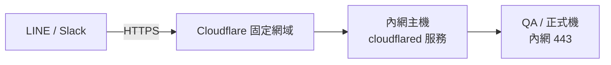

## 背景

> [!IMPORTANT]
> **核心痛點:全程人工、高重複、需求無紀錄。**

- **區間賠率監控全程人工**:風管定時定期手撈資料 → Excel 組裝 → LINE 回傳,全程人工。
- **頻率高、極重複**:分日夜班輪流、**每天 5 次、每次約 10 分鐘**。
- **需求口頭傳遞、無紀錄**:統計時間段與遊戲類型由執行長決定、變動頻繁,需求全靠口頭(執行長 → 特助 → 風管),沒有歷史紀錄、無法數據比對。
- **運營資料散在獨立 app**:原本得開獨立 app,需不斷重登、又不會跳通知提示,容易漏接最新資料。

## 目標

全自動化、多平台定時推送,設定與內容可紀錄/比對,並主動通知。

## 成果亮點

1. **風管人工歸零**:原本日夜班每天 5 次、每次約 10 分鐘的手撈+組裝+回報,改為機器人**定時自動推送**(LINE 每日 4 次、Slack 每小時),完全免人工。
2. **多平台串接、設定與內容同步**:LINE + Slack 同源推送,設定紀錄與推送內容多平台一致,**歷史查詢/比對方便**(取代過去的口頭傳遞)。
3. **主動通知、不漏接**:定時跳通知提示,最新運營資料不再因「要開 app、要重登、無提示」而漏接。

## 解法與架構

| 模組 | 用途 | 關鍵機制 |
|------|------|----------|
| 區間賠率監控(LINE) | 定時推賠率區間明細 | 由每小時統計 cron 完成後**鏈式觸發**推播(不再用固定時間差的獨立 cron,見最痛的坑) |
| 運營資料即時更新(Slack) | 每小時推營運統計 | 伺服器產 PNG 快照 + bot 上傳 |
| LINE 會員池 + Webhook | 會員自助加入/授權 | LINE Webhook 接收訊息 → 建立會員池,後台帳密 sha1 授權 |
| SDK | LINE 推播 | LINE Bot SDK(選用相容正式機環境的版本) |

**對外連線路線(避開 QA/正式機防火牆)**:

- LINE Messaging API 的 Webhook **只收 HTTPS**。
- 正式:Cloudflare 固定網域 + 內網主機上的 `cloudflared` tunnel 打進內網。
- 開發:用 **ngrok** 反向代理臨時取得 HTTPS。

## 困難點

1. **Webhook 必須 HTTPS**:LINE Messaging API 強制 HTTPS;本機無公開網域 → 開發用 ngrok 反向代理。
2. **QA/正式機都有防火牆**:外部打不進內網 → 改走 Cloudflare 固定網域 + cloudflared tunnel(見上方路線)。
3. **多平台格式差異大**:Slack 推送格式一路演進(純資料 → Markdown → Block Kit),但 **iOS 不支援 Block Kit 的部分 CSS**;LINE 用 URL 推圖會經 CDN 有延遲。(決策見關鍵取捨)

## 最痛的坑

### 排程 race:統計逐筆寫入 vs 定時推播 —— LINE「只送部分資料」卻無任何 error

- **症狀**:正式機 LINE 定時推播只送出部分統計內容;Slack 正常、統計頁正常、**手動重推完全正常**、log 一片乾淨;QA 完全重現不了。
- **根因**:每小時統計 cron 每算完一個區間就 insert 一列(每區間要掃數月的勝分報表資料,隨區間累積越來越慢);推播用 `MAX(endTime)` 挑最新 eventId——**新 event 寫入第一列的瞬間就成為「最新」**,推播讀到寫一半的 event。半份資料推送照樣 HTTP 200,所以沒有任何 error。
- **為什麼難查(三重迷霧)**:
  1. 失敗只印 console,排程 `runInBackground()` 把 stdout 丟掉 → 應用 log 永遠乾淨;
  2. `modifyTime` 只是複製 `endTime`,DB 沒記實際寫入時刻 → 事後查不出「統計何時寫完」,時間證據湮滅;
  3. QA 資料小、統計秒級寫完 → QA 永遠正常;直覺被誤導成「截斷/則數上限」問題(實際單則才 ~1,500 字,離 LINE 5,000 上限遠得很)。
- **怎麼破案**:先實測切則邏輯無損 + 歷史 506 個 event 全部單則 → 排除截斷;「手動正常、排程短少」鎖定時序;對照排程 :10/:11 與逐筆 insert 拍板。
- **修法**:改成**鏈式觸發**(統計完成後直接呼叫推播,移除固定時間差的獨立 cron)+ **整批單一多列 INSERT**(原子可見,含 LINE 互動查詢在內的任何讀取端都讀不到半份)+ 每則 push 寫 Log(status/body/字數)+ `modifyTime` 記實際寫入時刻(連動重跑刪範圍改用 `endTime`,否則歷史重跑會刪不到而產生重複)。
- **追打的第二個坑——DB 主機時鐘偏移,「完成時間」早於「開始時間」**:`modifyTime` 一開始用 `DEFAULT CURRENT_TIMESTAMP`(由 DB 蓋章),結果 QA 出現 modifyTime(13:01:56)比 endTime(13:02:15)**早 19 秒**的倒掛。用 NTP 當裁判實測:

  **問題根源:QA 的 MySQL 主機時鐘慢了約 30 秒**

  | 時鐘 | 對 NTP 標準時間的偏差 | 判定 |
  |---|---|---|
  | 工作機(跑 artisan 的 PHP) | **-2.4 秒** | 準 |
  | QA MySQL 主機 | **約 -30 秒** | 慢(元兇) |

  倒掛 19 秒 = 30 秒偏移 −(統計耗時 ~10 秒),完全吻合。`endTime` 用 PHP 的錶、`modifyTime` 用 DB 的錶,兩支錶不同步就倒掛。量測方法:PHP 前後夾擊 `SELECT NOW()` 量 PHP 與 DB 的相對偏移,再用 `w32tm /stripchart` 對 NTP 量絕對偏差。修法:`modifyTime` 改由 **PHP 於 insert 前一刻蓋章**,與 endTime 同一時鐘來源,相減恆為真實耗時;錶準的環境(正式機)行為不變,schema 的 DEFAULT 留給其他寫入端當保底。附帶發現:QA 那台 MySQL 上**所有** `NOW()`/`CURRENT_TIMESTAMP` 欄位都慢 30 秒,已列 infra 對時待辦。

這次事故收斂出幾個一般性原則:「產生資料」與「消費資料」兩個排程用**固定時間差**串接等於埋定時炸彈,資料成長遲早會撞上,要嘛鏈式觸發、要嘛寫入原子化,最好兩者都做;多列資料要有「整組完成」的概念,逐筆 insert 的中間態對所有讀取端都可見;`runInBackground()` 的指令裡 console error 等於不存在,重要結果一律走 `Log::`;資料表要留「實際寫入時刻」欄位,否則事後無從鑑識;「QA 正常、正式機異常」優先懷疑**資料量/時序差異**而非程式碼版本差異;而要拿來相減比較的時間欄位必須來自同一時鐘來源,跨主機(PHP vs DB)各自蓋章,時鐘偏移會做出「倒因為果」的資料,懷疑時鐘問題時就用 NTP 當裁判,別互相猜。

### cloudflared 兩份 yml(裝成 root)—— 一直改錯檔

- **症狀**:照著設好 tunnel/DNS,但改了設定**怎麼都不生效**。
- **根因**:安裝 cloudflared 時**裝到 root 帳號去了**,系統存在**兩份 config.yml**;我一直在改 root 那份,**實際執行讀的卻是另一個檔案**。
- **怎麼發現**:卡很久,最後**重裝時才報錯**,才發現執行用的 yml 在別處;修正後成功透過 cloudflared + 內網主機打進 QA/正式機。
- 這也是為什麼 cloudflared 設定不生效時,第一步不是反覆改 `~/.cloudflared`,而是先確認「**正在跑的 service 到底讀哪個 config**」(看 systemd / `cloudflared service` 指向的路徑),否則會一直對著沒作用的檔案繞圈。

**其他兩個坑**:

- **LINE 用 URL 推訊息會經 CDN → 延遲**:`pushMessage` 走 URL/圖片會吃到 CDN 延遲 → 最後**改純文字推送**避開(見關鍵取捨)。
- **字體 / icon 必須放主機 storage**:Slack 與 LINE 機器人都會用到 font 與 icon,主機 storage 沒放對應檔就會**報錯** → 部署時要一起備妥。

## 關鍵取捨

### 1. Slack 推送格式:為什麼最後選 PNG?

- 演進:純資料 → Markdown → **Block Kit** →(carousel 改垂直 block)→ **PNG**。
- Block Kit 排版漂亮,但 **iOS 上不支援其部分 CSS**(版面跑掉)→ 否決。
- 改成**伺服器產 PNG 圖片再上傳**(伺服器端算好版面 → 產 PNG → bot 上傳),跨平台一致。

### 2. LINE 推送:為什麼用純文字而非 URL / 圖片?

- URL / 圖片推送會經 **CDN → 延遲**,即時性差。
- 改純文字推送(合併訊息 + 在換行邊界無損切則、每則 ≤4,900 字;早期的硬截斷已淘汰),即時不卡。

## 量化成效

| 項目 | 之前 | 之後 |
|------|------|------|
| 區間賠率回報 | 風管人工:日夜班輪流、**每天 5 次 × 約 10 分鐘** | 機器人**定時自動推送**(LINE 每日 4 次) |
| 人工時間節省 | — | **~50 分/天 × 365 天 ≈ 304 小時/年**(日夜班合計可達 ~608 小時/年) |
| 運營資料 | 開獨立 app、需重登、無通知 | Slack **每小時**自動推 + 主動通知 |
| 需求 / 設定 | 口頭傳遞、無紀錄 | 設定有紀錄、多平台同步、可歷史比對 |

## 異常處理與維運規劃

- **Slack error alert**:sync 排程失敗或機器人推送失敗時,自動送 Slack error 訊息通知工程師(這也是發現正式機無法連 ClickHouse / GCP 需開權限的管道)。
- **知識傳承**:操作邏輯與架構已整理成內部文件,納入團隊知識庫,全團隊可查。

## 未來規劃

- 推送內容 / 時段的後台自助設定再強化(降低工程介入)。
- 推送失敗重試機制(現有 Slack error 告警已可人工介入,可進一步加自動重試)。
- LINE 會員綁定遊戲帳號(目前 `U` 開頭 userId 無法對應實名)。

## 附錄

**可複用經驗**:

- 第三方(LINE/Slack)打進有防火牆內網 → **Cloudflare 固定網域 + cloudflared tunnel**(開發用 ngrok)。
- 跨平台顯示不一致(尤其 iOS)→ **改推 PNG 圖片**最穩。
- 會經 CDN 的推送注意延遲,即時需求改純文字。
- cloudflared 設定不生效 → 先確認「正在跑的 service 讀哪份 config」。
