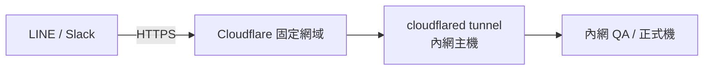

## 背景

區間賠率監控原本全程人工:風管日夜班輪流,每天 5 次、每次約 10 分鐘,手動撈資料、Excel 組裝、LINE 回傳。統計時間段與遊戲類型由執行長口頭決定、經特助傳到風管,沒有任何紀錄,無法做歷史比對。運營資料則得開一個獨立 app,需要不斷重登、也不會跳通知,常常漏接最新資料。

## 專案內容

把區間賠率監控與運營統計改為多平台機器人定時自動推送:LINE 每日 4 次、Slack 每小時,設定與推送內容在兩平台間同步一致,可歷史查詢比對,並主動跳通知。

## 專案挑戰

LINE Messaging API 的 Webhook 強制要求 HTTPS,而 QA 與正式機都在防火牆後面,對外打不進來。另外 Slack 的推送格式一路從純資料、Markdown 演進到 Block Kit,才發現 iOS 不支援 Block Kit 用到的部分 CSS,版面會跑掉;LINE 若用 URL 推圖片又會經過 CDN,即時性變差。

## 個人貢獻

- 設計對外連線路線:LINE/Slack → Cloudflare 固定網域 → 內網主機的 cloudflared tunnel → QA/正式機內網,開發環境則用 ngrok 反向代理取得臨時 HTTPS。
- 排除 cloudflared 裝成 root 帳號、系統裡有兩份 `config.yml`,改了半天其實都在改「沒在跑」的那份的坑——直到重裝時才報錯,才發現實際執行讀的是另一個檔案。
- 取捨後,Slack 改為「伺服器產 PNG 圖片再上傳」確保跨平台顯示一致;LINE 改為純文字推送,避開 CDN 延遲。

## 專案結果與影響

風管人工回報歸零,單班約省 50 分鐘/天,兩班合計可達約 608 小時/年(保守估計以單班計約 304 小時/年);設定與推送內容多平台同步、可歷史比對,運營資料也不再因為要開獨立 app、要重登、沒通知而漏接。

## 關鍵技術決策與踩坑

### 對外連線路線

第三方(LINE/Slack)要打進防火牆後的內網,採「固定網域 + tunnel」的路線,開發環境則以 ngrok 臨時取得 HTTPS:

### 最痛的坑:cloudflared 兩份設定檔,一直改錯

設好 tunnel 與 DNS 後,改了設定卻怎麼都不生效。追了很久才發現:cloudflared 當初被裝到 root 帳號下,系統裡因此存在**兩份 `config.yml`**;我一直在改的是「沒在跑」的那一份,實際執行的 service 讀的是另一個檔案。最後是在重裝時報錯,才暴露出真正被讀取的設定路徑。

**教訓**:cloudflared 設定不生效時,第一步不是反覆改 `~/.cloudflared`,而是先確認「正在跑的 service 到底讀哪一份 config」(從 systemd 服務指向的路徑回推),否則會一直對著沒作用的檔案繞圈。

### 關鍵取捨一:Slack 格式最後選伺服器產 PNG

Slack 推送格式一路演進:純資料 → Markdown → Block Kit → PNG。Block Kit 排版漂亮,但在 iOS 上不支援它用到的部分 CSS,版面會跑掉。權衡跨平台一致性後,改成「伺服器直接算好版面、產成 PNG 圖片再上傳」,無論 iOS 或桌面顯示都完全一致。

### 關鍵取捨二:LINE 改純文字推送

LINE 用 URL 推圖片會經過 CDN,產生延遲、即時性差。監控類訊息重點是「即時看到」,因此捨棄圖片、改為純文字推送(單則長度控制在上限內以避免被拒),換取最直接的送達速度。
