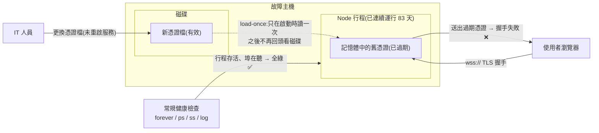
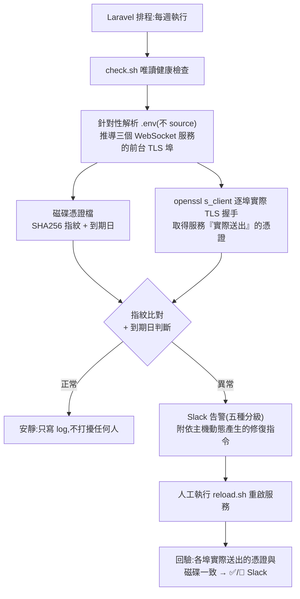

## 背景

> [!IMPORTANT]
> **核心痛點:「功能沒壞 + 行程有在跑」根本不足以判斷服務健康。** IT 人員換完憑證當下,測試環境各功能確認都正常、三個後台即時服務(客服聊天/數值告警/版本通知)都在跑——但服務其實已經注定在三天後掛掉,而且沒有任何監控看得出來。

- **換憑證後沒重啟 = 定時炸彈**:IT 人員換好新憑證檔,但沒有重啟服務。執行中的 Node 行程仍持有啟動時載入記憶體的舊憑證,舊憑證於週六凌晨到期 → 週一上班時前端 wss 全掛,足足兩天空窗。
- **故障當下所有常規檢查都是綠燈**:`forever list` running、`ps` 行程狀態正常、`ss` 看每個埠都在聽、log 時間戳是幾分鐘前仍在處理流量、記憶體充裕且無 OOM。**唯一線索只有瀏覽器 console 的 `WebSocket connection failed`。**
- **憑證缺失會靜默降級**:程式是 `if (existsSync(KEY) && existsSync(CERT)) https else http`——憑證路徑錯或檔案不在時,Node 不報錯,改用明文 http 起在同一個埠。服務照樣 listening、照樣有 `Client connected`,但瀏覽器的 `wss://` 就是連不上。
- **同型未爆彈存在於正式環境**:正式環境存在同型憑證、將於數月後到期,架構與測試環境一字不差,續期後若沒重啟會完整重演。
- **零主動監控**:沒有任何機制會在憑證到期前提醒,也沒有任何機制能發現「檔案換了但沒生效」。

故障機制一張圖:



**利害關係人**:

- **營運/客服**:線上回報等即時功能突然不能用,但後端看服務都正常,難以說明與定位。
- **IT 人員**:換完憑證以為結束,不知道還要通知後端重啟服務。
- **後端**:故障發生在週六凌晨、週一才發現,兩天空窗。

## 目標

建立一套能抓出「服務活著但憑證失效」的主動監控 + 可照做的修復流程;本期只做**監控與告警**(重啟一律人工),不做自動重啟、不做憑證自動續期、不動 Node 程式碼。

## 成果亮點

- **抓得到「全綠的假故障」**:以 `openssl s_client` 實際握手取得「服務送出的憑證」,與磁碟憑證做 SHA256 指紋比對——這是唯一能戳破 forever/ps/ss/log 全綠假象的方法。
- **偵測時機從「事後」提前到「事前」**:原本要等憑證過期、前端報錯才知道(本次為過期後 2 天);現在每週主動比對,且到期前 14 天預警。
- **告警自帶解法,非工程人員也能處理**:五種告警每則都附【怎麼解】的可複製指令,且**指令依當下主機動態產生**(測試環境顯示 `forever restartall`、正式環境顯示 `sudo pm2 restart all`,路徑跟著腳本位置走)。
- **免每台手動維運**:排程掛在 Laravel 排程器,隨版本更新自動部署(各環境主機既有排程進入點),不必逐台加 crontab。
- **推翻「換 pm2 就沒事」的既有認知**:實查證實正式環境用 pm2 也是同樣的 load-once 行為,其憑證之所以正常純粹是近期剛好重啟過——讓團隊不再把資源投在錯誤方向。
- **上線前就抓出自身缺陷**:在真機驗收階段重現並修掉預備環境假警報地雷(3 則 → 0 則)與相對路徑解析語意錯誤,避免上線後製造告警疲勞。

## 量化成效

| 面向 | Before | After |
|---|---|---|
| 憑證失效發現方式 | 前端報錯後回報(本次為過期後 **2 天**) | 每週主動偵測;到期前 **14 天**預警 |
| 「換檔沒生效」偵測 | **無**(無任何機制) | 指紋比對,換檔後最遲 1 週內告警 |
| 明文降級偵測 | **無**(埠仍 listening,看不出來) | 實際 TLS 握手判定 |
| 故障定位耗時 | 需逐一排除多個錯誤方向 | `check.sh --status` 一行看完磁碟與各埠到期日 |
| 修復指令正確性 | 口傳且有誤(`forever restart all` 無效) | 告警內附正確指令,腳本自動分辨 forever/pm2 |
| 預備環境假警報 | 設計初版 **3 則/次** | **0 則**(明確宣告式監控開關) |
| 正式環境未爆彈 | 未知 | 已辨識(同型憑證、數月後到期)並納入監控 |
| 部署成本 | — | 0 台手動加 cron(隨版本更新部署) |
| 上線範圍 | — | 測試/預備/正式**三環境全數上線**,內容一致 |
| 換證 SOP | 口耳相傳、指令有誤、缺版號補回步驟 | 文件化 5 步驟並入內部文件庫;含完整驗收清單 |

## 解法與架構

**核心洞見:判斷憑證健康,只能看「服務實際送出什麼」,不能看「服務活著沒」。** 把磁碟上的憑證與服務實際送出的憑證(= 行程記憶體那張)做 SHA256 指紋比對——指紋不同,就代表 IT 換了新證、但服務還沒重載。



| 元件 | 職責 |
|---|---|
| `cert-common.sh` | 共用函式:`.env` 針對性解析(不 source)、憑證路徑解析、TLS 握手取證、指紋/到期日、Slack 送出、主機標籤、行程管理器判斷 |
| `check.sh` | 唯讀健康檢查(每週排程)。正常安靜只寫 log,出事才 Slack。`--status` 為人工查詢模式 |
| `reload.sh` | 人工執行:自動分辨 forever/pm2 重啟三支服務 → 驗證各埠送出的憑證已與磁碟一致 → ✅/🔴 Slack |
| Laravel 排程 | 每週固定時間執行 `check.sh`,`withoutOverlapping` + 背景執行,隨版本更新自動部署 |

**五種告警**(皆附【怎麼解】):🔴 握手不到 TLS(降級明文)/🔴 埠沒在聽/🔴 憑證已過期/🟠 新證待生效/🟠 剩不到 14 天。

**只監控前台(TLS)埠**:三個 WebSocket 服務各開兩個埠——前台埠走 wss(TLS,瀏覽器連線)、後台埠走純 ws(內部使用、天生無憑證)。只有前台埠納入監控;埠清單由 `.env` 動態推導,改埠不需改腳本。韌性:所有網路呼叫包 `timeout`、整支以 `flock` 防疊機。

## 上線狀態

**已全線上線(以檔案內容 diff 驗證,而非 commit hash——原因見坑 9)**:

| | check.sh | reload.sh | cert-common.sh | 週排程 |
|---|---|---|---|---|
| 測試環境 | ✅ | ✅ | ✅ | ✅ |
| 預備環境 | ✅ | ✅ | ✅ | ✅ |
| 正式環境 | ✅ | ✅ | ✅ | ✅ |

三支腳本在三環境**位元組完全一致**;唯一差異在排程檔,且為既有的、與本案無關的正式環境專屬排程。

**驗收結果(測試環境 + 預備環境真機實測)**:

| 項目 | 結果 |
|---|---|
| A `--status` 查詢模式 | ✅ 主機標籤/磁碟與三個前台埠到期日正確 |
| B 正常時安靜 | ✅ 0 則告警,log 正確寫入 |
| C Slack 通道 | ✅ 三則 🟠 實際送達頻道 |
| D 明文降級 🔴 | ✅ 以一個本就走明文 ws 的內部埠作為降級偵測的天然對照樣本 |
| E 新證待生效 🟠 | ✅ 臨時自簽憑證模擬指紋不符,核心觸發邏輯確認 |
| F 不監控主機略過 | ✅ 預備環境真機驗證 |
| **G reload 實測** | ✅ 自動判為 forever、三埠到期日正確、✅ Slack 送達 |
| 靜態檢查 | ✅ `bash -n` ×3、`php -l`、LF/無 BOM |

> G 項另有一個意外收穫:正因為重啟後版本號歸零(見坑 7),反證了**行程確實有真的重啟**——否則記憶體狀態不會被清空。(此測試因當時磁碟證與記憶體證本就相同,單看指紋比對無法區分「有無重啟」。)

**文件**:機制原理、換證 SOP(5 步驟)與逐項驗收清單已文件化並入內部文件庫;推送前經機密掃描(webhook 為佔位符、無密碼/token/私鑰)。

## 困難點

- **受限的遠端環境**:目標主機無 sshpass、無法配置 SSH 金鑰、sudo 需密碼——改用 OpenSSH 的 `SSH_ASKPASS` 機制免互動帶入認證,認證資訊只進記憶體、經環境變數傳遞、不落磁碟;遠端指令以 base64 雙層編碼傳遞,避開引號與 CRLF 的逐層轉義問題。
- **判斷「服務是否真的在服務」**:`forever list`/`ps`/`ss`/log 四種常規手段全部無效,必須設計出「握手取憑證」這個唯一有效的探針。
- **告警必須零假陽性**:後台埠天生無 TLS、預備環境天生不跑 wss——任何一個誤納入都會每次噴假警報,導致告警疲勞、真出事被當雜訊。
- **驗收不能破壞環境**:設計 `ENV_FILE`/`WSS_PORTS`/`EXPIRY_WARN_DAYS` 環境變數覆寫,使六項驗收(含明文降級、新證待生效、到期預警)全部可在**唯讀、不重啟、不動正式 `.env`** 的前提下完成——測試時用覆寫把腳本指向臨時的自簽憑證與埠清單,而不是改動環境去遷就測試,驗完環境零殘留。

## 最痛的坑

### 坑 1:所有健康檢查都在說謊(核心)

- **症狀**:前端 wss 全掛,但 `forever list` running、`ps` 狀態正常、`ss` 每個埠都在聽、log 幾分鐘前還在處理流量、無 OOM。
- **誤判過的方向(依序排除)**:
  1. **redis 連不上**(錯誤 log 有 `ConnectionException`)→ 細看 stack 是另一台 Windows 開發機的路徑,而故障主機是 Linux,不可能出現該路徑 → 兩件事無關;實測故障主機的 redis 完全正常。
  2. **系統 log 裡的「憑證錯誤」** → 那是防毒軟體更新病毒庫走純 HTTP(port 80),根本沒有 TLS 參與,是無關雜訊。
  3. **三支服務掛了** → 實測全部活著且在處理流量。
  4. **正式環境換 pm2 就不會有此問題** → 見坑 3。
- **真正根因**:用 `openssl s_client` 對三個前台 TLS 埠實際握手,取回憑證的 `notAfter` 是**兩天前**——服務送出的憑證已過期;再看磁碟:憑證檔幾天前才剛換過、到期日在半年後 → **磁碟是新的、記憶體是舊的**。
- **為什麼會這樣**:`https.createServer({ cert: fs.readFileSync(...) })` 只在**啟動時**把憑證讀進記憶體,之後不再回頭看磁碟。行程已連續運行 83 天,遠早於換檔日;重啟的作用就是讓行程重新去讀磁碟。這也是為什麼判斷「服務是否真的在服務」不能看行程狀態——要**從外部發一個真實請求,看它實際回什麼**;凡是「啟動時載入設定/憑證/金鑰進記憶體」的服務,都有同一類「檔案換了但沒生效」的隱形故障。

### 坑 2:憑證缺失會靜默降級成明文

- 程式為 `if (existsSync(KEY) && existsSync(CERT)) https else http`。憑證路徑錯或檔案不在時,Node **不報錯**,改用明文 http 起在**同一個埠**。
- 結果是「埠有在聽、log 有連線、但瀏覽器連不上」,與坑 1 同樣難以察覺。這也是為什麼監控必須**真的做 TLS 握手**——只檢查「埠是否 listening」完全抓不到降級。

### 坑 3:換 pm2 解決不了 load-once(推翻既有認知)

- 團隊原本認為「正式環境換成 pm2 就不會掛」。實查:正式環境 pm2 是 **fork 模式 + watch 停用**,行為與 forever 完全相同。
- 正式環境憑證之所以有效,純粹因為**近期剛好重啟過**:憑證檔半年前就換了,直到近期一次重啟才生效——**中間半年一直送舊證**。
- 問題出在**應用層**(啟動讀一次),不是 daemon 管理器;換 forever→pm2 無效,真正的根治是 TLS 終結交給前面的反向代理,或應用支援熱重載。

### 坑 4:修復指令本身是錯的

- `forever restart all`(有空格)**不會動作**,正確是 `forever restartall`(`forever --help` 確認)。
- 正式環境服務掛在 **root 的 pm2** 之下,一般系統帳號自己的 pm2 清單是空的——用 `pm2 list` 看到空的不代表服務沒跑,`pm2 restart all` 不加 sudo 等於**什麼都沒重啟**。
- 故障當下沒人有心情查文件,所以把正確指令**直接寫進告警訊息**、且依主機動態產生。

### 坑 5:預備環境假警報地雷(驗收時實測重現)

- 初版設計以「`.env` 未設憑證路徑或憑證檔不存在」作為非監控主機的略過條件,理由是「預備環境不跑 wss」。
- **實測打臉**:預備環境磁碟上留有一份**仍可用的舊憑證檔**,略過條件不成立 → 腳本繼續往下檢查 → 發現三個前台埠都沒監聽 → **噴 3 則 🔴 假警報**。
- 目前因預備環境的排程進入點本就停用而不會自動執行,但只要有人啟用就中獎。
- **解法**:改用 `.env` 明確設 `CERT_MONITOR_ENABLED=false`,實測 3 則 → 0 則。「靠環境現況推論要不要監控」不可靠——**要不要監控應該是明確宣告的設定**,不是猜出來的。

### 坑 6:相對路徑解析的語意錯誤

- `.env` 裡的憑證路徑是相對路徑(形如 `CERT=./x.crt`)。初版把它相對於「**腳本所在目錄**」解析——正式部署時腳本與 `.env` 同層,看起來完全正常。
- 但正確語意應是相對於「**`.env` 所在目錄**」(= Node 行程的 cwd,Node 就是這樣解析的)。測試時把腳本放到別的目錄才暴露:憑證被解析到錯誤位置,導致誤判為「本機未跑 TLS」。模擬既有程式的行為時,要複製它的**解析基準**,不是複製它的字面設定。

### 坑 7:重啟後版本號歸零——同一類「記憶體狀態」問題的第二個實例

- **症狀**:`reload.sh` 跑完、憑證驗證全 ✅,但後台使用者看到永不消失的紅色錯誤「版本號獲取失敗」。
- **根因**:版本通知服務的版本號變數**只存在記憶體**,唯一寫入來源是前端專案建置完成時、向該服務僅綁本機(`127.0.0.1`)的回報埠打一次版本 timestamp。行程一重啟就歸零成空字串,之後每個連上的前端都收到空值,前端即跳出不自動消失的錯誤通知。
- **關鍵細節**:回報只打 `127.0.0.1`,所以前端建置必須在**跑 Node 服務的那台機器**上執行,在別台跑不會生效。
- **解法**:換證 SOP 補上一步——重啟後在同機重跑前端建置;並把提醒寫進 `reload.sh` 的輸出與 ✅ Slack 訊息。
- 這與憑證是**同一類問題**——啟動時載入記憶體、重啟即失、無自動補回機制。差別只在憑證是「重啟才會更新」、版號是「重啟就會消失」。做重啟型維運前,應先盤點**所有只存在記憶體的狀態**,而不是只看被修的那一項;根治方向是把版本號持久化到檔案、啟動時讀回。

### 坑 8:遠端測試時把 `.env` 明文複製到 /tmp(自身失誤)

- 為了做測試,把整份 `.env` 只濾掉一兩行就輸出到遠端主機的 `/tmp`——等於把 DB 帳密等機密留在磁碟上。發現後已全數清空。
- 這件事改變了我準備測試材料的方式:測試用的設定檔要**只 grep 需要的那幾行**(如只取憑證相關設定),絕不整份複製再濾。

### 坑 9:用 commit hash 判斷「上線了沒」→ 假陰性

- **症狀**:收尾時用 `git branch -r --contains <sha>` 查監控相關 commit,預備與正式環境分支都顯示「沒有」,於是回報「還沒推、只在本地」——實際上早已全數上線。
- **根因**:測試→預備環境是以 **cherry-pick** 搬運,落地時是**不同的 sha**。用原始 sha 去 `--contains`/`--merged` 必然查不到,得到假陰性。
- **正確作法**:以**內容**判斷——`git cat-file -e <ref>:<file>` 看檔案在不在、`git show <ref>:<file> | grep` 看關鍵行在不在、`git diff --stat <refA> <refB> -- <files>` 看內容是否一致。實測三支腳本在三環境位元組完全一致。
- 在 cherry-pick 為主的分支流裡,**commit 身分(sha)不具跨環境意義,只有內容才有**。回報「還沒部署」這類結論前,一定要先跑內容比對——誤報會讓對方以為有工作漏做。

### 坑 10:grep 遠端原始碼誤入 minified bundle

- 對遠端專案目錄遞迴 grep,誤入前端打包產物目錄,命中 79MB 的 minified JS(`Object.keys` 誤中 `.key` 關鍵字),輸出爆量並使 SSH 逾時。之後遠端 grep 一律加 `--exclude-dir` 排除 node_modules 與打包產物,或直接指定檔案。

## 關鍵取捨

| 決策 | 選擇 | 被否決的方案與理由 |
|---|---|---|
| 觸發條件 | **磁碟 vs 記憶體憑證指紋比對** | ❌「到期前 N 天自動重啟」:會與 IT 換檔搶時間——IT 還沒換就重啟,只會讀到同一張舊證、白斷一次連線,且隔天條件仍成立 → **變成天天重啟**。指紋比對則是「換了才觸發、重載後自動停」。到期天數只留作「沒人續證」的安全網告警。 |
| 自動化程度 | **Phase 1 全人工重啟,監控只通知** | ❌ 偵測到就自動 reload:正式環境無人看管時自動重啟,萬一新憑證檔本身有問題,會把「憑證快到期」升級成「服務現在就掛」。先讓偵測與告警穩定跑一段時間再談自動化。 |
| 排程方式 | **Laravel 排程器** | ❌ 每台手動加 crontab:各環境主機既有排程進入點,寫在 Laravel 排程可隨版本更新部署、不必逐台維護;預備環境因排程進入點本就停用而天然不執行。 |
| 監控範圍 | **只監控前台(TLS)埠** | ❌ 監控全部埠:後台埠本來就是內部明文 ws、天生無憑證,納入會每次噴假警報 → 告警疲勞 → **真出事時也被當成雜訊忽略**。 |
| 讀取設定 | **針對性 `grep` 解析 `.env`** | ❌ `source .env`:會執行 `.env` 內任意內容,且含空白/特殊字元的值會壞掉。 |
| 非監控主機 | **明確宣告 `CERT_MONITOR_ENABLED=false`** | ❌ 靠「憑證檔是否存在」自動推論:預備環境留有舊憑證,實測會誤報(見坑 5)。 |
| 失敗處理 | **只通知 IT,不自救不重試不回滾** | ❌ 自動重試:憑證檔本身有問題時重試無意義,且可能打成 restart loop 反覆中斷正式服務——寧可讓人看著告警處理,也不讓腳本在無人環境自作主張。 |
| 根治方案 | **本期不做**,先上監控 | ❌ 立刻改由反向代理終結 TLS:要動代理設定 + 前端連線 URL + 三支服務 + 三個環境,影響範圍大。先用低風險的監控補上安全網。 |

## 未來規劃

- **Phase 2**:測試環境偵測到新證時自動執行 `reload.sh`(正式環境維持人工)。
- **根治**:改由反向代理(Apache `mod_proxy_wstunnel`)終結 TLS——正式環境本就跑 Apache、HTTPS 已用同一張萬用字元憑證——Node 只跑純 ws 綁 `127.0.0.1`、**完全不碰憑證**。之後換證只要 graceful reload,Node 永遠不用重啟,監控可退化為單純的到期預警。
- **版本號持久化**:把版本通知服務的版本號寫入檔案、啟動時讀回(約三行改動),即可免除「重啟後必須重跑前端建置」這一步(見坑 7)。
- **正式環境憑證數月後到期**:續期後**務必**重啟服務(或屆時已完成根治)。

## 注意事項

- **`.env` 不進 git**:Slack webhook、憑證路徑、主機標籤、監控開關都是**每台手動設定**,換機要重做。
- **CERT 對 `.crt`、KEY 對 `.key`**:各環境憑證目錄不同,寫反 TLS 會起不來並靜默降級。
- **預備機與正式機的 hostname 相同**:人工 SSH 前先確認自己在哪一台,再下任何指令。
- 腳本需 **LF + UTF-8 無 BOM**,CRLF 在目標 Linux 主機會 `bad interpreter`。
- 重啟會**瞬斷**所有 ws/wss 連線,正式環境須挑低峰時間。

## 附錄

**可複用經驗**:凡是「啟動時把設定/憑證/金鑰讀進記憶體」的服務,都存在「檔案換了但沒生效」的隱形故障;健康檢查不能只看行程狀態,必須**從外部發真實請求、比對它實際回應的內容與磁碟上的來源**。

**關鍵指令**(通用形式):

```bash
# 看服務「實際送出」的憑證到期日(判斷換檔有沒有生效,看這個)
echo | openssl s_client -connect 127.0.0.1:$PORT 2>/dev/null | openssl x509 -noout -enddate

# 看磁碟上的憑證檔
openssl x509 -noout -enddate -in /path/to/cert.crt

# 兩者不同 = 檔案換了,但服務還沒重載
```
